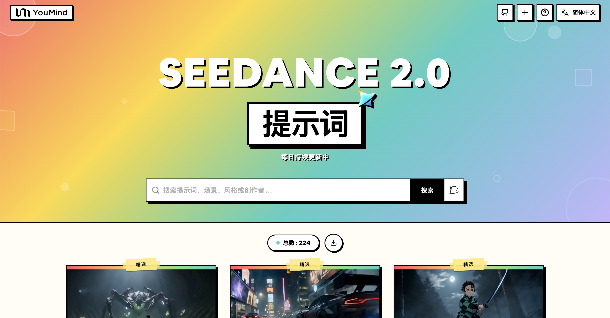

[](README.md) [](README_zh.md) [](README_zh-TW.md) [](README_ja-JP.md) [](README_ko-KR.md) [](README_th-TH.md) [](README_vi-VN.md) [](README_hi-IN.md) [](README_es-ES.md) [-Click%20to%20View-lightgrey)](README_es-419.md) [](README_de-DE.md) [](README_fr-FR.md) [](README_it-IT.md) [-Click%20to%20View-lightgrey)](README_pt-BR.md) [](README_pt-PT.md) [](README_tr-TR.md)

---

# 🎬 Leadde Seedance 2.0 视频提示词库

[](https://awesome.re)
[](https://github.com/Leadde-OpenLab/awesome-seedance-2-prompts)
[](https://creativecommons.org/licenses/by/4.0/)
[](https://github.com/Leadde-OpenLab/awesome-seedance-2-prompts/pulls)

面向创作者、营销团队和 AI 视频工作流的 Seedance 2.0 提示词精选与案例索引

> ⚠️ **版权声明**：本库整理社区公开分享的提示词，仅用于学习、研究和案例参考。如果您认为某条内容侵犯了您的权利，请[提交 issue](https://github.com/Leadde-OpenLab/awesome-seedance-2-prompts/issues/new)，我们会尽快核查处理。

---

## 📖 目录

- [🌐 在网页画廊中查看](#-)
- [🤔 什么是 Seedance 2.0？](#--seedance-20)
- [📊 统计数据](#-)
- [⭐ 精选提示词](#-)
- [🎬 所有提示词](#-)
- [🤝 如何贡献](#-)
- [📄 许可证](#-)
- [🙏 致谢](#-)
- [⭐ Star 历史](#-star-)

---

## 🌐 在网页画廊中查看

<div align="center">



</div>

**[👉 在 Leadde 查看完整 Seedance 2.0 提示词画廊](https://leadde.com/zh-CN/seedance-2-0-prompts)**

当你需要预览效果、快速搜索，并从提示词直接跳到视频结果时，Leadde 画廊会比长篇 README 更高效。

| Feature | GitHub README | Leadde 画廊 |
|---------|--------------|---------------------|
| 🎬 视频预览 | ❌ 长列表中的静态缩略图 | ✅ 可在线播放的视频画廊 |
| 🔍 搜索 | 仅 Ctrl+F | 按标题、标签、作者和提示词全文搜索 |
| 🤖 智能推荐 | - | AI 辅助发现相关提示词 |
| 📱 移动端 | 基础 | 完全响应式 |

---

## 🤔 什么是 Seedance 2.0？

**Seedance 2.0** 是**字节跳动**推出的视频生成模型，支持文本、图片、视频和音频输入，适合电影化短片、产品展示、社媒内容和多模态视频实验。

**Key Features:**
- 🎥 **文本生成视频** — 根据文字描述生成视频
- 🖼️ **图片生成视频** — 将静态图片动画化为动态视频
- 📹 **视频转视频** — 转换和扩展现有视频
- 🎵 **音频驱动** — 通过音频输入驱动视频生成
- 📐 **最高 1080p 分辨率**，4-15 秒时长
- 🔊 **自动配音配乐** — 自动旁白和背景音乐

---

## 📊 统计数据

| 指标 | 数量 |
|--------|-------|
| 📝 提示词总数 | **3894** |
| ⭐ 精选提示词 | **6** |
| 🔄 最后更新 | **2026-06-13** |

---

## 🔥 精选提示词

> ⭐ 重点展示构图、运动设计和提示词结构表现突出的案例

### No. 1: Seedance 2.0：15 秒电影感日式浪漫短片


#### 📖 描述

一个高度详细的 15 秒多场景提示，专为 Seedance 2.0 设计，旨在生成一部电影级的、超现实的日本高中纯爱短片。该提示详细说明了场景设置（空教室、温暖的金色阳光、浮动的尘埃）、摄像机运动、角色一致性（无变形/漂移）、微妙的微表情、同步的呼吸/嘴唇动作、对话以及音效（蝉鸣、笔尖划过纸张的声音、低频心跳声、轻柔的钢琴声）。故事情节聚焦于一个正在书写的女孩和一个偷偷观察她的男孩之间强烈、笨拙而又亲密的紧张情感，最终以一次害羞的对峙收尾。

#### 📝 提示词

```
15 秒电影感日剧纯爱暧昧短片，超写实画质，下午空无一人的教室里，暖金色阳光透过百叶窗洒落在并排的课桌上，细小的尘埃颗粒在光束中缓慢漂浮，老旧的木质课桌，极其自然的细微动作、呼吸和眼神张力，人物的面部、服装和发型在整个过程中保持一致，没有变形、漂移或伪影，真实的胸部轻微起伏与呼吸同步，浅景深，奶油般模糊的背景，温暖的胶片颗粒，8K 锐利，日系青春克制的心动窒息感。
0-4 秒：从课桌的中景极慢地推向两人并排而坐的侧面特写。一个穿着夏季校服的清纯女孩低头专注地写着笔记，乌黑的长发和耳边的碎发被微风轻轻吹拂，长长的睫毛投下细微的阴影，皮肤自然粉嫩，专注时嘴角不经意地微微上扬，呼吸轻柔均匀。
4-9 秒：切换到男孩的特写。他的校服领口微松，手肘撑在课桌上，偷偷转头凝视着她，眼神中充满温柔克制的爱意和柔情，瞳孔微微放大，喉结轻轻滚动。突然注意到她的笔停顿了一下，他迅速而慌乱地转头假装看自己的笔记，耳垂迅速微微泛红，指尖握笔时轻微颤抖，偶尔从刘海下偷瞄她一眼，呼吸略显紊乱，嘴唇紧抿，努力保持镇定。
9-15 秒：两人脸部同框特写，慢动作眼神突然交汇：女孩缓慢转头，先是茫然的惊讶，然后迅速害羞地低头 0.3 秒，轻轻咬住下唇，脸颊和耳垂瞬间泛起樱花粉，湿润的睫毛怯生生地再次抬眼与他对视，同时轻柔害羞地低语道：“……你看什么呢？”；男孩完全僵住，瞳孔放大，呆滞 0.4 秒，然后慌乱而小声地结巴回应：“没、没什么……”。女孩声音更轻地低语，咬着嘴唇又偷瞄他一眼，继续低语道：“……骗子。”。男孩停顿，然后轻轻叹了口气，低语道：“……就看你。”，嘴角缓慢地向上弯起一个害羞、温柔、歪斜的笑容，眼角出现细纹，呼吸明显加深。一股无形的电流似乎在两人脸庞之间拉扯着暧昧的张力，分享着彼此的呼吸温度，背景完全融化成层层叠叠的奶油般梦幻光斑、温暖光晕和细微的空气颗粒。
口型同步自然精准，情绪微颤和呼吸同步，对话是低能量的害羞耳语，自然停顿在 200-400 毫秒之间，说话时嘴巴只轻微移动，没有夸张或机械感，完美的自然唇语和情感真实性。
整体音效：远处夏日蝉鸣声隐约可闻，笔尖触纸的轻柔沙沙声，几乎听不见的心跳低频脉动，最后渐隐为非常轻盈的钢琴声。对话作为耳语完全自然地融入场景，女孩的声音轻柔害羞，男孩从慌乱结巴过渡到温柔。
人物身份始终保持一致，真实的细微头部倾斜、眼神移动和呼吸同步，无文字、水印或字幕，纯日系青春暗恋心动悬念。
```

#### 🎬 视频

<div align="center">

<a href="https://github.com/Leadde-OpenLab/awesome-seedance-2-prompts/releases/download/videos/1402.mp4">

</a>

📥 *点击图片下载视频* | **[🎬 观看视频 →](https://leadde.com/zh-CN/seedance-2-0-prompts?id=1402)**

</div>

#### 📌 详情

- **作者:** [AIGC｜阳家豪](https://x.com/JiahaoYang_art)
- **来源:** [Twitter Post](https://x.com/JiahaoYang_art/status/2033119940216344616)
- **发布时间:** March 15, 2026

**[👉 立即体验 →](https://leadde.com/zh-CN/seedance-2-0-prompts?id=1402)**

---

### No. 2: 好莱坞高级定制奇幻视频提示


#### 📖 描述

一个为 Seedance 2.0 设计的详细多场景视频生成提示，旨在创作一部好莱坞高级定制奇幻电影。该提示指定了风格、分辨率（8K）、渲染引擎（Unreal Engine 5）、时长（15 秒），以及三个独特的摄像机/动作序列，其中涉及一个身着液态青花瓷的模特，青花瓷碎裂成水墨燕子，最终形成一个 3D 流体水墨漩涡。

#### 📝 提示词

```
[风格] 好莱坞高级定制奇幻大片，8K 超清，超写实，时尚杂志风格，虚幻引擎 5 流体渲染，视觉错觉。[时长] 15 秒。[场景] 无边无际的真实乌尤尼盐沼（天空之镜）。天空布满压抑的乌云，地面如镜面般完美倒映一切，整体画面呈现极简冷色调。[00:00-00:05] 镜头 1：高定入场与瓷肌。机位：极低角度仰拍，超长焦镜头推近。动作：一位辨识度极高的亚洲高定脸女模特，在水面上冷酷行走。效果：她身着并非布料，而是流动着的真实液态青花瓷长裙。行走时裙摆发出真实陶瓷般的清脆碰撞声，表面流淌着光泽。传统的青花纹样在白色瓷质裙摆上如活物般游走。[00:05-00:10] 镜头 2：物理破碎与水墨坠落。机位：面部特写，焦点快速拉远。动作：模特突然停下，冷冷地凝视镜头，清脆地打了个响指。效果：响指打响的瞬间，她的青花瓷裙并未坠落，而是瞬间炸裂成千万只极其写实的水墨燕子。这些燕子携带着真实的水珠和墨痕，在空中拖曳着黑色流体残影，围绕着她疯狂盘旋。[00:10-00:15] 镜头 3：维度消融与深渊倒影。机位：高空俯拍，镜头快速旋转下坠。动作：水墨燕子群冲入模特脚下镜面般的湖水中。效果：原本坚实的盐湖表面张力瞬间消失。整个极其写实的世界开始像浓墨滴入清水般剧烈洇开、消融。真实的乌云和模特的身影彻底化为极其宏大的 3D 流体水墨漩涡，将镜头完全吞噬进黑白交织的深渊。
```

#### 🎬 视频

<div align="center">

<a href="https://github.com/Leadde-OpenLab/awesome-seedance-2-prompts/releases/download/videos/594.mp4">

</a>

📥 *点击图片下载视频* | **[🎬 观看视频 →](https://leadde.com/zh-CN/seedance-2-0-prompts?id=594)**

</div>

#### 📌 详情

- **作者:** [John](https://x.com/johnAGI168)
- **来源:** [Twitter Post](https://x.com/johnAGI168/status/2025849650654122348)
- **发布时间:** February 23, 2026

**[👉 立即体验 →](https://leadde.com/zh-CN/seedance-2-0-prompts?id=594)**

---

### No. 3: 现代乡村美学治愈系短片视频提示词


#### 📖 描述

一个详细的三镜头提示，用于 Seedance 2.0 生成一部现代乡村美学风格的治愈系电影短片。它指定了风格（电影商业广告、4K/8K、超微距、自然光、ASMR），场景（一个享有花园景色的现代开放式厨房），人物（一位穿着亚麻服装的专注创作者），以及三个场景的具体动作：采摘番茄、精准切割和安静地享用。

#### 📝 提示词

```
[风格]
现代乡村美学，电影级商业质感，使用 Sony A7S3/电影摄影机拍摄，4K/8K 超清，极致微距，自然通透光线，治愈系 ASMR，无历史古装剧感。

[场景]
一个维护良好、现代化的农舍开放式厨房，背景是郁郁葱葱的菜园，阳光明媚。

[人物]
现代乡村创作者，黑色长发随意用木簪挽起，身穿深蓝色舒适亚麻服饰，妆容清淡，眼神专注而平静。

[镜头细节]
[00:00-00:05] 镜头 1：晨间采摘 (新鲜)
画面：高清特写。晨光侧逆光打在植物上。
动作：创作者的双手（手指修长干净）从藤蔓上摘下一颗挂着晶莹露珠的鲜红番茄。
细节：焦点极其锐利，清晰展现番茄表面的绒毛和水珠滑落的轨迹。背景是虚化的高品质绿色。

[00:05-00:10] 镜头 2：极致匠心 (技艺)
画面：室内灶台区域，充满生活气息但一尘不染。
动作：创作者切菜，动作娴熟精准（非表演性质）。
细节：微距镜头捕捉刀刃切开食材的瞬间，汁水飞溅。随后切换到土灶中橘色火焰跳动，光影温暖真实。

[00:10-00:15] 镜头 3：宁静时光 (此刻)
画面：全景/中景。
动作：一道精致的家常菜肴摆放在院子里的木质长桌上。创作者安静地坐下，轻柔地整理一缕碎发，夹起一口食物。
氛围：蒸汽在逆光中缓缓升腾，场景安静得仿佛能听到风声，展现现代人向往的极致松弛感。
```

#### 🎬 视频

<div align="center">

<a href="https://github.com/Leadde-OpenLab/awesome-seedance-2-prompts/releases/download/videos/288.mp4">

</a>

📥 *点击图片下载视频* | **[🎬 观看视频 →](https://leadde.com/zh-CN/seedance-2-0-prompts?id=288)**

</div>

#### 📌 详情

- **作者:** [John](https://x.com/johnAGI168)
- **来源:** [Twitter Post](https://x.com/johnAGI168/status/2021818021354848258)
- **发布时间:** February 12, 2026

**[👉 立即体验 →](https://leadde.com/zh-CN/seedance-2-0-prompts?id=288)**

---

### No. 4: 《鬼灭之刃》真人战斗提示词，适用于 Seedance 2.0


#### 📖 描述

一个为 Seedance 2.0 设计的详细、高能量视频提示，用于生成一个 15 秒的《鬼灭之刃》风格战斗（水之呼吸 vs. 雷之呼吸）的真人改编片段。该提示详细说明了风格（好莱坞真人漫画改编、黑暗武士、4K、极致快速剪辑、粒子光效）、场景（夜晚迷雾森林），以及三个不同镜头，详细描绘了角色的动作、能力提升序列和最终的冲突。

#### 📝 提示词

```
真人漫改 · 呼吸法对决（15 秒 · 超燃特效版）
【核心看点】：水之呼吸（蓝色水龙）VS 雷之呼吸（金色闪电），真人极速对决。
【风格】：好莱坞真人漫改电影质感，暗黑武士风，4K 超清，极致快剪，粒子光效炸裂，无血腥。
【时长】：15 秒
【场景】：月光下的迷雾森林，泥泞地面，落叶。
[00:00-00:05] 镜头 1：水之旋律序章 · 起手式（蓄力感）
画面：一位身穿绿黑色方格羽织（外套）的年轻武士，在月光下沉下重心，双手握刀。
动作：他深吸一口气，周围空气瞬间凝滞。随着他拔刀出鞘，一条由高压水流凝结而成的巨大蓝色水龙凭空出现，围绕着他的身体和刀刃高速旋转，发出流水咆哮声。
特效细节：水流具有真实的飞溅感，照亮了黑暗的森林。
[00:05-00:10] 镜头 2：雷之闪光 · 突进（极速感）
画面：他对面的金发剑士，身穿黄色三角纹羽织，身体压得极低，摆出拔刀术的架势。
动作：地面骤然炸裂。他整个人瞬间化作一道耀眼金色闪电残影，以肉眼不可见的速度，呈“Z”字形在树林间高速折射突进。
特效细节：他经过的地方留下金色电弧和焦黑的落叶。
[00:10-00:15] 镜头 3：水雷相撞 · 终之音（终极招式碰撞）
画面：极速的正面碰撞。年轻武士挥舞着巨大的蓝色水龙迎击，化作闪电的金发剑士猛烈撞击而来。
动作：两把刀在画面中央猛烈相撞。
特效奇观：蓝色水龙与金色闪电瞬间炸裂，形成一个向外扩散的巨大水雷能量风暴。周围的参天大树被能量波拦腰折断，泥土、水花与光线遮蔽了镜头。画面在极致耀眼的蓝、黄、白光中结束。
```

#### 🎬 视频

<div align="center">

<a href="https://github.com/Leadde-OpenLab/awesome-seedance-2-prompts/releases/download/videos/189.mp4">

</a>

📥 *点击图片下载视频* | **[🎬 观看视频 →](https://leadde.com/zh-CN/seedance-2-0-prompts?id=189)**

</div>

#### 📌 详情

- **作者:** [John](https://x.com/johnAGI168)
- **来源:** [Twitter Post](https://x.com/johnAGI168/status/2021610292979876208)
- **发布时间:** February 11, 2026

**[👉 立即体验 →](https://leadde.com/zh-CN/seedance-2-0-prompts?id=189)**

---

### No. 5: Seedance 2.0：80 岁说唱歌手 MV


#### 📖 描述

一个详细的 15 秒提示，用于 Seedance 2.0 生成一个 16:9 横屏街头说唱音乐视频（MV），主角是一位 80 岁的老奶奶。该提示指定了风格（霓虹紫/蓝冷色调，爆炸性氛围）、人物形象（银发，皮夹克，嘻哈配饰）、场景分解（0-3 秒开场，3-7 秒说唱，7-11 秒舞蹈，11-15 秒高潮/结尾）、具体的说唱歌词、拍摄技巧（低角度，360 度旋转，快速剪辑）以及声音设计（Trap 电子音乐，重型 808 鼓）。

#### 📝 提示词

```
16:9 横屏，街头说唱 MV 风格，霓虹紫蓝色冷色调，炸裂酷飒氛围。0-3 秒：中景推近，城市街头夜景，霓虹灯闪烁，一位 80 岁银发老奶奶站在涂鸦墙前，银白色短发梳成利落大背头，脸部轮廓分明呈方型，剑眉斜飞入鬓，眼神锐利如电，眼角皱纹如岁月勋章，嘴角带着自信的笑容，身穿黑色皮夹克，内搭白色印花 T 恤（胸前黑色大字“YOLO”）+ 黑色工装裤 + 白色高帮运动鞋，脖子上戴着粗金链，手腕戴着银手链，双手举起麦克风，BGM 鼓点骤起，老奶奶眼神一凛，张嘴开 Rap。3-7 秒：中景 + 特写切换，老奶奶开始说唱，节奏感极强，银发随着头部摇摆动作飞扬，一只手握着麦克风，另一只手配合节奏做手势——食指指向镜头，手掌上下切分节奏，做出嘻哈手势，动作流畅自如，眼神锐利直视镜头，皱纹随着表情生动跳跃，嘴唇快速开合，吐出歌词：[Rap 歌词]“八十岁老腿，比你跳得更带劲！银发飞扬，这是我的骄傲！别叫我老，我的 Flow 比你强，你玩说唱时，我听迪斯科！”（语速快，节奏强，态度飒）快速剪辑：面部特写、手部动作、全身摇摆、侧身剪影，与 BGM 鼓点同步。7-11 秒：舞蹈片段，镜头拉远至全身，老奶奶开始跳舞——先是经典的嘻哈弹跳，接着是利落的街舞定格，然后是肩膀到脚趾的身体波浪传递，再是快速的脚步动作，动作干净利落，银发在霓虹灯下飞舞，皮夹克在空中翻飞，她边跳边 Rap：[Rap 歌词]“腿脚灵活，速度不慢，我的歌词刻在时间里！你玩手机，我玩节拍，八十年人生，写进这句词！”（节奏更快，语气更强）低角度仰拍 + 360 度环绕拍摄，捕捉老奶奶酷飒的舞姿。11-15 秒：高潮结尾，老奶奶一个帅气转身，银发在空中划出弧线，她面向镜头，食指做出“嘘”的动作，然后嘴唇凑近麦克风，用低沉磁性的嗓音唱出最后一句：[现实歌词]“时间从不打败美人，我只是换了一种方式，体验青春……”（节奏放缓，情感深沉，余韵悠长）镜头缓慢推近，特写老奶奶的眼睛，眼角皱纹都是故事，眼神依旧锐利却带着一丝慈祥，BGM 在高潮处戛然而止，画面定格在老奶奶酷飒中带着一丝温柔的笑容，画面四周暗角 + 霓虹紫色光晕。
```

#### 🎬 视频

<div align="center">

<a href="https://github.com/Leadde-OpenLab/awesome-seedance-2-prompts/releases/download/videos/1403.mp4">

</a>

📥 *点击图片下载视频* | **[🎬 观看视频 →](https://leadde.com/zh-CN/seedance-2-0-prompts?id=1403)**

</div>

#### 📌 详情

- **作者:** [松果先森](https://x.com/songguoxiansen)
- **来源:** [Twitter Post](https://x.com/songguoxiansen/status/2033175478765289598)
- **发布时间:** March 15, 2026

**[👉 立即体验 →](https://leadde.com/zh-CN/seedance-2-0-prompts?id=1403)**

---

### No. 6: 电影级街头赛车场景提示词


#### 📖 描述

一份使用 Seedance 2.0 生成电影级夜间街头赛车场景的详细提示词，涵盖了运镜方式、镜头时序（0-12 秒）、环境细节以及所需的视觉风格（灵感源自《速度与激情》）。

#### 📝 提示词

```
夜间电影级街头赛车场景，高性能跑车内，驾驶员全神贯注紧握方向盘，眼神专注，城市灯光映照在挡风玻璃上，加速前的紧张感蓄势待发

运镜：采用具备无缝转场的快速多角度系统，内景特写 → 肩后视角 → 外景追踪 → 低机位贴地拍摄，超动态运镜，结合急摇镜头（whip pans）+ 变速转场（speed ramp）+ 运动模糊遮罩剪辑，营造连续流动的视觉幻象

(0-2s) 驾驶员内景特写，手部紧握换挡杆，细微的呼吸起伏，仪表盘灯光闪烁
(2-4s) 肩后视角，前方道路延伸至霓虹闪烁的城市，引擎震动感增强
(4-6s) 按下氮气加速（NOS）按钮的极度特写，瞬间点火反应
(6-8s) 爆发式加速，镜头迅速切换至外景侧向追踪，车辆以狂暴的速度激射而出
(8-10s) 贴近沥青路面的超低机位，车轮极速旋转，环境景物飞速掠过
(10-12s) 狭窄街道上的高速追逐，急转弯，镜头在不同角度间急摇切换，反射光与光轨增强速度感

密集的城市夜景，湿润的沥青路面反射着霓虹灯光，隧道穿梭，路灯拉出光影，浓厚的高速城市氛围
超写实风格，灵感源自《速度与激情》，照片级真实光影，强烈的运动模糊，高对比度霓虹反射，电影级景深，极致的速度感，流畅转场，无畸变，无拉伸
```

#### 🎬 视频

<div align="center">


**[🎬 观看视频 →](https://leadde.com/zh-CN/seedance-2-0-prompts?id=2530)**

</div>

#### 📌 详情

- **作者:** [Pierrick Chevallier | IA](https://x.com/CharaspowerAI)
- **来源:** [Twitter Post](https://x.com/CharaspowerAI/status/2039651574297792688)
- **发布时间:** April 2, 2026

**[👉 立即体验 →](https://leadde.com/zh-CN/seedance-2-0-prompts?id=2530)**

---

---

## 🎬 所有提示词

> 📝 按发布日期排序（最新优先）

### 工业走廊逃亡追逐


> 一个紧张刺激的追逐场景提示词，描述逃亡者在工业走廊中躲避无人机群的追击，包含坍塌的结构和动态镜头运用。

#### 📝 提示词

```
一名逃亡者在密集的工业走廊中飞奔，身后是如潮水般涌入的庞大无人机群。环境光线昏暗且充满刺眼的人造光与闪烁的信号灯。环境极不稳定：狭窄的几何结构、运转的机械、四溅的火花以及不断坍塌的建筑。动作节奏紧凑。逃亡者全速奔跑，无人机群像流体一样涌动，填满了整个空间。采用连续无缝的镜头拍摄。起始镜头为走廊远景，随后迅速切入追逐者视角。锁定紧凑的追逐过程。镜头快速穿过弯道，升至高空展现无人机群全貌，再低空穿过狭窄缝隙。序列中段，走廊向内坍塌，地面崩裂。逃亡者坠入下层。镜头拉远展示坍塌全景，随后跟随坠落动作俯冲，重新锁定追逐视角。结尾镜头拉远：前方路径愈发狭窄，身后的一切被无人机群吞没。
```


**[🎬 观看视频 →](https://leadde.com/zh-CN/seedance-2-0-prompts?id=5982)**

**作者:** [Alexandra Aisling](https://x.com/AllaAisling) | **来源:** [Link](https://x.com/AllaAisling/status/2065584181682241858) | **发布时间:** Jun 12, 2026

---
### 电影级微距拉花艺术生成


> 一个详细的电影级提示词，用于创作拉花艺术倾倒过程的微距视频，其中特定的图案或文字在浓缩咖啡油脂表面逐渐浮现。

#### 📝 提示词

```
从正上方拍摄的微距镜头。捕捉倒入白色陶瓷杯中的浓缩咖啡拿铁表面。在美丽的焦糖色油脂上，咖啡师开始缓慢倾倒来自不锈钢拉花缸的顺滑热牛奶。

随着牛奶扩散，白色泡沫图案逐渐显现。参考图像中的最终字符逐步完成。

牛奶的流动和拉花缸的细腻动作清晰可见。拉花艺术分阶段形成，随着完成度的提高，细节变得更加精致。泡沫质地顺滑细腻。温暖的咖啡馆灯光。逼真的咖啡质感。浅景深。如同高端咖啡馆宣传片般精美的视觉表现。

最终，呈现出与参考图像中字符拉花完美匹配的设计。超高清，照片级真实感，4K，电影级，平滑运动。

从倾倒开始到完成一镜到底。牛奶在油脂上扩散的方式令人赏心悦目。泡沫边缘清晰，拉花艺术仿佛自然浮现。在完成前进行微调，使字符拉花的细节更加突出。

负面提示词 (Negative Prompt)：
拉花坍塌，不自然的图案，Logo，水印，牛奶飞溅，镜头抖动，低分辨率，模糊，过度装饰，不自然的色彩，未完成的拉花，畸形，不对称设计。
```


**[🎬 观看视频 →](https://leadde.com/zh-CN/seedance-2-0-prompts?id=5991)**

**作者:** [なお](https://x.com/Naonekozamurai) | **来源:** [Link](https://x.com/Naonekozamurai/status/2065558528585253054) | **发布时间:** Jun 12, 2026

---
### 一级方程式赛车草图变形


> 这是一个高度详细的技术提示词，用于生成一段视频：展示一张 F1 赛车的铅笔素描在建筑师桌面上转变为 3D 模型的过程。

#### 📝 提示词

```
一段超写实的视频序列，展示了一辆照片级逼真的一级方程式赛车从建筑师杂乱桌面上的精细铅笔素描中浮现的过程。", "camera": { "type": "缓慢弧形运镜", "lens": "100mm 微距定焦镜头", "aperture": "f/2.8", "position": "镜头从铅笔素描的极近特写开始，随着赛车转变为 3D 物体，镜头缓慢后拉并绕车身进行弧形移动。", "environment": { "location": "设计师或工程师的绘图桌。", "details": "桌面是一张高质量、带有轻微纹理的白纸，上面覆盖着赛车的技术蓝图和示意图。几支石墨铅笔、彩色铅笔、一块橡皮擦和一个圆规散落在主图周围。背景是一个失焦的暗色调工作室。" }, "lighting": { "primary_source": { "type": "建筑师台灯", "position": "位于画面左上方，刚好在取景框外。", "fill_light": { "type": "柔和环境光", "source": "来自失焦的工作室背景。", "color": "冷蓝色调。", "intensity": "低强度，用于柔和地提亮最暗的阴影，并增加场景的深度。" } }, "main_subject": { "name": "一级方程式赛车", "initial_state": "一幅精湛的超写实铅笔素描。线条精准，阴影平滑，即使在 2D 状态下也具有深度感。", "final_state": "一辆完全呈现、照片级逼真的 Red Bull F1 赛车 3D 模型。材质完美：光泽的碳纤维、带有涂装的金属漆面以及具有柔和光泽的橡胶轮胎。", "animation": { "0.0s - 2.0s": "镜头聚焦在素描上。一只照片级逼真的手进入画面，用橡皮擦轻轻擦去了素描中几条淡淡的辅助线。", "2.0s - 7.0s": "一场神奇的变形“波浪”从赛车前翼开始并向后扫过。波浪所过之处，2D 的铅笔线条和阴影无缝转化为 3D 纹理材质。绘图中的赛道碎片升起并变为真实物体，悬浮片刻后落下。", "7.0s - 8.0-10s": "变形完成。赛车现在完全呈现为 3D 形态，仿佛一辆真实的微型车辆停在纸面上。引擎发出轻微的轰鸣声，排气口散发出细微且逼真的热浪。" } }, "audio_design": { "style": "变形感，从安静、自然的氛围转变为强劲、电影级的质感。", "timeline": [ { "time": "0.0s - 2.0s", "sound": "铅笔在纸上摩擦的柔和真实声，以及橡皮擦轻轻擦拭的“沙沙”声。" }, { "time": "2.0s - 7.0s", "sound": "随着变形波浪扫过车身，一种低沉、神奇的嗡嗡声和闪烁声逐渐增强。背景叠加了宏大、澎湃的管弦乐配乐。"
```


**[🎬 观看视频 →](https://leadde.com/zh-CN/seedance-2-0-prompts?id=5987)**

**作者:** [Iqra Saifi](https://x.com/IqraSaifiii) | **来源:** [Link](https://x.com/IqraSaifiii/status/2065495184696328509) | **发布时间:** Jun 12, 2026

---
### 动漫赏金猎人战斗序列


> 一个高能动漫提示词，用于描绘未来派火车站中的赏金猎人战斗场景，强调流畅度、变速效果和爆炸性的动作编排。

#### 📝 提示词

```
传奇动漫赏金猎人，留着凌乱的银发，拥有闪烁的深红色双眼，黑色长风衣在风中剧烈飘动，机械手臂上闪烁着不稳定的能量。
在未来派火车站中冷静行走，随后突然爆发，与精英刺客展开疯狂的近身搏斗，在子弹下闪避滑行，在爆炸间瞬移，并释放出能震碎整个站台的毁灭性能量重拳。
光天化日之下巨大的未来派车站，全息投影破碎，列车坍塌，火花和碎片充斥环境 + 开场以缓慢的电影感镜头推向他闪烁的双眼，随后突然切换至史诗级动漫风格的变速镜头，进入爆炸性战斗，超动态的甩镜头连接着不可思议的攻击，受 FPV 启发的穿梭破坏镜头，围绕能量冲击的环绕镜头，夸张的动漫拖影和剧烈的镜头倾斜以增强速度感，碎片和火花向画面飞溅，结尾处赏金猎人独自站在被毁的站台上，身后燃烧的列车脱轨，幸存的敌人同时倒下，镜头穿过烟雾和阳光向上拉升，展现出彻底的毁灭。
```


**[🎬 观看视频 →](https://leadde.com/zh-CN/seedance-2-0-prompts?id=5981)**

**作者:** [Pierrick Chevallier | IA](https://x.com/CharaspowerAI) | **来源:** [Link](https://x.com/CharaspowerAI/status/2065459129431240860) | **发布时间:** Jun 12, 2026

---
### 励志黑色电影风格剪影奔跑


> 一段充满戏剧性的黑白电影感视频提示词，包含运动模糊和光轨效果，画面为一名男子的剪影在公路上奔跑，并配有同步的励志文字。

#### 📝 提示词

```
一段极具冲击力的黑白电影感励志视频，高对比度，强烈的运动模糊，夜间路灯和车灯产生的戏剧性光束与长曝光轨迹。一名戴着软呢帽的神秘男子剪影，正从镜头前方有力地向黑暗空旷的公路深处奔跑。从后方跟拍的快节奏动态镜头，速度感强烈，奔跑的人物和路面带有幽灵般的模糊效果，伴有发光的白色光晕和镜头特效。

场景时间轴（总计 10 秒）：
0-1 秒：戴帽子的男子剪影开始向黑暗的道路前方奔跑，屏幕中央出现简洁的白色无衬线字体文字：“People don't test you”（人们考验你）。
1-3 秒：他跑得更快，运动模糊加剧，光轨掠过，出现文字：“to hurt you, they test you to understand you.”（不是为了伤害你，而是为了了解你。）
3-5 秒：动态的侧面和背面视角，戏剧性的奔跑动作，出现文字：“Small disrespect, jokes that cross the line, ignoring boundaries once these aren't accidents.”（小小的冒犯、越界的玩笑、无视底线，这些都不是偶然。）
5-7 秒：加速奔跑，身后爆发出明亮的光芒，出现文字：“The brain looks for patterns. One reaction defines future behavior.”（大脑会寻找规律。一次反应就定义了未来的行为。）
7-9 秒：史诗般的广角奔跑镜头，伴随强烈的运动模糊和光轨，出现文字：“If you stay silent when disrespected, it registers permission.”（如果你在被冒犯时保持沉默，就等于默许。）
9-10 秒：最后有力地冲向发光的地平线，文字渐隐：“Strong reactions aren't loud, they're consistent.”（强大的反应不是大声喧哗，而是始终如一。）

极致电影感，胶片颗粒，高速能量，励志暗黑美学，动作与文字出现完美同步，9:16 竖屏格式，适用于 Reels/Shorts，采用类似参考视频的戏剧性黑白调色。
```


**[🎬 观看视频 →](https://leadde.com/zh-CN/seedance-2-0-prompts?id=5985)**

**作者:** [BMX](https://x.com/bmx_ai13) | **来源:** [Link](https://x.com/bmx_ai13/status/2065455584519073983) | **发布时间:** Jun 12, 2026

---
### 傣族女性河边洗发习俗


> 一段电影感与高定时尚风格的视频提示词，记录了傣族女性在河边洗发的传统习俗，展现优雅的动作与高质量的摄影细节。

#### 📝 提示词

```
[@Reference Image] 西双版纳傣族少女河边洗发的项目（从左至右顺序）。请根据从左至右的顺序生成完整视频。

场景内容：

场景 1：洗发开始。一位女性站在西双版纳热带河流的浅滩中，湿润的黑色长发自然垂向水面。她微微前倾，双手以自然的动作轻柔地洗发。画面强调清澈的河水与发丝的质感。

场景 2：动态高潮。女性将湿润的长发从水面用力向后甩起。发丝在空中划出一道巨大而平滑的弧线，伴随着水花飞溅，捕捉到极具冲击力的动态瞬间。人物姿态优雅且充满力量感。

场景 3：结尾镜头。河岸边的女性优雅地整理头发，双手轻轻拢起湿发。她姿态放松，神情从容自信。长发顺滑垂落，营造出清新且高级的氛围。

风格/基调：电影感、高定时尚大片、动态捕捉、超写实摄影风格、浅景深、丰富的细节、清晰的水滴、分明的发丝、逼真的衣物面料质感、精致的银饰细节、国际时尚杂志审美、强叙事性，以及完整的视觉叙事。无背景音乐，仅保留环境音。
```


**[🎬 观看视频 →](https://leadde.com/zh-CN/seedance-2-0-prompts?id=5990)**

**作者:** [intothewin](https://x.com/intothewin1) | **来源:** [Link](https://x.com/intothewin1/status/2065442819863687304) | **发布时间:** Jun 12, 2026

---
### 2D 动漫鸽子喜剧


> 一个 12fps 的幽默 2D 动画提示词：一名年轻男子走在街上，被鸽子拉了屎，随后那只鸟被飞来的鞋子击中。

#### 📝 提示词

```
我想创作一个 12fps、2D 动画风格的 15 秒短片。一名年轻男子走在街上，突然鸽子屎掉在了他的肩膀上。他抬头看，发现鸽子正在嘲笑他。接着，画面出现短暂一幕：一双鞋飞过来，正好砸在还在大笑的鸽子头上。画面出现“zzzzz”的动漫特效，表现鸽子被撞击后头晕目眩、摇摇晃晃的样子。随后，年轻男子从斜挎包里拿出纸巾擦掉污渍，脸上带着得意的表情继续向前走。
```


**[🎬 观看视频 →](https://leadde.com/zh-CN/seedance-2-0-prompts?id=5984)**

**作者:** [Patrick](https://x.com/patrickassale) | **来源:** [Link](https://x.com/patrickassale/status/2065432461077512682) | **发布时间:** Jun 12, 2026

---
### 足球赛事直播模拟


> 专为 Seedance 2.0 设计的复杂多镜头提示词，旨在生成逼真的 8K 体育赛事直播画面。包含慢速推镜头和追踪镜头等运镜方式，以及动态记分牌和 LIVE 叠加层等功能性 UI 元素。

#### 📝 提示词

```
[风格] 体育赛事直播真实感 (Live TV Broadcast Realism)，照片级真实感，8K 超高清，高帧率，夜间体育场灯光。
[时长] 15 秒。
[场景] 足球场直播信号，起始帧参考 @Image1：看台上身穿蓝色球衣的球迷海洋，体育场灯光下明亮的绿色草坪。
[角色] @Image1 中的白背心女观众（脸颊上有红色圆形贴纸，手持带有红圈的白旗）；场上为蓝队对阵黄队。
[全程保留] 左上角记分牌（蓝 2 : 0 黄 + 比赛计时器持续走动），右上角频道 Logo 和 LIVE 标记，作为直播信号叠加层 (Broadcast Overlay) 固定显示，不发生畸变或消失。

[00:00-00:03] 镜头 1：聚焦于她（慢速推镜头）
从原始参考图构图开始，摄像机缓慢推向 @Image1，她挥舞旗帜欢呼，周围球迷呐喊；记分牌计时器从 62:43 继续走动。

[00:03-00:08] 镜头 2：切换至比赛画面（硬切 → 直播广角 + 追踪）
硬切至高位全景直播视角，记分牌和 Logo 保持不变：蓝队推进，边锋高速盘带过掉两名黄队防守队员，急转弯时草屑飞溅。
低角度追踪：他强力传中，球划出弧线进入禁区，摄像机跟随球移动。

[00:08-00:11] 镜头 3：鱼跃头球破门（超慢动作）
极慢动作：蓝队前锋跃起鱼跃头球，球衣面料紧绷，汗水飞溅，额头触球；球疾速飞入死角，球网鼓起，守门员扑救不及。
进球瞬间，记分牌从 2 : 0 变为 3 : 0，伴随轻微的闪烁动画。
伴随球撞击球网的沉闷声 + 体育场瞬间爆发的欢呼声。

[00:11-00:15] 镜头 4：切回她（硬切 + 手持感）
硬切回原始看台位置：@Image1 跳起，挥舞旗帜，仰头欢呼，头发飞扬；球迷们跳跃拥抱，红白旗帜涌动。
记分牌定格在 3 : 0，计时器继续走动，画面在她跳至最高点时减速，以欢呼声浪的音效结束。
```


**[🎬 观看视频 →](https://leadde.com/zh-CN/seedance-2-0-prompts?id=5992)**

**作者:** [John](https://x.com/johnAGI168) | **来源:** [Link](https://x.com/johnAGI168/status/2065414140257075713) | **发布时间:** Jun 12, 2026

---
### 未来科幻动漫战斗


> 一段史诗级科幻动作场景的电影感提示词，包含紫色能量冲击波、外星战舰以及利用光芒护盾进行防御的动漫英雄。

#### 📝 提示词

```
随着巨大的紫色球体在未来城市塔楼上方内爆，一股强劲的能量冲击波向外扩散。镜头拉远，呈现出一个宽广的电影级追踪镜头，揭示出一支庞大的外星战舰舰队突然跃迁至风暴密布的天空中，其舰体闪烁着不祥的红紫色能量。在下方破碎的火山岩地面上，五位动漫英雄肩并肩站立，他们的斗篷和外套在强风中剧烈飘动。金发领袖向前迈步，将手中闪烁着电光的剑举向天空，一道耀眼的防护能量屏障在团队周围爆发，抵挡住了如雨点般袭来的激光射击。强烈的电影级光影，动态粒子特效，史诗级科幻动作场景，3D 动漫风格，高风险战斗，4k 分辨率。
```


**[🎬 观看视频 →](https://leadde.com/zh-CN/seedance-2-0-prompts?id=5983)**

**作者:** [ÀBDŪLLÂH](https://x.com/itxabdullaa) | **来源:** [Link](https://x.com/itxabdullaa/status/2065391801997877435) | **发布时间:** Jun 12, 2026

---
### 电影级恐怖汽车旅馆人影


> 这是一个电影级恐怖黑色风格的提示词，描绘了一个站在闪烁的汽车旅馆招牌下的无脸人影，非常适合创作具有真实雨水物理效果、氛围阴森的视频序列。

#### 📝 提示词

```
深夜，一个高大的无脸人影静止地站在闪烁的路边汽车旅馆招牌下。旅馆陈旧且几乎空无一人，地面是开裂的沥青，积着雨水，霓虹灯发出嗡嗡声，背景中几扇客房窗户透出微弱的光。人影穿着一件深色长外套，头微微低垂，面部完全隐没在阴影中，没有任何可见的五官。

镜头以广角开场，横跨潮湿的停车场，将人影框定为不稳定霓虹灯下的黑色剪影。招牌忽明忽暗，短暂地显露出雨丝、飘散的薄雾以及人影随风轻摆的外套。镜头缓慢向前推移，同时霓虹灯字母发出不均匀的嗡嗡声和脉冲光。

当镜头推进到中景时，人影向镜头微微侧头，但并未向前迈步。背景中，一间旅馆客房的窗帘晃动了一下。招牌熄灭了一秒钟，只剩下黑暗和雨声，随后再次闪亮，此时人影已向前移动了几英尺。

风格：电影级恐怖黑色风格、缓慢的紧张感、写实的霓虹灯光、湿润路面的倒影、深邃的阴影、体积雾、冷蓝与红色的旅馆光晕、轻微的手持晃动感、35mm 胶片质感、浅景深、真实的雨水物理效果、诡异的路边氛围、正常的比例，无拉伸变形。
```


**[🎬 观看视频 →](https://leadde.com/zh-CN/seedance-2-0-prompts?id=5980)**

**作者:** [LudovicCreator](https://x.com/LudovicCreator) | **来源:** [Link](https://x.com/LudovicCreator/status/2065373607438508270) | **发布时间:** Jun 12, 2026

---
### 写实足球电影感画面


> 一个用于 Seedance 2.0 的专业足球锦标赛写实视频提示词，包含体育场灯光和观众氛围。

#### 📝 提示词

```
超写实足球电影感画面，专业锦标赛，戏剧性的体育场灯光，真实的观众氛围，体育商业广告质感，动态
```


**[🎬 观看视频 →](https://leadde.com/zh-CN/seedance-2-0-prompts?id=5988)**

**作者:** [Renoise](https://x.com/renoiseai) | **来源:** [Link](https://x.com/renoiseai/status/2065332544229580858) | **发布时间:** Jun 12, 2026

---
### 内省式超现实艺术短片


> 一份详细的脚本和提示词，用于创作一部通过玻璃工作室中的倒影探索自我认知的超现实艺术短片。

#### 📝 提示词

```
任务：创作一部 15 秒的电影级写实超现实内省艺术短片，片名为《Photosensitive Self》。一位女性主角在极简的暗色反射工作室中移动，场景中包含玻璃、镜子、柔和的定向光、阴影、微弱的雾气以及抽象的反射纹理。影片除呼吸声、玻璃共鸣声、低沉的环境音以及结尾处的一句低语旁白外，全程静音。

故事流程：
0:00–0:01.2 极近景特写，通过破碎/分层的玻璃拍摄她的眼睛。低沉的嗡嗡声开始。静态、私密、神秘。
0:01.2–0:02.5 特写，指尖划过起雾的玻璃。伴随细微的玻璃刮擦声和呼吸产生的冷凝水汽。
0:02.5–0:03.7 侧面特写。一束窄光照亮她半张脸，另一半隐入阴影。缓慢推镜头。
0:03.7–0:04.9 分屏倒影。真实的脸保持静止，而倒影略有延迟，暗示身份的碎片化。
0:04.9–0:06.1 细节镜头，她的手和嘴唇靠近玻璃。呼吸在反射表面晕开。
0:06.1–0:07.3 更广阔的抽象工作室全景。她站在反射平面之间，显得渺小而脆弱。缓慢拉镜头。
0:07.3–0:08.5 肩后镜头看向镜子。出现多个倒影，每个都略有错位。
0:08.5–0:09.7 极近景特写，她的眼睛，泪光捕捉到一丝细微光线。除类似心跳的低频脉冲外，几乎完全静音。
0:09.7–0:10.9 抽象的反射碎片将她的脸在玻璃板上成倍增加。缓慢的横向平移镜头。
0:10.9–0:12.1 中景。她抬头迎向柔和的顶光，接受光线的洗礼。
0:12.1–0:13.3 特写。她伸手触碰自己的倒影，指尖几乎相触。缓慢推镜头。
0:13.3–0:15.0 最终特写。真实的脸与倒影完美重合。保持静止。低语旁白：“我从未只有一张面孔……我只是光，在学习该停留在何处。”

摄影：采用受控的奢华编辑风格运镜：静态特写、缓慢推镜头、缓慢横向平移、肩后反射构图、一个缓慢拉镜头全景，以及最终锁定的特写。无快速剪辑，无手持晃动。

视觉风格：电影级写实、抽象反射奢华编辑风格、深银黑色调、深蓝灰色阴影、柔和温暖的肤色高光、高对比度、自然的皮肤纹理、反射玻璃、微弱雾气、极简布景、诗意的脆弱感。
```


**[🎬 观看视频 →](https://leadde.com/zh-CN/seedance-2-0-prompts?id=5986)**

**作者:** [BMX](https://x.com/bmx_ai13) | **来源:** [Link](https://x.com/bmx_ai13/status/2065285212280348887) | **发布时间:** Jun 12, 2026

---
### 世界杯之旅 Vlog 提示词


> 为 Seedance 2.0 设计的史诗级三幕视频提示词，旨在创作一段写实的 iPhone 风格 Vlog，记录一位球迷的旅程以及最终在世界杯赛场上进球的辉煌时刻。

#### 📝 提示词

```
第一幕：采用未经处理的 iPhone 手持拍摄风格，所有相机设置均设为自动。画面呈现真实的手持抖动和拍摄者的呼吸感，并伴有偶尔的自动对焦搜索，以及面部与动作之间的轻微延迟。自动白平衡在日光与球场灯光之间自然过渡。画面保持原始质感，保留了真实的镜头眩光、皮肤高光处的轻微过曝、织物纹理以及运动模糊。音效设计仅使用相机内置的自然环境音：呼吸声、欢呼声、脚步声、球迷歌声以及自然的风声。采用真实的社交媒体旅行 Vlog 纪录片风格，构图偶尔带有不完美感。主角：一位年轻漂亮的亚洲女性（留着黑色长直发，五官精致），穿着参考资产 hf_20260612_001211_407b13a6-7728-42c9-b2c6-948049a41fe3（绿色网眼拼接运动背心 + 红色高腰瑜伽裤），充满活力与兴奋感。

第二幕：在夜间球场灯光下延续真实的 iPhone Vlog 风格。焦点在球迷与球场之间切换。画面捕捉了一场葡萄牙队的比赛，展示了快节奏的进攻、一次极慢动作的头球偏出，以及球迷从失望转为激情的瞬间，她翻越广告牌冲入球场。

第三幕：这位球迷原来是一位街头足球高手。她开启了一段精彩的个人秀，通过踩单车和转身等技术“技能”，盘带过掉了四名刚果队后卫。在最高潮处，她完成了一记强力的倒钩射门，皮球直挂死角。她与一位著名的葡萄牙足球明星拥抱庆祝，现场观众瞬间沸腾。所有幕次均保持原始的纪录片式 iPhone Vlog 质感，不进行后期处理或添加特效。
```


**[🎬 观看视频 →](https://leadde.com/zh-CN/seedance-2-0-prompts?id=5954)**

**作者:** [John](https://x.com/john87445528) | **来源:** [Link](https://x.com/john87445528/status/2065246846885286040) | **发布时间:** Jun 12, 2026

---
### 迷你滑板厨房大冒险


> 一个适用于 Seedance 2.0 的动画风格提示词，展示了一个小男孩在巨大的厨房里滑滑板，并配有电影级灯光效果。

#### 📝 提示词

```
保持参考图中男孩的外貌、服装和滑板样式。厨房布局可以更改。主角为迷你尺寸，高度约为一个马克杯。高质量动画电影视觉表现。
明亮、整洁的厨房。迷你男孩在滑板上做出起步姿势。
0-3 秒：向前看，他蹬地并在厨房台面上加速。采用低角度跟拍以强调比例差异。
3-7 秒：在巨大的马克杯、碗和餐具之间高速滑行。轮子自然转动，身体平衡平稳。温暖的晨光照亮厨房。
7-11 秒：利用一块“项目”进行小跳跃。在空中轻微倾斜滑板并平稳着陆。摄像机随行拍摄后拉远，展示广阔的厨房空间。
11-15 秒：进一步加速冲入厨房深处。巨大的餐具出现，暗示着更多冒险。以他向远处滑去的跟拍镜头结束。
风格：高质量动画、电影级灯光、动态摄像机、低角度、比例强调、流畅动作、逼真物理效果。
负面提示词：无文字、无 Logo、无 UI、无变形、无闪烁、无不自然的扭曲、无恐怖元素、无阴暗氛围、无尺寸变化。
```


**[🎬 观看视频 →](https://leadde.com/zh-CN/seedance-2-0-prompts?id=5959)**

**作者:** [なお](https://x.com/Naonekozamurai) | **来源:** [Link](https://x.com/Naonekozamurai/status/2065184799997005882) | **发布时间:** Jun 11, 2026

---
### 奢华无线耳机产品展示


> 一份为高端无线耳机商业广告设计的综合分镜脚本，场景设定在充满历史感的欧洲，重点展示产品细节与生活方式的融合。

#### 📝 提示词

```
镜头 1：开场 0-2 秒，一位优雅的欧洲金发女性，扎着低马尾，身穿驼色羊绒大衣，内搭米色粗棒针高领毛衣，漫步在拥有精致石拱门和复古铁艺阳台的历史感欧洲鹅卵石街道上，黄金时刻的暖阳投下柔和的阴影，她停下脚步，单手去拿某样东西。镜头 2：2-4 秒产品展示，特写她优雅的手拿着时尚的哑光银色无线耳机盒，透明盖子露出内部纯白色的耳机，柔和的自然光突显出高级的金属质感，她用纤细的手指打开盖子，背景是虚化的欧洲建筑，呈现出户外咖啡馆露台的氛围。镜头 3：4-6 秒佩戴，转场至她的侧脸再到正面，将白色无线耳机戴入耳中，表情自信从容，带着淡淡的微笑，双眸明亮专注，镜头平滑推进，耳机与米色高领毛衣及整体极简美学完美融合。镜头 4：6-9 秒生活方式，她继续在欧洲街道漫步，佩戴着耳机，镜头跟随拍摄，捕捉时尚与科技的融合，交替展示耳机细节、自信的目光以及手指触碰耳边金发捕捉暖阳的画面。镜头 5：9-11 秒细节镜头，产品核心剪辑，超近距离拍摄耳机放入耳中的过程，哑光银色耳机盒盖清脆的闭合声，耳机指示灯亮起，浅景深效果呈现欧洲建筑背景虚化，高级材质特写强调其流畅设计。镜头 6：11-13 秒氛围，电影感广角镜头，她站在欧洲广场上，金色的光线营造出戏剧性的轮廓光，她短暂闭上双眼沉浸在音乐中，发丝随风飘动，镜头缓慢推进，营造出情感共鸣。镜头 7：13-15 秒结尾，最终优雅的广角镜头，她站姿自信，双耳清晰可见佩戴着白色耳机，手持哑光银色耳机盒，欧洲建筑作为框架，采用青橙色调的电影级色彩分级，暖金色光线，带着自信的浅笑，全程平滑顺畅的转场，带有胶片颗粒质感。
```


**[🎬 观看视频 →](https://leadde.com/zh-CN/seedance-2-0-prompts?id=5937)**

**作者:** [Natai](https://x.com/masterai13) | **来源:** [Link](https://x.com/masterai13/status/2065171710459236585) | **发布时间:** Jun 11, 2026

---
### 轮胎里的微缩世界杯球场


> 一个极具创意的微距提示词，描绘了在轮胎内部进行的阿根廷队与葡萄牙队之间的微缩世界杯决赛，展现了细节丰富的微缩球员和观众反应。

#### 📝 提示词

```
一段电影感视频，以围绕轮胎内微缩球场的 360 度缓慢平移镜头开场，捕捉微缩球员的动作和欢呼的观众。随后镜头平滑地推向球场，从广角过渡到低角度的微距特写，追踪阿根廷队和葡萄牙队球员在草地上的激烈对抗。观众兴奋地跳跃，动作同步且清晰可见，慢动作挥舞着旗帜。高保真球场音效：观众的欢呼声、鼓声、哨声，以及足球被踢动时细微而真实的声响，在轮胎结构内产生轻微回声。电影级灯光配合动态阴影随镜头移动在球场上变换，增加了深邃的质感和超写实的戏剧效果。高帧率配合平滑的动态模糊，呈现出专业的视频质感。
```


**[🎬 观看视频 →](https://leadde.com/zh-CN/seedance-2-0-prompts?id=5950)**

**作者:** [Saman | AI](https://x.com/Samann_ai) | **来源:** [Link](https://x.com/Samann_ai/status/2065139044325937483) | **发布时间:** Jun 11, 2026

---
### 秋叶漩涡文字视觉特效


> 一段电影级的 FPV 镜头，展现了秋叶漩涡在半空中汇聚成“WILD”字样的震撼场景。

#### 📝 提示词

```
FPV 镜头：穿梭于由秋叶组成的龙卷风中。摄像机进入一个由旋转落叶形成的参天漩涡。金红色颗粒在镜头周围加速飞舞，最终自然地排列成“WILD”字样，随后被风暴吹散。动感自然，极具电影美感。
```


**[🎬 观看视频 →](https://leadde.com/zh-CN/seedance-2-0-prompts?id=5938)**

**作者:** [Pierrick Chevallier | IA](https://x.com/CharaspowerAI) | **来源:** [Link](https://x.com/CharaspowerAI/status/2065096739694989326) | **发布时间:** Jun 11, 2026

---
### 逼真的 Omegle 聊天互动


> 一个为 Seedance 2.0 设计的复杂脚本提示词，用于生成逼真的 Omegle 风格分屏视频通话，并展示魔术揭秘效果。

#### 📝 提示词

```
16:9 水平分屏 Omegle 风格 PC 屏幕录制。
黑色背景。中间有细白分割线。左下角有半透明的“Omegla dot com”水印。顶部有淡出的文字：“You're now chatting with a stranger.”
左侧面板：
南亚男性 @ img ，20 多岁，穿着朴素的深色连帽衫，逼真的网络摄像头画质，温暖的台灯照明，干净的房间背景。自然的皮肤纹理，可见毛孔，无美颜滤镜，构图略微偏离中心。
右侧面板：
日本女性 @2WfwPnB8Z80h2z8kSc4s ，20 岁出头，休闲卧室背景，低比特率手机摄像头画质，轻微的手持抖动，柔和的窗户过曝灯光，轻微的压缩伪影。
时间轴
0-3 秒
连接已建立。
两人随意挥手。
男性：
“Hey.”
女性：
“Hi.”
3-7 秒
男性：
“Where are you from?”
他停止说话并等待。
女性：
“I'm from Japan.”
男性微微点头。
男性：
“Oh nice, Japan.”
7-10 秒
自然的沉默。
两人保持眼神交流。
无人说话。
10-14 秒
男性：
“Okay... say anything random.”
他完全说完话并等待。
女性短暂思考。
女性：
“Golf ball.”
她停止说话。
14-18 秒
自然的停顿。
男性保持完全冷静。
他的右手握成拳头放在胸前。
他缓慢地将紧握的拳头举向摄像头。
没有可见的物体。
18-21 秒
男性缓慢张开拳头。
一颗真实的白色高尔夫球显露在掌心。
没有视觉特效。
没有发光。
没有变形效果。
21-24 秒
男性随意地将高尔夫球向上抛起几英寸。
逼真的物理效果。
干净利落地接住。
他将手掌转向摄像头。
男性：
“This is what you said.”
轻微的坏笑。
24-28 秒
女性僵住约一秒钟。
轻微的通话延迟。
随后她本能地向前倾身。
自动对焦短暂偏移。
女性：
“How is that possible?”
眼睛睁大。
下巴微张。
一只手抬起靠近脸部。
反应感觉真实且未经过排练。
28-30 秒
定格在她震惊的表情上。
硬切。
风格
真实的 Omegle 屏幕录制。
网络摄像头压缩伪影。
仅有环境噪音。
无音乐。
自然的对话节奏。
反应期间有 1-2 帧的视频通话延迟。
逼真的肢体语言。
真实的情感。
可选字幕：
“say anything random”
“SHE SAID GOLF BALL 💀”
“HOW IS THAT POSSIBLE 😭”
负面提示词
无 AI 皮肤。
无塑料感面孔。
无 VFX。
无发光的高尔夫球。
拳头张开前无可见物体。
无多余手指。
无扭曲的手部。
无美颜滤镜。
无电影级调色。
无夸张表演。
无尖叫。
无戏剧性反应。
无摄影棚灯光。
无仓促的节奏。
```


**[🎬 观看视频 →](https://leadde.com/zh-CN/seedance-2-0-prompts?id=5932)**

**作者:** [WasifAI](https://x.com/doctorwasif) | **来源:** [Link](https://x.com/doctorwasif/status/2065091271589310711) | **发布时间:** Jun 11, 2026

---
### 日本封建时代村庄剧场第一人称视角


> 一个视频生成提示词，用于拍摄白天日本剧场表演的手持第一人称视角镜头，场景包含一座日本封建时代的村庄大门。

#### 📝 提示词

```
从观众席第三排用手机拍摄的第一人称手持镜头，画面略有晃动，镜头高举过前方人群。白天的一个大型户外日本剧场舞台，还原了日本封建时代的村庄大门
```


**[🎬 观看视频 →](https://leadde.com/zh-CN/seedance-2-0-prompts?id=5945)**

**作者:** [Okan Can](https://x.com/0kncn) | **来源:** [Link](https://x.com/0kncn/status/2065079323757773240) | **发布时间:** Jun 11, 2026

---
### 奢华腕表商业动画


> 一款适用于 Seedance 2.0 的高端产品商业提示词，通过微距齿轮镜头和电影级灯光展示奢华腕表。

#### 📝 提示词

```
一只奢华腕表从黑暗中浮现。极具张力的微距镜头捕捉齿轮转动与指针走时的细节。金色火花与漂浮粒子环绕在腕表周围。摄像机围绕腕表旋转，戏剧性的光束在蓝宝石水晶镜面上反射。慢动作水花在腕表周围凝固于半空。机械组件自动组装。电影级黑金配色环境，高级商业灯光，超写实反射，奢华生活方式广告，震撼的管弦乐氛围，平滑的运镜，产品主视觉镜头，品牌展示，好莱坞级商业大片，8K 极致写实。
```


**[🎬 观看视频 →](https://leadde.com/zh-CN/seedance-2-0-prompts?id=5935)**

**作者:** [Shahid Wani](https://x.com/meng_dagg695) | **来源:** [Link](https://x.com/meng_dagg695/status/2065078841765458040) | **发布时间:** Jun 11, 2026

---
### 高铁旅途电影感纪录片


> 这是一个为 Seedance 2.0 设计的专业级电影感提示词，用于生成 10 秒的高铁旅行视频。它侧重于逼真的手持运镜、自然光影以及舒缓的纪录片节奏，以避免机械化的 AI 感。

#### 📝 提示词

```
竖屏 9:16，10 秒短视频，60fps，逼真的移动旅行纪录片风格，全程自然手持轻微晃动，非机械抖动，镜头具有生活化的呼吸感。
场景：高铁车厢靠窗位，冷白清透色调，低饱和度，轻微胶片颗粒感，侧逆光勾勒发丝轮廓光，光线柔和无硬阴影。数字人长发女孩，清冷慵懒气质，所有动作减速 35%，节奏舒缓。运镜与动作序列：
0-1s 特写，侧脸望向窗外，镜头极缓慢前推，低幅度轻微晃动；
1-2s 同机位过渡，人物静止，长发随风飘动，晃动感不变；
2-3s 中特写，轻轻撩起一缕头发，镜头随手部动作小范围跟随；
3-4s 中景，身体前倾，镜头微下摇，垂直晃动感略微增加；
4-6s 特写，缓慢转头看向镜头，镜头后拉 + 小范围环绕微动，中等自然手持晃动；
6-7s 面部特写，镜头锁定，保留极细微晃动，眼神看向镜头，表情淡漠；
7-8s 特写，转头望向窗外，镜头缓慢后拉至常规视角，晃动感减弱；
8-10s 中特写定格结尾，固定镜头，最弱幅度微晃，人物静止靠在座椅上。

全片无特效转场，镜头衔接丝滑，运镜低调舒缓，动态自然流畅，发丝物理运动逼真，4K 超清，规避机械 AI 感，画面具备实拍的松弛质感。
```


**[🎬 观看视频 →](https://leadde.com/zh-CN/seedance-2-0-prompts?id=5952)**

**作者:** [沐星｜Nana](https://x.com/dye_saint64567) | **来源:** [Link](https://x.com/dye_saint64567/status/2065078209163808978) | **发布时间:** Jun 11, 2026

---
### 带有 Logo 项目的动画角色


> 一个适用于 Seedance 2.0 的提示词，用于创作一段 15 秒的动画，展示一个角色手持 Logo 项目并与镜头愉快互动。

#### 📝 提示词

```
在 Seedance 2.0 中创建一个 15 秒的视频。角色“WAGAHAI (orthographic views)”快乐地飞来飞去，手中拿着一个带有“Flova ai logo”的标牌项目。随后，角色愉快地靠近镜头，将脸部和标牌项目贴近镜头，开心地微笑。最后，屏幕上出现手写文字“WAGAHAI meets Flovia.ai”。画面明亮且具有流行感，配有欢快的背景音乐，无字幕。
```


**[🎬 观看视频 →](https://leadde.com/zh-CN/seedance-2-0-prompts?id=5955)**

**作者:** [AiRT🎥生成AI動画を創る人](https://x.com/AutoIntelliMode) | **来源:** [Link](https://x.com/AutoIntelliMode/status/2065067781578780981) | **发布时间:** Jun 11, 2026

---
### 奢华粉底液广告创意


> 一个为奢华美妆广告设计的精致多场景提示词，描述了粉底液滴在大理石雕像上，随后幻化为拥有光感美肌的真实女性的过程。

#### 📝 提示词

```
3D CGI 广告风格序列，场景设定在奢华、华丽的巴洛克式宫殿大厅，配有金箔装饰和高大的拱形窗户。
场景 1：特写追踪镜头，拍摄一尊美丽的古典白色大理石女性雕像，她梳着编发，手中拿着一瓶 NARS 粉底液。
场景 2：粉底液瓶倒置，一滴顺滑的米色粉底液从喷嘴缓慢滴落。液滴变形为一个完美的悬浮球体。
场景 3：粉底液球体溅射在大理石雕像冰冷的脸颊上。
场景 4：大理石纹理在她的脸部和身体上无缝溶解并剥落，显露出下方一位令人惊艳的真实女性，她拥有无瑕、光感的美肌和棕色编发。
场景 5：这位真实女性转过头，自信地直视镜头，手中拿着粉底液瓶。照片级真实感，柔和的电影级布光，平滑的转场，高端美妆广告美学。
```


**[🎬 观看视频 →](https://leadde.com/zh-CN/seedance-2-0-prompts?id=5943)**

**作者:** [Zyrella](https://x.com/Zyrellix) | **来源:** [Link](https://x.com/Zyrellix/status/2065058727603110230) | **发布时间:** Jun 11, 2026

---
### 电影级电梯坠落动作场面


> 一个紧张刺激的视频提示词，描绘了夜间摩天大楼外玻璃电梯坠落的场景，并详细刻画了间谍角色在坠落过程中逃生的镜头。

#### 📝 提示词

```
超写实电影级动作序列，15 秒，宽高比 16:9。夜间，一座现代摩天大楼外的玻璃电梯正在坠落，周围伴随着雨水、城市灯光、倒影、火花和断裂的金属缆绳。一名留着灰白头发和胡须、身穿深色战术服的资深间谍被困在电梯内，随着电梯沿建筑外墙急速下坠。

镜头 1：摩天大楼的广角外景，玻璃电梯突然脱落并开始沿大楼侧面坠落，内部灯光闪烁，电梯轨道处迸发出紧急火花。

镜头 2：内部特写镜头，电梯坠落时，间谍被甩向玻璃墙。他抓住扶手，踢开紧急天花板舱门，向上攀爬，坠落产生的惯性使周围的杂物漂浮并四处撞击。

镜头 3：极具戏剧性的外部追踪镜头，间谍爬到坠落电梯的顶部。暴雨倾盆，狂风呼啸，断裂的缆绳在他身边抽打，随着下方城市景观的模糊，轨道处迸发出阵阵火花。

间谍从坠落的电梯跳向摩天大楼附带的维修平台。他单手勉强抓住边缘，用力摆动，将自己拉上去，随后翻滚到平台上。就在此时，玻璃电梯在下方坠毁，伴随着巨大的玻璃碎裂声、火花和烟雾。

最终时刻：间谍站在摇晃的维修平台上，大口喘着粗气，雨水倾泻在他身上，被毁的电梯在下方远处燃烧，背景是闪烁的城市灯光。

风格：超写实、电影感、激烈的垂直动作、真实的物理效果、雨水、玻璃倒影、火花、烟雾、戏剧性光影、快速但清晰的镜头运动、高细节、无文字、无 Logo、无慢动作、非卡通风格、无额外主要角色。保持比例。保持风格和特征。宽高比 16:9。
```


**[🎬 观看视频 →](https://leadde.com/zh-CN/seedance-2-0-prompts?id=5934)**

**作者:** [DeCat](https://x.com/DeCat2025) | **来源:** [Link](https://x.com/DeCat2025/status/2065041356389544048) | **发布时间:** Jun 11, 2026

---
### 卡通战斗场景动画帧


> 一个用于 Seedance 的电影级动作提示词，描述了英雄与克隆人战斗期间，地面视角快速推进的镜头。

#### 📝 提示词

```
第 1 帧 - 对峙 (1.5 秒)：28mm 变形镜头 f/2.8，地面视角快速激进的推拉镜头，英雄男孩的蓝色光环与邪恶克隆人的红色光环缓慢向彼此扩张，光环交汇处紫色能量闪烁，上方是带有闪电的卡通暴风雨天空，
```


**[🎬 观看视频 →](https://leadde.com/zh-CN/seedance-2-0-prompts?id=5951)**

**作者:** [Shara | AI Video Creator](https://x.com/itsshara_ai) | **来源:** [Link](https://x.com/itsshara_ai/status/2065021850657468648) | **发布时间:** Jun 11, 2026

---
### 大理石画廊：舞动觉醒


> 这是为 Seedance 2.0 设计的电影级视频提示词，展现了在古典大理石博物馆中优雅的舞蹈，并与重低音和古典音乐同步。

#### 📝 提示词

```
[条件定义]
参考图像。1:1 比例，15 秒电影级声画同步舞蹈视频。场景设定在白色大理石古典博物馆的中央大厅。全程保持欧洲博物馆空间感，包含高耸的拱形天花板、白色立柱、雕塑、画框和反光地面。主角仅为参考图像中的女性。她是真人，而非雕塑。随着重低音和古典音乐的响起，大理石产生涟漪，白色石粉、大理石碎片和金色颗粒随之浮现。聚焦于高端奢华、宁静、神秘与戏剧感。无需循环。

[可选：表演者外观]
以参考图像中的女性为唯一主角。保持面部特征、发型、发色、眼神印象、年龄、体型、服装风格和整体氛围。不要将其变成大理石雕塑。服装可随动作自然飘动，但必须保持原始印象。

[镜头 / 流程]
0:00-0:03：女性静静地站在白色博物馆中央。缓慢的推镜头。营造宁静与张力。
0:03-0:06：伴随重低音觉醒。地面泛起涟漪，雕塑轻微震动，石粉和金色颗粒漂浮。她开始缓慢移动。
0:06-0:11：优雅而有力的舞蹈，与声音同步。重点展示手臂、上半身、旋转和织物的流动，而非脚步。碎片和颗粒随节拍舞动。
0:11-0:15：高潮。涟漪和颗粒扩散。她摆出一个有力而优美的姿势，同时保持其原始外观。

[摄像 / 剪辑]
开始时缓慢推入。随后使用平滑的环绕镜头、低角度拍摄，以及对手部、面部、服装和地面反射的特写。从宁静到觉醒再到高潮，节奏清晰。避免过度晃动或杂乱的快速剪辑。

[声音]
重低音 + 古典氛围。涟漪和颗粒的运动与声音强同步。无对白。

[负面提示]
禁止改变角色。禁止将女性变成雕塑。禁止更改场景。禁止出现文字、Logo 或人群。禁止滑稽。禁止混乱的破坏。禁止过度模糊。
```


**[🎬 观看视频 →](https://leadde.com/zh-CN/seedance-2-0-prompts?id=5958)**

**作者:** [AIライフハック](https://x.com/ai_lifehack55) | **来源:** [Link](https://x.com/ai_lifehack55/status/2065021393071390779) | **发布时间:** Jun 11, 2026

---
### Live2D 风格抽卡游戏界面


> 为 Seedance 2.0 提供的详细提示词，旨在将静态角色插画转化为具有自然呼吸和发丝飘动效果的 Live2D 风格抽卡游戏首页。

#### 📝 提示词

```
根据附图创作一段 8 秒的视频，使手机社交游戏的抽卡首页呈现出 Live2D 般的动态效果。UI、文字、按钮、菜单、货币以及小型的觉醒前头像保持静止。仅最大的觉醒后角色进行动态展示。角色需呈现自然的 Live2D 风格：头发轻柔摆动，刘海与发梢随之飘动；衣服、袖子、丝带及装饰物轻微晃动。肩膀和胸部随呼吸缓慢起伏。双手保持不动，但指尖有轻微动作。包含自然的眨眼效果和闪烁的眼部高光。表情从原始状态过渡到温和的微笑，随后转变为角色专属的露齿笑。添加细腻的闪光特效、光粒子以及角色周围的柔和光晕，且不得遮挡 UI。固定镜头，无缩放，无转场，无按钮交互。完美保持角色细节与文字。高质量日本动画风格，社交游戏待机动作。
```


**[🎬 观看视频 →](https://leadde.com/zh-CN/seedance-2-0-prompts?id=5956)**

**作者:** [だしのもと](https://x.com/dasi_ai_nomoto) | **来源:** [Link](https://x.com/dasi_ai_nomoto/status/2065018706519085504) | **发布时间:** Jun 11, 2026

---
### 电影级故事板自然动画


> 将故事板制作成流畅的电影级视频，呈现孢子绽放和雨水等自然灵感的转场效果。

#### 📝 提示词

```
将提供的 3x4 故事板制作成流畅的电影级视频。保持准确的镜头顺序和连贯性。使用纤维缓慢解开融入大地、苔藓孢子绽放、雨水落在原始织物上以及幼苗生长等效果。
```


**[🎬 观看视频 →](https://leadde.com/zh-CN/seedance-2-0-prompts?id=5946)**

**作者:** [𝐌](https://x.com/Strength04_X) | **来源:** [Link](https://x.com/Strength04_X/status/2065011230201499885) | **发布时间:** Jun 11, 2026

---
### 登山者化身为金雕的变身序列


> 一段由 Runway ML 创作的电影级序列，展现了登山者在日出悬崖之巅化身为金雕的过程。

#### 📝 提示词

```
15 秒超电影级写实变身序列，场景设定在日出时分风起云涌的山峰之巅。

一位登山者独自站在云海之上的高耸悬崖边缘。金色的阳光缓缓照亮群山，强劲的山风掠过峰顶。

整体氛围写实、宏伟且扎实。

镜头缓慢环绕人物，细微的生理变化开始显现。登山者的视线变得锐利，双眼逐渐转变为深邃的金雕之眼。前臂和颈部隐约浮现出细小的羽毛结构。

气流在身体周围变得愈发清晰，衣物在狂风中剧烈摆动，变身过程随之加速。

镜头推进，骨骼与肌肉开始重构。双臂伸展，肩部大幅变宽。羽毛迅速覆盖双臂、背部和胸部。

数以千计细节丰富的金棕色羽毛在变身过程中自然生长。每一根羽毛都对风产生真实的物理反应。身体变得更轻盈、更具空气动力学特征，并逐渐呈现出鸟类形态。

脊椎发生位移，双臂转化为巨大的翅膀结构，同时在整个蜕变过程中保持了可信的解剖学逻辑。强有力的利爪从双脚逐渐长出。

镜头紧随其后，捕捉到新形成的翅膀首次展开的瞬间。巨大的羽翼捕捉着日出的光芒，展现出细腻的纹理与真实的动态。

变身后的金雕迈向悬崖边缘。山谷间的上升气流涌动，羽毛在山风中自然起伏。

最终电影级时刻：巨大的金雕从悬崖上一跃而起。镜头以令人屏息的航拍视角跟随其后，它在云层之上滑翔，双翼完全展开，被初升的太阳照亮。金雕消失在金色的天际，下方群山从云海中显露出来。

风格：超写实生物变身，照片级金雕解剖结构，真实羽毛模拟，电影级山地氛围，扎实的生物学变身逻辑，日出光影，航拍电影感，顶级 VFX 质量，AAA 级野生动物纪录片质感，无魔法能量，无文字，无遮罩。

音频：史诗级自然风格电影配乐，山风声，羽毛摩擦声，真实的骨骼与肌肉位移声，远处的鹰鸣，大气航拍环境音，富有感染力的管弦乐渐强。

由 @runwayml 制作
```


**[🎬 观看视频 →](https://leadde.com/zh-CN/seedance-2-0-prompts?id=5941)**

**作者:** [LudovicCreator](https://x.com/LudovicCreator) | **来源:** [Link](https://x.com/LudovicCreator/status/2065011214170620089) | **发布时间:** Jun 11, 2026

---
### Seedance 2.0 糖葫芦动画美食广告


> 一个专业的视频生成提示词，可将 8 帧的 storyboard 转化为一段时长 12 秒、镜头节奏精准的动画美食广告。

#### 📝 提示词

```
请使用随附的“Tanghulu Master” storyboard 海报作为精准的视觉参考，生成一段 12 秒、16:9 的中国风动画美食广告。请勿生成动态海报，而是将 8 帧 storyboard 转换为连续的视频镜头。请严格遵循 1-8 的顺序，每个镜头时长约为 1.5 秒。
```


**[🎬 观看视频 →](https://leadde.com/zh-CN/seedance-2-0-prompts?id=5953)**

**作者:** [HiAPI](https://x.com/hiapi_ai) | **来源:** [Link](https://x.com/hiapi_ai/status/2065007376009445720) | **发布时间:** Jun 11, 2026

---
### 海盗厨师与鹦鹉的 ASMR 喜剧


> 一段皮克斯风格的 3D 动画喜剧短片，讲述了一位魁梧的海盗厨师与一只顽皮鹦鹉在船舱厨房里的故事，包含细腻的音效与动作设计。

#### 📝 提示词

```
皮克斯画质的 3D ASMR 喜剧，场景设定在灯火摇曳的海盗船厨房中。一位魁梧的海盗厨师正在烹饪，而一只顽皮的绿鹦鹉不断试图偷走食材。温暖的琥珀色灯光，电影级的景深效果，闹剧风格的幽默，以及清脆的食物 ASMR 音效。

0–2 秒：极近特写。鹦鹉抓起一颗大蒜。海盗的手猛地拍在旁边。双方僵住对视。鹦鹉缓缓抬头。伴随唱片刮擦声的静止。

2–4 秒：海盗将鹦鹉弹开。鹦鹉慢动作翻滚。它落在锅架上，装作若无其事。海盗快速切蒜。清脆的 ASMR 声。

4–6 秒：海盗烹饪时，鹦鹉蹑手蹑脚地走向背景里的番茄。大蒜落入热油发出巨大的滋滋声，吓得鹦鹉从架子上跌落。杯子发出碰撞声。

6–8 秒：快节奏蒙太奇。番茄滋滋作响，香草被撕碎，橄榄油以金色的慢动作倾泻而下。海盗在烹饪状态中露出笑容。丰富的 ASMR 音效叠加。

8–9 秒：鹦鹉费力地拖拽平底锅。海盗转身盯着它。鹦鹉抓着锅柄僵在原地。

9–10 秒：海盗端上餐点，并向鹦鹉滑去一小碟酱汁和面包。鹦鹉开心地蹦跳着，在海盗身边享用美食。温暖的灯笼光影，船身轻轻摇晃，柔和的手风琴声渐弱。
```


**[🎬 观看视频 →](https://leadde.com/zh-CN/seedance-2-0-prompts?id=5940)**

**作者:** [Nuel](https://x.com/FavorW12) | **来源:** [Link](https://x.com/FavorW12/status/2065003126801805338) | **发布时间:** Jun 11, 2026

---
### 东京城市墨迹飞溅蒙太奇


> 这是一个为 Seedance 2.0 设计的高能视频提示词，将电影质感的东京城市景观与动态的物理墨水及油漆特效相结合，使其与环境产生互动。

#### 📝 提示词

```
基于附带的 storyboard 图像，创作一个高质量的 15 秒 16:9 横屏视频。
主题：实景素材与特效的共生。
整体概念：在东京实景城市景观中，融入色彩斑斓的墨水、油漆、飞溅、滴落、涂层、撞击痕迹以及粉末扩散效果，仿佛城市本身正在做出反应。关键在于油漆必须看起来真实地附着在道路、标志、墙壁、电线杆、天空、河面、电车、人行道和建筑物上，并与 3D 空间自然融合。
流程：遵循 storyboard 分镜进行快节奏蒙太奇剪辑。序列：
1. 包含晴空塔的城市全景：从实景东京开始；鲜艳的墨水飞溅爆发，顺应建筑物和道路的透视感。
2. 俯瞰十字路口：油漆随人流向四面八方迸发，在斑马线上蔓延。
3. 人行信号灯特写：灯光变换时墨水颗粒爆发，并从金属框架上滴落。
4. 电线杆/电线的低角度镜头：油漆弧线沿电线在蓝天背景下延伸，运用喷溅和撕裂的胶片质感。
5. 鸟居：大胆的油漆撞击在鸟居周围，将城市图形与神圣的静谧感融合。
6. 水岸/运河：油漆在栏杆和空气中散开，色彩倒映在水中。
7. 主干道/建筑物：叠加多重油漆爆炸效果，在保持画面清晰的同时将能量推向高潮。
8. 后巷/自动贩卖机：墨水飞溅并渗入狭窄空间。
9. 电车/铁路道口：电车经过时，油漆爆发效果随风压飘动。
10. 海滨步道：结合细微颗粒与大面积飞溅，营造开阔的户外感。
11. 静谧池塘/公园：降低密度，呈现色彩轻微漂浮的宁静场景。
12. 日落/城市剪影：最后的巨大墨水飞溅在夕阳倒影中向天空蔓延。
风格：以东京实景为基础，2.5D 视觉效果，高质量电影级图形。颜色：青色、品红、黄色、橙色、粉色、蓝色、黑色、白色。保持空间一致性和光影效果。避免可爱或丝带状的效果。
剪辑：节奏感强的快速剪辑、缩放、低角度和动态模糊，以强调能量感。
重要提示：禁止静态 Slides 展示；确保所有元素（摄像机、环境、特效）都在运动。墨水/油漆必须具备物理属性（反弹、滴落）。画面中不得出现文字、Logo 或 UI。
```


**[🎬 观看视频 →](https://leadde.com/zh-CN/seedance-2-0-prompts?id=5957)**

**作者:** [ヤノ(Ryuki_Yano)](https://x.com/Ryuki_Yano) | **来源:** [Link](https://x.com/Ryuki_Yano/status/2064989518256578686) | **发布时间:** Jun 11, 2026

---
### “一日生活”连续长镜头


> 一段 15 秒的超电影感长镜头，通过无缝的环境转场，记录了一位女性的日常生活。

#### 📝 提示词

```
电影级连续水平追踪镜头，16:9 画幅，15 秒，无剪辑长镜头。摄像机平滑地从左向右移动，跟随一位台湾女性度过完整的一天，周围环境随之无缝切换。

场景从昏暗的卧室开始。闹钟响起，女子在毯子下翻身，睡眼惺忪地伸手关掉闹钟。摄像机继续向右移动进入浴室，她用冷水洗脸、刷牙，并短暂地注视着镜中的自己。

摄像机持续向右漂移进入厨房。新鲜的咖啡发出轻微的咕噜声，烤面包机里传来酥脆的响声，她站着匆忙吃完早餐。温暖的晨光透过窗户洒入室内。

摄像机再次向右移动到户外。城市在她身边苏醒，人群涌过繁忙的地铁站。她戴着耳机，神情坚定地向前走去，专注于即将到来的一天。

摄像机继续向右进入办公大楼大厅。电梯门打开，她快步走向工位，还没来得及脱下外套，电脑便已启动。

随着工作强度增加，摄像机继续向右移动。她坐在办公桌前全神贯注，周围散落着文件。电话声、键盘敲击声、背景中的交谈声此起彼伏，杯中的咖啡渐渐变凉。

摄像机滑向午餐时间。她独自坐在户外的长椅上拿着三明治，这是全天难得的宁静时刻。她短暂地闭上双眼，将脸庞转向温暖的阳光。

摄像机再次向右移动，工作日结束。她松开领带，拿起包，长舒一口气，重新步入城市之中。

摄像机继续向右进入晚高峰通勤。还是那辆地铁，但此刻显得更加安静。她靠在窗边，看着城市掠过，脸上显露出疲惫。

摄像机最后一次向右移动，回到家中。她在门口脱下鞋子，瘫坐在沙发上。窗外城市灯火闪烁。这是她全天第一次完全静止，闭上双眼，随着房间逐渐变暗而彻底放松。

声音设计与每个环境完美同步：闹钟声、流水声、咖啡机冒泡声、烤面包声、地铁轰鸣声、人群嘈杂声、办公室交谈声、键盘敲击声、城市氛围音以及夜晚的静谧。

超写实视觉效果，IMAX 电影级画质，细节锐利，情感沉浸式叙事，自然光效，电影级景深，极具表现力的女性形象，真实且具人文关怀。角色的面部必须与参考图像完全一致，确保在整个镜头中保持面部特征和身份的连贯性。
```


**[🎬 观看视频 →](https://leadde.com/zh-CN/seedance-2-0-prompts?id=5936)**

**作者:** [Oogie](https://x.com/oggii_0) | **来源:** [Link](https://x.com/oggii_0/status/2064975880192147704) | **发布时间:** Jun 11, 2026

---
### 全球足球世界杯之旅


> 一段电影质感的视频提示词，追溯一颗足球从里约热内卢到布宜诺斯艾利斯、卡萨布兰卡、东京、拉合尔和伦敦的全球旅程，最终抵达世界杯决赛现场。

#### 📝 提示词

```
一场关于全球足球的电影级盛宴。视频开始于 **巴西里约热内卢** 一条充满活力的街道，一个小男孩熟练地踢着足球。当球离开他的脚时，镜头以无缝衔接的方式跟随它飞向全球。

足球抵达了 **阿根廷布宜诺斯艾利斯**，孩子们在拥挤的街区玩耍。一名球员将球凌空抽射传出。镜头跟随旋转的足球飞越大洋。

足球降落在 **摩洛哥卡萨布兰卡** 一场色彩斑斓的街头比赛中。一名球员展示了一项 技能 并将球传出。足球转场至 **日本东京** 霓虹灯下快节奏的比赛，一位年轻女孩踢出一记强有力的射门。

镜头继续跟随足球抵达 **巴基斯坦拉合尔**，孩子们在尘土飞扬的社区球场上踢球。一个微笑着的孩子送出了一记完美的远传。

随后，足球到达了 **英国伦敦** 一个阴雨连绵的社区球场。一名年轻球员控球后，将球向天空踢出一记壮观的最后一传。

镜头跟随足球穿过云层，随后降落在一个挤满来自世界各国球迷的 世界杯 决赛体育场。足球来到一位明星球员脚下，他踢进了制胜一球。全场欢声雷动。烟花在体育场上空绽放。

在最后时刻，来自不同国家的球员聚集在一起，共同举起世界杯奖杯，彩带洒满天空。镜头拉远，展现出全球数百万球迷同时庆祝的画面。史诗感、情感充沛、鼓舞人心、真实的观众反应、无缝转场、电影级灯光、通过足球实现全球团结，无文字，无水印，无字幕。
```


**[🎬 观看视频 →](https://leadde.com/zh-CN/seedance-2-0-prompts?id=5947)**

**作者:** [Ai Doctor](https://x.com/DoctorAmna11) | **来源:** [Link](https://x.com/DoctorAmna11/status/2064971276301590762) | **发布时间:** Jun 11, 2026

---
### 赛博朋克霓虹武士对决


> 一个为 Seedance 2.0 设计的 15 秒超电影感动作提示词，呈现了赛博朋克雨夜背景下充满视觉特效的武士对决。

#### 📝 提示词

```
赛博朋克霓虹武士对决（高能动作病毒式风格）15 秒超电影感赛博朋克视觉特效对决，变形镜头光晕，8K 超写实，霓虹黑色电影风格的雨夜新宿小巷，倾盆大雨伴随逼真的水花和湿沥青路面的倒影，粉色/青色体积光，高快门速度配合动态模糊，逼真的物理效果与风格化的慢动作冲击相结合，火花与能量冲击波，无文字/标志，武士面部、发光的神经链接和武士刀在整个过程中保持一致，无变形或多余肢体。0–2 秒：极低角度追踪镜头，带有发光蓝色神经链接的赛博武士在倾盆大雨中大步前行，武士刀发出嗡嗡的电流声。2–4 秒：全景快速摇镜头，全息守卫显现，武士发起流畅的剑术连击，刀刃碰撞迸发出明亮的火花。4–6 秒：中景 120fps 追踪镜头，低位横扫踢将一名守卫踢飞，镜头跟随腿部弧线捕捉逼真的雨滴飞溅。6–8 秒：子弹时间 360° 环绕，武士用震动的武士刀格挡数字子弹雨，在慢动作中产生扩散的蓝色能量环。8–10 秒：垂直慢动作跳跃旋转，强力的下劈击碎沥青路面，混凝土碎片和雨滴呈完美球状向上炸开。10–12 秒：武士反光面罩的特写快速摇镜头，霓虹灯闪烁，他转身面对最后的守卫。12–14 秒：眯起双眼的极近特写，武士刀伴随着清脆的金属撞击声和电流释放入鞘，背景霓虹光斑虚化。14–15 秒：快速拉远全景，武士在沉降的雨水和碎片中以戏剧性的英雄剪影定格，取得胜利。
```


**[🎬 观看视频 →](https://leadde.com/zh-CN/seedance-2-0-prompts?id=5890)**

**作者:** [Pan](https://x.com/sebatheepan) | **来源:** [Link](https://x.com/sebatheepan/status/2064965108791406996) | **发布时间:** Jun 11, 2026

---
### 办公室会议室的冲突与反转


> 一段 15 秒的电影级戏剧性场景，讲述了一名员工在模拟末日的科技感会议室中掌掴老板的故事。

#### 📝 提示词

```
照片级真实感电影画面，16:9 实拍，15 秒。时尚的高层会议室，长条形深色会议桌，黑色皮椅，咖啡杯，文件，冷色调 LED 灯光。整个后墙是一块无缝的落地 LED 显示屏，伪装成玻璃窗，俯瞰着灰暗天空下超写实的东南亚大都市天际线。

两名男子对峙：年轻的南亚裔员工（橄榄色 Polo 衫，米色休闲裤），神情紧张；年长的行政主管（深蓝色西装），冷静且威严。镜头缓慢推近。

第 2 秒，墙上的远方城市爆发巨大爆炸，橙色光芒充斥房间。员工先注意到，变得惊恐万分。第 4 秒，他确信世界末日来临，转身狠狠地给了老板一记耳光。撞击声清脆，镜头轻微晃动。老板缓慢转过头，面无表情。

员工冷静地点燃一支烟，看着巨大的海啸伴随着阴影般的怪兽利爪从天际线升起，冰冷的蓝灰色光芒填满房间。他彻底绝望地吐出一口烟雾。

老板缓慢地从西装口袋掏出一个黑色小遥控器并举起。员工注意到后僵住了。老板按下一个按钮。瞬间，整面墙变为纯黑色——爆炸、海啸、怪兽、城市在这一帧内全部消失。刺眼的日光灯亮起，显露出普通的会议室和一面哑光黑色 LED 墙。

镜头缓慢拉远。员工一动不动地站着，香烟燃烧着，盯着空白的墙壁，随后缓慢看向老板。老板安静地整理领带和西装，表情毫无变化。定格在两人沉默的镜头中 2 秒。冷幽默风格，逼真的光影转换，超写实电影级调色。
```


**[🎬 观看视频 →](https://leadde.com/zh-CN/seedance-2-0-prompts?id=5939)**

**作者:** [WasifAI](https://x.com/doctorwasif) | **来源:** [Link](https://x.com/doctorwasif/status/2064950620642328605) | **发布时间:** Jun 11, 2026

---
### 奇幻王国喜剧动画


> 一段皮克斯风格的喜剧动画片段：肌肉发达的战士们无法将石中剑拔出，而一名无聊的年轻人却通过阅读简单的说明轻松成功。

#### 📝 提示词

```
色彩斑斓的奇幻王国动画，阳光明媚的山谷中央矗立着一座巨大的古老神殿。一把散发着魔法光芒的剑嵌入在石座中。湛蓝的天空、漂浮的微粒、色彩鲜艳的旗帜、郁郁葱葱的草地，电影级卡通视觉效果，皮克斯风格品质。
场景 1：古老神殿内，传说之剑发出戏剧性光芒的广角定场镜头。人群满怀期待地注视着。史诗般的奇幻氛围。
场景 2：三名身材魁梧的战士试图将剑从石头中拔出。一名野蛮人肌肉紧绷地用力，一名全副武装的骑士使出浑身解数，一名巨人战士一边尖叫一边尝试。尘土飞扬。剑纹丝不动。人群感到震惊。夸张的搞笑面部表情。
场景 3：一名瘦弱的普通年轻人一边吃着薯片一边漫不经心地走进神殿。他看起来很无聊，完全不感兴趣。人群爆发出笑声并对他指指点点。色彩鲜艳的卡通反应镜头。
场景 4：年轻人随手将一只手放在剑上。瞬间，剑伴随着明亮的魔法光芒毫不费力地滑了出来。史诗般的金光在场景中炸开。人群惊呆了。战士们惊掉下巴。国王差点从王座上摔下来。戏剧性的电影级变焦。
场景 5：年轻人低头看向石座。特写镜头揭示了上面刻着的巨大说明：← 推 | 拉 →
年轻人意识到发生了什么，轻声说道：“哦……”
全场陷入尴尬的沉默。
最后一帧：所有人盯着说明，表情尴尬。
极其流畅的动画，富有表现力的卡通面孔，电影级摄像机角度，色彩丰富的奇幻环境，喜剧节奏，高质量叙事，皮克斯风格角色设计，鲜艳的灯光，幽默的视觉包袱，动画杰作。
负面提示词：
模糊，阴暗场景，恐怖，写实人类，低质量，文字错误，扭曲的面孔，多余的肢体，丑陋的解剖结构，暗淡的色彩，低饱和度，构图糟糕，水印，标志，角色被裁剪，恐怖表情，阴郁氛围，节奏仓促，运动伪影。
```


**[🎬 观看视频 →](https://leadde.com/zh-CN/seedance-2-0-prompts?id=5949)**

**作者:** [yusra.](https://x.com/chatgptpaglu) | **来源:** [Link](https://x.com/chatgptpaglu/status/2064950192697188365) | **发布时间:** Jun 11, 2026

---
### 空灵月蛾变身


> 一个电影级且高度精细的提示词，用于生成月球破碎并显现出一只巨型发光飞蛾掠过城市屋顶的变身序列。

#### 📝 提示词

```
寂静的夜间屋顶；满月悬挂在异常低空。

柔和的城市氛围，远处的风声。

1.0–3.0 秒

月球表面出现如瓷器般的细微裂纹。

细微的碎裂声，低沉的嗡嗡声开始响起。

3.0–6.0 秒

月球像蛋一样破碎并裂开；银色光芒倾泻而出。

上升的呼啸声，玻璃般的碎片飘散。

6.0–8.5 秒

一只巨大的发光飞蛾破茧而出，展开闪烁的翅膀。

深沉的拍翅声，如唱诗班般的音效渐强。

8.5–10.0 秒

飞蛾从头顶飞过；城市笼罩在闪烁的月光中；在剪影处切断。

一声如雷鸣般轻柔的撞击声，随后归于寂静。

一段 10 秒的电影级镜头，背景为雨夜的城市屋顶。一轮满月低悬于天际。在第 1 秒时，月球表面出现如瓷器般的细微裂纹。月球像一颗巨大的蛋一样裂开，释放出强烈的银色光芒和漂浮的闪光碎片。一只拥有半透明翅膀的巨大发光飞蛾显现，短暂悬停后从头顶飞过，将城市沐浴在闪烁的月光中。照片级真实感，超精细细节，体积光，逼真的雨滴，电影级运镜，戏剧性对比，柔和的镜头光晕，HDR，大片氛围，无文字，无水印。

运镜方案（单次连续镜头）

开始时缓慢推向月球。

当裂纹出现时，加入轻微的手持抖动以体现规模感。

当月球裂开时，过渡为平缓的向上仰拍。

在飞蛾展开翅膀时，围绕其进行 15–20° 的轨道环绕拍摄。

最后以飞蛾从头顶飞过的宽广剪影画面结束。

音效设计提示词

极简电影感音景：远处的城市氛围音、风声、瓷器碎裂声、低频轰鸣声、月球裂开时的空气呼啸声、层叠的飞蛾拍翅声、柔和的唱诗班渐强音、最后的低沉雷鸣撞击声，随后短暂寂静。

负面提示词（减少常见的 AI 伪影）

卡通，动漫，低分辨率，模糊，低多边形，翅膀重复，多余肢体，解剖结构畸形，文字，Logo，水印，抖动，闪烁，高光过曝，阴影浑浊，月球形状不一致，城市透视失真，过度运动模糊
```


**[🎬 观看视频 →](https://leadde.com/zh-CN/seedance-2-0-prompts?id=5942)**

**作者:** [yashal Ai](https://x.com/_YashalAli) | **来源:** [Link](https://x.com/_YashalAli/status/2064944251763372300) | **发布时间:** Jun 11, 2026

---
### 皮克斯风格足球热情动画


> 一个关于小男孩对足球的终身热爱以及对世界杯期待的暖心 3D 动画短片提示词。

#### 📝 提示词

```
创作一部暖心的皮克斯风格 3D 动画短片，讲述一个痴迷足球的小男孩，他从未错过任何一场比赛。他每天观看经典的足球集锦，研究球员，收集贴纸、海报和球衣，并在房间里为世界上最盛大的赛事制作了倒计时日历。他的卧室里充满了足球的回忆、奖杯、旗帜和梦想。

随着比赛临近，兴奋感与日俱增。他和朋友们讨论预测，研究球队和明星球员，并想象着可能发生的难忘瞬间。倒计时来到了最后一天。开赛前夜，他几乎无法入睡，抱着足球，脑海中浮现出座无虚席的体育场、欢呼的球迷和传奇般的进球。

清晨到来。阳光洒满房间。他穿上最喜欢的球衣，冲进客厅，打开电视。世界各地，数以百万计的球迷也在做着同样的事情。体育场灯光闪耀，人群挥舞着旗帜，烟花点亮夜空，开幕式开始了。

第一声哨响。男孩的眼中闪烁着惊奇的光芒。他欢呼、庆祝进球、激动地跳跃，完全沉浸在比赛中。无论输赢，每一个瞬间都感觉如此神奇。对他来说，足球不仅仅是一场比赛，更是一种终身的激情。

最终电影场景：比赛结束后的深夜，男孩站在窗边俯瞰城市灯光，怀抱足球，面带微笑。比赛的光芒映照在他的眼中，世界共同庆祝这一时刻。

屏幕文字：
“有些人等待世界杯。”
“有些人每天都在为之生活。”

皮克斯风格 3D 动画，情感叙事，电影级运镜，富有表现力的人物动画，温馨的室内环境，充满活力的体育场氛围，全球足球狂热，温暖的灯光，励志氛围，超精细视觉效果，电影级渲染，16:9 YouTube 格式。
```


**[🎬 观看视频 →](https://leadde.com/zh-CN/seedance-2-0-prompts?id=5930)**

**作者:** [Smiling Khan](https://x.com/AIwithkhan) | **来源:** [Link](https://x.com/AIwithkhan/status/2064929770719027705) | **发布时间:** Jun 11, 2026

---
### 极限游乐园大冒险


> 这是为 Seedance 2.0 创作的 15 秒电影级提示词，画面中一位身着优雅黑裙的女性在写实的游乐园中体验高速游乐设施。

#### 📝 提示词

```
超写实真人电影级视频。一位美丽的年轻女性身着优雅的黑色连衣裙，步入世界上最极致的游乐园。整个视频中面部和外貌保持一致。好莱坞级摄影水准，真实的物理效果，戏剧性的氛围，自然光影，真实的人类情感，动态运镜，悬疑叙事，4K HDR。

场景 1 (0–2 秒)
日落时分，宏伟游乐园的电影级广角镜头。巨大的过山车耸立在天际线上。身着时尚黑裙的女性自信地穿过正门。人群在她身边穿梭。摄像机跟拍其后。史诗般的电影配乐响起。

场景 2 (2–4 秒)
快节奏剪辑。她乘坐巨大的自由落体塔。头发和裙摆在风中自然飘动。瞬间切换至高速环形过山车。她脸上洋溢着真实的兴奋感。逼真的游乐设施运动和人群反应。

场景 3 (4–7 秒)
两个极限游乐设施之间的快速切换。巨大的钟摆游乐设施在离地数百英尺的高空摆动。随后是俯瞰整个公园的旋转空中秋千。动态无人机镜头。逼真的光影和运动模糊。

场景 4 (7–10 秒)
她登上了公园最惊险的过山车。发射序列以极高速度加速。镜头在她的面部特写和过山车穿梭于环路、扭转和垂直俯冲的广角镜头之间交替。烟花照亮了夜空。

场景 5 (10–13 秒)
过山车缓慢爬升至最高点。氛围骤变。音乐变得紧张。风声渐大。远处的公园灯光闪烁。她自信的表情变得严肃。她凝视前方。

场景 6 (13–15 秒)
过山车到达顶峰。她的面部极致特写。她双眼因震惊而睁大。她看到了轨道之外意想不到的东西。镜头迅速推向她的脸部。

在观众看清她所见之物前

画面切黑。

出现文字：

“最终之旅……”
```


**[🎬 观看视频 →](https://leadde.com/zh-CN/seedance-2-0-prompts?id=5933)**

**作者:** [Ai Bella](https://x.com/zahra4sure) | **来源:** [Link](https://x.com/zahra4sure/status/2064925037300207968) | **发布时间:** Jun 11, 2026

---
### 电影级体育纪录片之旅


> 一份高度详细的提示词，用于创作一部电影级体育纪录片风格的视频，讲述一位印尼女性前往世界杯的旅程。

#### 📝 提示词

```
全程使用 @image 作为同一位主角。一个连续的电影级镜头，超写实体育纪录片风格，9:16 竖屏。
一位年轻的印尼女性在雅加达的智能手机上收到了世界杯门票通知。她既震惊又兴奋，迅速将一件葡萄牙队 C 罗 7 号球衣、护照和旅行必需品装入行李箱。镜头跟随她穿过现代化的国际机场，抵达登机口。
镜头推向飞机舷窗，过渡到云端之上令人惊叹的日出飞行画面。
穿出云层后，她抵达美国，走过充满足球迷的活力城市。在酒店房间里，她放下行李，换上葡萄牙队 C 罗 7 号球衣、破洞牛仔裤和白色运动鞋。
她进入拥挤的世界杯球迷区，只带着智能手机和比赛门票走向巨大的体育场。在入口附近，她看向镜头，微笑着说道：
“我从雅加达一路赶来，就是为了这一刻。”
身后的体育场灯光亮起。人群爆发出阵阵欢呼。
```


**[🎬 观看视频 →](https://leadde.com/zh-CN/seedance-2-0-prompts?id=5931)**

**作者:** [Noor](https://x.com/noorlewisx) | **来源:** [Link](https://x.com/noorlewisx/status/2064916701528154250) | **发布时间:** Jun 11, 2026

---
### 电影感女孩生活 Vlog


> 一套包含 10 个场景的综合提示词，用于生成全天生活 Vlog，从阳光明媚的晨间日常到夜晚游乐园的压轴大戏。

#### 📝 提示词

```
场景 1 (0-4s)
一位年轻女性在舒适且阳光充足的卧室中醒来，在柔软的白色毯子下伸懒腰，金色的晨光透过窗户洒入，电影感生活 Vlog，手持摄像机，写实风格，自然光。

场景 2 (4-8s)
女孩在现代风格的厨房里准备早餐，倒橙汁，将煎饼和水果摆放在盘子里，温暖的晨间氛围，美学食物特写，浅景深。

场景 3 (8-12s)
女孩梳妆打扮的特写镜头，化妆、做发型、挑选时尚服装，明亮的镜面反射，干净优雅的 Vlog 美学。

场景 4 (12-16s)
女孩出门走向游乐园入口，色彩缤纷的大门，兴奋的表情，晴朗的天气，电影感跟拍镜头，充满活力的情绪。

场景 5 (16-20s)
她进入游乐园，周围是充满活力的游乐设施、彩色气球、音乐和欢笑的家庭，动态的人群移动，沉浸式第一人称 Vlog 风格。

场景 6 (20-24s)
女孩乘坐巨型过山车，戏剧性的爬升后紧接着惊险的俯冲，头发在风中飘动，兴奋地尖叫，电影感动作镜头，高能量。

场景 7 (24-28s)
她在游乐园里享用经典美食，边走边吃棉花糖和爆米花，色彩鲜艳的嘉年华摊位，欢快的氛围，慢动作瞬间。

场景 8 (28-32s)
女孩玩嘉年华游戏，投掷圆环，赢取毛绒玩具，与朋友欢笑，明亮的灯光，有趣的反应，充满活力的游乐园环境。

场景 9 (32-36s)
她在日落时分乘坐摩天轮，俯瞰整个游乐园的壮丽景色，金色的天空，闪烁的灯光开始浮现，梦幻般的电影感视觉效果。

场景 10 (36-40s)
夜晚游乐园的压轴戏，到处都是闪烁的灯光，女孩微笑着俯瞰灯火通明的游乐园，梦幻般的氛围，电影感结尾镜头，高细节，写实 Vlog 风格。
```


**[🎬 观看视频 →](https://leadde.com/zh-CN/seedance-2-0-prompts?id=5944)**

**作者:** [Soulful Ai](https://x.com/soulful__ai) | **来源:** [Link](https://x.com/soulful__ai/status/2064904994604896561) | **发布时间:** Jun 11, 2026

---
### 神奇护肤晨间仪式


> 一份详细的电影级护肤流程提示词，包含闪烁的玫瑰精华液和带有发光轨迹的神奇粉晶刮痧板。

#### 📝 提示词

```
在光线柔和的浴室中，一场宁静而神奇的晨间自我护理仪式。柔和的晨光透过窗户洒入，窗外鸟鸣声声，宁静祥和。

一位皮肤光彩照人的年轻女子站在镜前，平静地开始她的晨间护肤流程。她轻轻地将奢华的闪烁玫瑰香氛面部精华液涂抹在脸部和颈部。

精华液呈现出精致的虹彩光泽，细小的闪光颗粒在她的皮肤上熠熠生辉。随后，她拿起一块光滑明亮的粉晶刮痧板，它散发着柔和的粉色魔法光晕。她以缓慢而充满爱意的动作，将发光的粉晶在脸颊、下颌线、额头和颈部滑动。随着刮痧板的移动，它留下了精致的闪烁光轨、漂浮的空灵粉色微粒以及可见的治愈能量波。

水晶和她的皮肤散发出温暖而迷人的粉色光芒，使整个场景显得神奇且极具吸引力。

梦幻般的电影氛围，柔和的焦外成像，轻柔的镜头光晕，空气中漂浮的闪烁尘埃，温暖的柔和色调，高度细腻的皮肤纹理，充满情感且令人着迷的自爱时刻。超写实，流畅的自然动作，16:9，15 秒。
```


**[🎬 观看视频 →](https://leadde.com/zh-CN/seedance-2-0-prompts?id=5948)**

**作者:** [Amy G](https://x.com/amynys) | **来源:** [Link](https://x.com/amynys/status/2064866141382832269) | **发布时间:** Jun 11, 2026

---
### 经典 90 年代迪士尼风格老虎动画


> 一个多场景动画提示词，讲述了一只老虎在科幻地牢中被机械臂挠痒痒，采用经典迪士尼动画风格。

#### 📝 提示词

```
经典 90 年代迪士尼动画风格。场景 1：在一个高科技地牢中，一只强壮的老虎仰卧在桌子上，腹部被皮带固定住。老虎愤怒地环顾四周，问道：“这是哪里？”场景 2：两只戴着白手套的机械臂从桌子旁的地板中伸出，向老虎靠近。老虎困惑且不安地看着它们。场景 3：戴手套的手开始轻轻挠老虎的肚子。老虎立刻咧嘴大笑，咯咯笑着扭动身体，用它特有的笑声说道：“噢，别这样，我很怕痒！”手继续挠着。场景 4：手继续挠痒；老虎咯咯笑着扭动，放下爪子试图保护肚子。场景 5：一只手套抓住老虎的手腕并将其举过头顶。老虎在咯咯笑的同时感到困惑。另一只手套挠着它暴露的腋下。这让老虎歇斯底里地大笑，并试图放下爪子。场景 6：戴手套的手继续挠腋下，老虎大笑。英语配音。全程仅出现两只机械臂。
```


**[🎬 观看视频 →](https://leadde.com/zh-CN/seedance-2-0-prompts?id=5905)**

**作者:** [migrok](https://x.com/migrok293703) | **来源:** [Link](https://x.com/migrok293703/status/2064844525319725536) | **发布时间:** Jun 10, 2026

---
### 破碎星球：工业毁灭


> 一个史诗级的科幻提示词：一台巨大的工业机器将一颗星球撕裂，飞船在漂移的大陆间穿梭。

#### 📝 提示词

```
镜头冲向一台星球大小的工业机器，它正在将整个世界撕裂。广阔的大陆彼此分离，发光的能量裂纹在表面蔓延。两艘高速飞船在国家大小的移动构造板块间穿行，熔岩般的光芒向上喷涌至太空。整座山脉从镜头前漂过。飞船穿梭在分离的陆地与附着在行星地壳上的巨型工业装置之间，在不可思议的缝隙中灵活穿行。标志性的一幕发生在悬浮于行星裂缝之上的透明控制球体内。最终，镜头拉升至毁灭区域上方，展现出整个世界如花朵般在它们下方绽放的景象。
```


**[🎬 观看视频 →](https://leadde.com/zh-CN/seedance-2-0-prompts?id=5902)**

**作者:** [Alexandra Aisling](https://x.com/AllaAisling) | **来源:** [Link](https://x.com/AllaAisling/status/2064838578874810459) | **发布时间:** Jun 10, 2026

---
### 京都水墨画与真人实拍的融合


> 一个为 Seedance 2.0 设计的创意视频提示词，将传统的日本水墨画（Sumi-e）与京都的真实实拍画面相结合。

#### 📝 提示词

```
{{Image 1}} = 分镜参考。基于所附的分镜图像 {{Image 1}}，创作一段高质量的 15 秒横向 16:9 视频。主题：“水墨画与真人实拍交织的京都”。
```


**[🎬 观看视频 →](https://leadde.com/zh-CN/seedance-2-0-prompts?id=5913)**

**作者:** [とうや](https://x.com/towya_aillust) | **来源:** [Link](https://x.com/towya_aillust/status/2064836755505955267) | **发布时间:** Jun 10, 2026

---
### 《重力劫案》科幻序列


> 这是为 Seedance 2.0 设计的一段复杂科幻动作提示词，场景包含霓虹城市劫案与反重力摩天大楼逃生。

#### 📝 提示词

```
超写实电影级科幻动作序列，15 秒，宽高比 16:9。夜间未来城市，霓虹灯光下的雨夜。一名技术高超的窃贼从高空悬浮安保金库中冲出，手中紧握着发光的蓝色能量核心。安保无人机随即展开追击，发射出明亮的眩晕光束，在他周围湿滑的玻璃上炸开。

镜头 1：广角航拍，窃贼在湿滑的玻璃屋顶上飞奔，身后无人机蜂拥而至，到处是霓虹灯的倒影，大雨倾盆，火花四溅，险象环生。

镜头 2：低位跟拍，视角紧跟他的脚步，捕捉他飞速奔跑的动作，手中的能量核心不断闪烁，光束擦身而过，玻璃在他脚下碎裂。

突然，重力发生故障。整座城市仿佛倾斜了。汽车、标志牌和碎片在建筑表面横向滑落。窃贼失去平衡，抓住边缘，随即迅速调整状态，开始在摩天大楼的垂直墙面上奔跑，仿佛墙壁变成了地面。

镜头 3：戏剧性的侧面视角，窃贼在摩天大楼墙面上疾驰，无人机紧追不舍，城市在不可思议的透视下向侧面延伸。

最终时刻：他从垂直的建筑上一跃而起，将发光的能量核心扔进下方升起的悬浮摩托车中，重重地落在车上，随后在摩天大楼间疾驰而去，身后传来无人机坠毁的声响。

风格：超写实，电影感，快节奏，戏剧性光影，霓虹蓝与橙色倒影，逼真的动态模糊，强烈的镜头运动，高细节，无文字，无 Logo，无慢动作，非卡通风格，无额外角色。保持比例。保持风格与特征。宽高比 16:9。
```


**[🎬 观看视频 →](https://leadde.com/zh-CN/seedance-2-0-prompts?id=5889)**

**作者:** [DeCat](https://x.com/DeCat2025) | **来源:** [Link](https://x.com/DeCat2025/status/2064820437318578232) | **发布时间:** Jun 10, 2026

---
### 动漫超级英雄真人舞台对决


> 一个宏大的电影级提示词，用于描述一场在日式复古背景下，由女性超级英雄带来的好莱坞顶级特效真人舞台表演。

#### 📝 提示词

```
POV 观众视角，手机手持拍摄，轻微的镜头抖动，手机高举过人群头顶。前景是密集的观众剪影，许多人举着手机和小型相机进行拍摄。日本户外剧场夜晚的超级英雄现场对决表演。舞台设计为昭和时代末期的东京夜间街道风格：霓虹灯招牌、电话亭、金属楼梯。两名成年女性演员进行好莱坞风格的超级英雄战斗。左侧角色使用红金色火焰能量；右侧角色使用蓝紫色念力。0 秒到 15 秒的详细时间轴包括能量爆炸、高速冲刺、肉搏战、终极技能碰撞以及中文对话。技术规格：竖屏手机手持拍摄，固定 POV，一镜到底，数字噪点，夜间户外照明。音频：人群欢呼声、能量冲击声、机械声、中文对话以及高潮时的掌声。
```


**[🎬 观看视频 →](https://leadde.com/zh-CN/seedance-2-0-prompts?id=5907)**

**作者:** [John](https://x.com/john87445528) | **来源:** [Link](https://x.com/john87445528/status/2064803444687327561) | **发布时间:** Jun 10, 2026

---
### 充满活力的印度旅行 Vlog 序列


> 一个高度详细的结构化提示词，用于制作以印度为背景的旅行 Vlog。视频跟随一位固定女性角色穿梭于拥挤的市场、乘坐人力车，并欣赏日落美景，采用快节奏的剪辑风格。

#### 📝 提示词

```
风格：超高能旅行 Vlog，手持摄像机，快节奏剪辑，真实的印度街头氛围，色彩鲜艳，拥挤的市场，混乱的能量，高氛围感的冒险内容，现代摇滚乐贯穿全片，无慢动作，快速剪辑，电影级旅行网红美学。

角色一致性（所有镜头）：极具魅力的年轻欧洲女性，金发随意扎成凌乱的发髻，自然妆容，淡淡的雀斑，表情生动。

服装在每个场景中必须保持完全一致：
白色修身背心
白色宽松短裤
米色斜挎包
金项链
休闲旅行凉鞋
整段视频发型保持不变

[00:00 - 00:02] 开场钩子
在极度拥挤的印度市场内拍摄的手持特写镜头。
周围人群四处走动。
她看起来不知所措，甚至有些惊慌，在人群中被推挤。
她直视镜头并说道：
“天哪……这可不太妙。”
台词结束后摇滚乐立即响起。
快速的人群噪音、喇叭声、市场喧闹声。

[00:02 - 00:04]
快速剪辑。
走在色彩斑斓的市场街道上。
小贩的叫卖声。
摩托车在人群中穿梭。
她一边躲避行人一边紧张地笑着。
镜头持续移动。

[00:04 - 00:06]
快速的人力车 POV 视角。
风吹过她的头发。
她在交通混乱的环境中自拍。
到处都是汽车、嘟嘟车和行人。
此刻她露出了灿烂的笑容。

[00:06 - 00:08]
街头美食序列。
小贩在巨大的平底锅里炸食物。
滋滋作响的食物特写。
她尝了一口。
眼睛睁大。
大笑。
兴奋地指向镜头。

[00:08 - 00:10]
快速蒙太奇。
古老的寺庙细节。
五颜六色的布料。
香料摊位。
孩子们在挥手。
屋顶上的猴子。
她在人群中旋转，面带微笑。

[00:10 - 00:12]
火车站序列。
拥挤的站台。
巨大的能量感。
人们登上火车。
她转向镜头，难以置信地大笑。
背着背包，依然穿着那套白色服装。

[00:12 - 00:14]
黄金时刻的屋顶景观。
太阳在密集的城市天际线上落下。
风吹动她的头发。
她看起来很惊叹。
城市景观与她的反应之间快速切换。

[00:14 - 00:15]
最终活力镜头。
走在狭窄多彩的小巷里。
她回过头对着镜头露出灿烂的笑容。
向镜头伸出手。
定格在欢笑和动作中。
摇滚乐持续播放。
以冒险才刚刚开始的感觉结束。
```


**[🎬 观看视频 →](https://leadde.com/zh-CN/seedance-2-0-prompts?id=5886)**

**作者:** [Keskin](https://x.com/craftian_keskin) | **来源:** [Link](https://x.com/craftian_keskin/status/2064787180380213441) | **发布时间:** Jun 10, 2026

---
### 高端奢华香水广告脚本序列


> 一套完整的 15 秒电影级奢华香水广告提示词，包含流动的丝绸、液态黄金及优雅的模特镜头。

#### 📝 提示词

```
15 秒高端香水广告 —— “空灵之欲”
时长：15 秒
风格：奢华、电影感、慢动作、极致高端。
转场说明：
1. 丝绸幻化为香水瓶。
2. 金色微粒化作沙漠之花。
3. 花朵消散为香水雾气。
4. 雾气重组为最终产品展示。
保持动作平滑连续，营造单一的高端奢华流动感。

镜头 1 (0–3s)
画面：
黑色丝绸在空中慢动作飘动的极致特写。金色阳光穿透织物。微小的香水颗粒像液态金粉一样闪烁。

摄影机：
微距镜头，缓慢推入。

氛围：
神秘、优雅。

提示词：
“极致奢华香水广告，悬浮在空中的流动黑色丝绸，金色日出光线，漂浮的金色颗粒，微距摄影，浅景深，高端时尚广告，照片级真实感，电影级慢动作，8k”

镜头 2 (3–6s)
画面：
水晶香水瓶从旋转的丝绸中浮现，仿佛诞生于液态黄金之中。光影在玻璃表面舞动。

摄影机：
围绕瓶身 360° 环绕拍摄。

氛围：
展示主角产品。

提示词：
“从流动黑色丝绸和液态黄金中浮现的水晶香水瓶，奢华香氛广告，电影级反射，高级玻璃质感，戏剧性光效，优雅的慢动作环绕拍摄，高级时尚商业广告，照片级真实感”

镜头 3 (6–10s)
画面：
一位精致的模特在黄昏时分走过超现实的金色沙漠。每走一步，闪烁的香氛轨迹便绽放出漂浮的金色花朵。

摄影机：
从背后跟随转为侧面轮廓的追踪镜头。

氛围：
自由、渴望、向往。

提示词：
“优雅时尚模特走在日落时分的超现实金色沙漠中，香氛轨迹转化为漂浮的金色花朵，奢华香水广告，电影级时尚摄影，梦幻氛围，体积光，超写实”

镜头 4 (10–13s)
画面：
模特轻轻地将香水喷在下巴下方的颈部。时间变慢。雾气化作围绕她们旋转的金色星群微粒。

摄影机：
超慢动作特写。

氛围：
迷人。

提示词：
“超慢动作下的奢华香水喷雾，香氛雾气转化为发光的金色星群微粒，电影级微距镜头，高端广告，魔幻现实主义，高度细节，照片级真实感”

镜头 5 (13–15s)
画面：
香水瓶独自伫立在抛光的黑色黑曜石上。金色微粒优雅地围绕它旋转。背景渐隐入黑暗。

摄影机：
缓慢推入。

定格画面：
香水瓶居中，宛如珠宝。

提示词：
“黑色黑曜石底座上的奢华香水瓶，金色微粒优雅旋转，深色高端背景，电影感”
```


**[🎬 观看视频 →](https://leadde.com/zh-CN/seedance-2-0-prompts?id=5895)**

**作者:** [AIwithYazdan](https://x.com/AIwithYazdan) | **来源:** [Link](https://x.com/AIwithYazdan/status/2064781898623467978) | **发布时间:** Jun 10, 2026

---
### 黄金时刻屋顶跑酷追逐


> 一段黄金时刻的电影级跑酷片段，捕捉了高速屋顶跳跃与翻滚动作，展现逼真的人体动能。

#### 📝 提示词

```
一段 15 秒的电影级跑酷追逐片段，背景为黄金时刻的现代密集城市。一名身着深色修身街头服饰的专业跑酷运动员，在街道上方的高处屋顶间飞奔，周围环绕着高楼大厦、水箱、通风口和天线，温暖的阳光反射在玻璃窗上，投下长长的戏剧性阴影，远处笼罩着琥珀色的光晕。

0–5 秒：从运动员后侧方进行的广角跟拍，摄像机沿屋顶边缘快速移动，运动员全速奔跑，翻越一个通风装置，随后跨越两栋建筑之间的狭窄缝隙。城市在他脚下无尽延伸，金色的阳光穿过天际线形成耀斑。

5–10 秒：从下一个屋顶拍摄的低角度正面跟拍，摄像机随运动员落地而向后移动，他落地沉稳，随即顺势完成一个流畅的肩部翻滚，起身不停顿地加速冲向下一个障碍物。落地时尘土和碎石飞溅，衣物和头发在风中自然摆动。

10–15 秒：动态侧向航拍镜头，跟随他在屋顶边缘奔跑，跳过一个更宽的间隙，在绚烂的夕阳下形成短暂的剪影，随后以受控的蹲姿落地，继续向天际线奔跑，同时摄像机向外扫视，展现出周围宏大的城市景观。

逼真的人体运动，强大的动能，可信的跑酷技巧，动作快速清晰，落地冲击感自然，电影级摄像机运动，近距离跟拍时带有轻微的手持感，温暖的黄金时刻光影，戏剧性的镜头光晕，高细节，逼真的城市比例，紧张的冒险氛围，镜头间衔接流畅，无慢动作，无文字，无 Logo，无重复人物，无肢体扭曲。保持比例，保持风格与特征的一致性。
```


**[🎬 观看视频 →](https://leadde.com/zh-CN/seedance-2-0-prompts?id=5899)**

**作者:** [DeCat](https://x.com/DeCat2025) | **来源:** [Link](https://x.com/DeCat2025/status/2064779745573622058) | **发布时间:** Jun 10, 2026

---
### 《疯狂的麦克斯》风格赛博朋克机车动作序列


> 一个为 Seedance 2.0 设计的详细动作导向视频提示词，描述了一名赛博朋克机车手在沙尘暴中穿梭于爆炸的沙漠车队。

#### 📝 提示词

```
一名无畏的亡命机车手，身穿燃烧的皮夹克，机械手臂闪烁着炽热的红光，脸上沾满尘土与血迹，骑着一辆巨大的装甲摩托车。
在崩塌的沙漠车队中疾驰，敌方的战车和喷火器在荒原上紧追不舍，他全速跳过爆炸区域并撞毁车辆 + 末日后的沙漠公路，巨大的沙尘暴伴随着火焰、烟雾和碎片吞噬了地平线。
镜头以机车旁超低位的轮迹追踪开始，在完成不可能的跳跃时进行变速处理，快速摇镜头转向爆炸的卡车，通过火焰和崩塌的残骸进行 FPV 追逐，火花和沙子不断撞击镜头，戏剧性的橙色夕阳穿透风暴，结尾处机车手独自骑行冲出爆炸的沙尘暴，身后数十辆燃烧的车队残骸纷纷倒塌，镜头缓慢升起至宏大的航拍视角，展现出一条化为火海坟场的公路。
```


**[🎬 观看视频 →](https://leadde.com/zh-CN/seedance-2-0-prompts?id=5887)**

**作者:** [Pierrick Chevallier | IA](https://x.com/CharaspowerAI) | **来源:** [Link](https://x.com/CharaspowerAI/status/2064735616013644203) | **发布时间:** Jun 10, 2026

---
### Lionel Messi MLS 转播进球与庆祝画面


> 一段详细的电影级转播风格视频提示词，展示了 Lionel Messi 的进球以及随后的戏剧性观众反应。

#### 📝 提示词

```
电影级 MLS 电视转播，16:9。分段叙事 —— 将两个瞬间剪辑为一个连续的转播序列。

镜头 1 —— 赛场动作：球门后方的中距离转播视角。身穿亮粉色与黑色 10 号球衣的球员在禁区内接到直塞球。身穿黄色球衣的对方门将积极冲出球门。球员保持绝对冷静，预判门将动作，并在一连串流畅的动作中完成了一次轻巧且力度完美的挑射。皮球划出一道缓慢而优雅的弧线，越过门将绝望伸出的双手，轻柔地落入空门中心。门将无助地倒在草地上。触球瞬间有轻微慢动作，球的轨迹带有动态模糊。

镜头 2 —— 观众反应：转播镜头立即切换到看台。完全保留参考图像中的确切身份和面部特征。她坐在座位上观看比赛，身穿超大号 Inter Miami 粉黑球衣，白色鸭舌帽微微倾斜。当球击中球网的瞬间 —— 她爆发了。双眼圆睁，双手捂脸，她从座位上起身，因纯粹的狂喜和难以置信而尖叫，并完全震惊地转向身边的球迷。头发自然摆动。体育场泛光灯在她脸上投下温暖的金色光点。周围是一片粉黑色的欢呼人群，背景呈现柔和的虚化效果，彩带开始飘落。

全程采用明亮的 MLS 体育场泛光灯，郁郁葱葱的绿色球场，座无虚席的体育场。左下角显示比分牌 —— MIA 5 CLB 1，时间 87:23。带有转播颗粒感和细微的压缩伪影，呈现真实的直播电视美学，观众镜头采用长焦镜头压缩效果，电影质感，4K 分辨率。
```


**[🎬 观看视频 →](https://leadde.com/zh-CN/seedance-2-0-prompts?id=5892)**

**作者:** [WasifAI](https://x.com/doctorwasif) | **来源:** [Link](https://x.com/doctorwasif/status/2064725821290697063) | **发布时间:** Jun 10, 2026

---
### 沙漠峡谷 FPV 拉力赛


> 一个高速竞速提示词，包含垂直峡谷俯冲，并过渡到沙漠拉力赛中激烈的 FPV 无人机追逐场景。

#### 📝 提示词

```
[0–5 秒]：峡谷俯冲。从巨大的沙漠峡谷中被阳光炙烤的陡峭红岩壁上进行极速垂直俯冲。镜头如坠石般掠过突出的砂岩壁和盘旋的尘卷风。强烈的镜头抖动模拟了严酷的空气动力学下沉气流，沙砾和碎石从镜头前飞速掠过，突显在刺眼的正午阳光下那令人目眩的下坠速度。
[5–10 秒]：巅峰穿梭。在即将撞上布满车辙的土路前几英寸处，镜头猛然拉起，瞬间稳定为丝般顺滑的高速 FPV 无人机滑行。它在混乱且高风险的 WRC 拉力赛漂移弯道中穿针引线。镜头从一个摇摆的赛道标志下方钻过，在两辆激烈博弈、车身擦碰的 Audi R8 之间紧凑穿行，并避开了旋转轮胎扬起的巨大且遮天蔽日的碎石喷溅。
[10–15 秒]：漂移与甩尾转场。镜头在巨大的土坡顶部下方执行了一次低空扬尘动力漂移，此时一辆涂装霓虹色的拉力赛车正从头顶上方飞跃而过，其轰鸣的排气火焰灼烧着空气。利用排气回火产生的亮橙色闪光作为转场，镜头执行了一个剧烈的、带有动态模糊的 180 度向右甩尾——精准捕捉到一名身着赞助商标识赛车服的维修区主管，画面定格在她挥下格子旗并用戴着手套的手指直指镜头的那一瞬间。
```


**[🎬 观看视频 →](https://leadde.com/zh-CN/seedance-2-0-prompts?id=5898)**

**作者:** [Iqra Saifi](https://x.com/IqraSaifiii) | **来源:** [Link](https://x.com/IqraSaifiii/status/2064723076005449837) | **发布时间:** Jun 10, 2026

---
### Infinite Palace Multiverse Portals


> 一个令人脑洞大开的提示词，用于创作穿越多重宇宙传送门的连续镜头，在无限宫殿中探索同一世界的不同版本。

#### 📝 提示词

```
无限宫殿内设有通往不同现实的门户，每个房间都展示了同一世界的不同版本，摄像机在不进行剪辑的情况下持续穿过传送门，实现宇宙间的无缝切换。
```


**[🎬 观看视频 →](https://leadde.com/zh-CN/seedance-2-0-prompts?id=5897)**

**作者:** [Alin](https://x.com/Alin_Reaper05) | **来源:** [Link](https://x.com/Alin_Reaper05/status/2064721596451840073) | **发布时间:** Jun 10, 2026

---
### 高节奏 9 图故障风剪辑


> 这是一个 15 秒的技术视频提示词，专为快速转场和复杂的网格布局设计，利用 9 张参考图像打造 MV/CM 风格的视觉密度。

#### 📝 提示词

```
15 秒 / 9 图高节奏剪辑提示词

仅使用 image1、image2、image3、image4、image5、image6、image7、image8 和 image9。请勿生成除上述指定图像以外的内容。整个视频应强调 MV/CM 级别的节奏感和剪辑密度，构图需不断变换。

0–2 秒：
以 0.1 秒为间隔进行高速切换。
显示顺序：image1→image2→image3→image4→image5→image6→image7→image8→image9→之后随机。
随机使用 Flash Cut（闪切）、Smash Cut（重击剪辑）、Glitch（故障）、RGB Split（RGB 分离）、White Flash（白闪）、Strobe（频闪）、Film Burn（胶片烧灼）和 Motion Blur（运动模糊）。

---

2–4 秒：
3x3 网格显示。
将 image1 到 image9 放置在 9 个槽位中。
每个槽位每 0.3 到 0.5 秒独立随机切换；槽位更新不同步。
使用 Split Screen（分屏）、Sliding Panel（滑动面板）、Tile Shuffle（磁贴洗牌）、Push（推入）、Pull（拉出）、Flip（翻转）和 Mask Reveal（遮罩显示）。

---

4–6 秒：
将屏幕分割为多个小磁贴。
在每个磁贴中随机显示 image1 到 image9。
磁贴以高速洗牌，通过 Checker（棋盘）、Random Block（随机块）、Diagonal（对角线）和 Cross（交叉）模式进行变换。

---

6–8 秒：
圆形网格效果。
将 image1 到 image9 均匀排列在圆周上。
高速旋转的同时随机切换排列顺序。
结合 Rotate（旋转）、Spin（自旋）、Circular Wipe（圆形擦除）和 Radial Blur（径向模糊）。

---

8–10 秒：
在 9 个垂直分割、9 个水平分割和条纹分割之间高速切换。
在每个条带中随机显示 image1 到 image9。
条带从左/右或上/下侧滑入，图像不断切换。

---

10–12 秒：
拼贴效果。
将 image1 到 image9 随机放置在各种不同大小的矩形形状中。
重复出现、消失、放大、缩小和高速旋转，整个屏幕不断重构。
使用 Grid Animation（网格动画）、Mosaic Reveal（马赛克显示）、Tile Shuffle（磁贴洗牌）和 Alpha Dissolve（Alpha 溶解）。

---

12–14 秒：
9 张图像同时显示。
在网格布局→圆形布局→单行横排→单行竖排→随机布局之间快速切换。
使用 Flash Cut、Glitch 和 Sliding Panel 连接每个布局。

---

14–15 秒：
9 张图像高速洗牌，每张图像瞬间全屏显示。
最后，将最令人印象深刻的一张图像全屏显示，并以 White Flash → Bloom（泛光）→ Light Leak（漏光）→ Freeze Frame（定格）结束。

推荐转场/剪辑效果：
Flash Cut, Smash Cut, Jump Cut, Match Cut, Glitch, RGB Split, Strobe, Film Burn, White Flash, Split Screen, Grid Animation, Tile Shuffle, Mosaic Reveal, Sliding Panel, Push, Pull, Flip, Rotate, Spin, Circular Wipe, Diagonal Wipe, Checker Wipe, Random Block, Mask Reveal, Alpha Dissolve, Motion Blur, Radial Blur, Zoom Cut, Freeze Frame, Echo Frame。

请勿连续使用相同的效果；呈现为一个高信息量、充满活力的视频，确保屏幕构图在 15 秒内不断变化。
```


**[🎬 观看视频 →](https://leadde.com/zh-CN/seedance-2-0-prompts?id=5911)**

**作者:** [ヤレヤル](https://x.com/YaReYaRu30Life) | **来源:** [Link](https://x.com/YaReYaRu30Life/status/2064719853303607707) | **发布时间:** Jun 10, 2026

---
### 武士鬼面水墨艺术


> 一段高对比度的动作视频，视频中一位戴着鬼面的武士使用巨型毛笔创作出栩栩如生的水墨老虎和龙。

#### 📝 提示词

```
一段极具电影感、高对比度的动作视频，场景设定在极简主义的纯白画廊空间中。一位身着传统黑色武士和服、留着飘逸白发并佩戴白色鬼面具的角色，挥舞着一支巨大的日式书法毛笔。该角色动态地旋转并挥动毛笔，留下一道道悬浮在半空中的浓郁、流畅且具有三维质感的黑色水墨笔触。墨水神奇地幻化为一只凶猛、超写实的老虎和两条巨大的中国龙，在角色周围雄伟地盘旋。照片级 3D CGI，Unreal Engine 5 真实感，超清晰细节，Unreal Engine 5 渲染，深邃的黑色墨迹与明亮的白色背景形成强烈对比。慢动作扫视，跟随笔触的动态追踪镜头，流畅的粒子模拟，影棚灯光，8K 分辨率。
```


**[🎬 观看视频 →](https://leadde.com/zh-CN/seedance-2-0-prompts?id=5903)**

**作者:** [Zyrella](https://x.com/Zyrellix) | **来源:** [Link](https://x.com/Zyrellix/status/2064710244026953911) | **发布时间:** Jun 10, 2026

---
### 皮克斯风格肉桂卷烘焙师


> 为一位在温馨厨房中烘焙的烘焙师制作详细的动画分镜，确保动画序列与提供的皮克斯 3D 风格及角色设计完全一致。

#### 📝 提示词

```
请使用随附的 THE CINNAMON ROLL BAKER 分镜作为精确的视觉参考。制作一段 12 秒、16:9 的皮克斯 3D 动画序列，并严格遵循所有 8 个镜头。保持同一位年轻女性、奶油色围裙、温馨明亮的家庭厨房，以及贯穿始终的温暖金色晨光。
```


**[🎬 观看视频 →](https://leadde.com/zh-CN/seedance-2-0-prompts?id=5904)**

**作者:** [TechieSA](https://x.com/TechieBySA) | **来源:** [Link](https://x.com/TechieBySA/status/2064706317965468068) | **发布时间:** Jun 10, 2026

---
### 红毯电影级主角登场


> 一个用于红毯活动角色登场的复杂单镜头提示词，使用人脸参考以实现一致的表演效果。

#### 📝 提示词

```
单一连续不间断的电影级镜头，无剪辑，15 秒一镜到底。名人主角登场序列，明亮的晴天，宏伟建筑外的奢华红毯活动。超写实专业电影质感，逼真的纹理，清晰的自然日光，抛光的表面，鲜艳的色彩，浅景深。绝对没有塑料感的 CGI 效果。

镜头从地面视角近距离特写开始，对准干净的铺装街道 / 红毯边缘，阳光照在柏油路上。一辆豪华亮面红色跑车向前驶入画面，保持正常的向前行驶方向，平稳停下。车门打开。摄像机保持低位，一双穿着精致礼服皮鞋的脚从车内踏出地面 —— 这就是那名男子 [IMAGE]，他穿着剪裁利落的优雅西装，展现出成熟的电影明星风范。

当他站定时，摄像机沿着他的身体从鞋子缓慢向上摇移至脸部。在此上升过程中，他顺势关上车门，整理西装外套和袖口，神态从容自信。当镜头到达他的脸部时，他动作流畅地摘下墨镜，露出充满魅力且镇定的表情。

随后摄像机围绕他平滑旋转，直到移至他身后 —— 展现出他面前围栏后等待的大批摄影记者和兴奋的粉丝，闪光灯不断，人群欢呼。男子开始向他们走去。

摄像机保持在他身后，但逐渐向上摇移，升至高处，形成俯视视角，从他头顶后方俯瞰他走在红毯上的身影，他挥手向欢呼的粉丝致意，随后继续向前，走进宏伟建筑的大门。

风格：电影感，明亮奢华的自然光，鲜艳的调色，阳光下的镜头光晕，逼真的动态模糊，浅景深，大片级红毯电影画质。
```


**[🎬 观看视频 →](https://leadde.com/zh-CN/seedance-2-0-prompts?id=5900)**

**作者:** [Yunan Helmy A](https://x.com/unxinstudio) | **来源:** [Link](https://x.com/unxinstudio/status/2064704006010913005) | **发布时间:** Jun 10, 2026

---
### 宁静晨间瑜伽流


> 一段在宁静花园中进行的瑜伽序列，捕捉了一位年轻女性在温暖晨光下的正念晨间日常。

#### 📝 提示词

```
宁静的晨间花园，四周环绕着郁郁葱葱的绿植、盛开的鲜花和金色的晨光。一位年轻女性带着卷好的瑜伽垫和水瓶走进花园。电影级的广角镜头展现了宁静的环境。她在草地上找到一个安静的角落，轻轻铺开瑜伽垫，脱掉鞋子，深吸一口清新的空气。微风拂过树梢，背景中传来阵阵鸟鸣，营造出一种平静的健康氛围。

镜头以平滑的电影级运镜跟随她，捕捉她伸展颈部、肩部、手臂和背部的动作。特写镜头捕捉到正念的细节——她将头发扎成马尾，调整瑜伽服，将双手放在垫子上，感受晨光的温暖。自然光在花园中营造出迷人的镜头光晕和柔和的高光。

她盘腿坐在垫子上，闭上双眼。缓慢的推镜头捕捉到她平静的呼吸和安详的表情。随着舒缓的音乐渐入，她开始进行温和的热身运动和优雅的瑜伽体式。镜头在专注表情的特写与展示她置身于五彩花朵、绿树和灿烂阳光下的广角镜头之间切换。

电影级的无人机镜头展现了整个花园，她行云流水般地完成瑜伽体式。慢动作镜头强调了平衡、柔韧和内心的宁静。金色的阳光穿过树木，营造出梦幻般的健康商业广告美感。每一个动作都显得自然、优雅且富有冥想感。

结尾处是一个令人惊艳的主镜头：这位女性在花园中央保持着优美的瑜伽体式，沐浴在温暖的晨光中。镜头缓慢拉远，展现出宁静的景观，营造出一种和谐、正念、健康以及与自然连接的感觉。超写实、电影级摄影、高端健康品牌广告、浅景深、柔和的自然色彩、平静的氛围、平滑的稳定器运镜、照片级真实感、16:9 画幅。
```


**[🎬 观看视频 →](https://leadde.com/zh-CN/seedance-2-0-prompts?id=5901)**

**作者:** [Synthia](https://x.com/AIwithSynthia) | **来源:** [Link](https://x.com/AIwithSynthia/status/2064680055134175430) | **发布时间:** Jun 10, 2026

---
### 第一人称恐怖遭遇


> 一个高质量的恐怖提示词，适用于第一人称手电筒视角视频，场景设定在杂乱昏暗的公寓房间中，并带有突如其来的超自然反转。

#### 📝 提示词

```
第一人称手机手电筒视角。夜晚，推开一扇老旧公寓的门，镜头进入一间杂乱、潮湿且昏暗的卧室。一个女人蜷缩在角落里，看起来被困住了。具有写实感的恐怖短片质感，伴随轻微的手持晃动和清晰的呼吸声。镜头 1 (0-3秒)：门吱呀一声打开，灯光扫过房间，发现了神情惊愕的女人；镜头 2 (3-6秒)：她带着如释重负的微笑向镜头跑来；镜头 3 (6-9秒)：灯光闪烁，她停下脚步，用令人毛骨悚然的声音说道“你终于来了”；镜头 4 (9-12秒)：她的表情凝固，双眼反射出异常的光芒，说道“我等的不是救援……而是替身”；镜头 5 (12-15秒)：手电筒剧烈闪烁，她的脸扭曲成鬼魅般的模样，以跳跃式惊吓（jump scare）和关门声结束。风格：第一人称手机录制、数字噪点、运动模糊、压抑氛围、无背景音乐、无血腥。
```


**[🎬 观看视频 →](https://leadde.com/zh-CN/seedance-2-0-prompts?id=5908)**

**作者:** [John](https://x.com/john87445528) | **来源:** [Link](https://x.com/john87445528/status/2064674423043416136) | **发布时间:** Jun 10, 2026

---
### 城市涂鸦与都市精灵蒙太奇


> 一个将写实城市交通场景与 2D 手绘魔法生物涂鸦相结合的电影感视频提示词，营造出奇幻的都市蒙太奇效果。

#### 📝 提示词

```
{{Image 1}} = 分镜参考。

基于随附的分镜图像 {{Image 1}}，创作一段高质量的 15 秒横屏 16:9 视频。

主题：“现实素材与特效的共存。”

整体上，视频场景应设定在车站、检票口、站台、列车内部、天桥、铁路桥及城市夜景中，让运动的节奏与虚构的 2D 手绘风格精灵涂鸦共存。
请勿制作成静态图片的幻灯片；确保这是一个快节奏的城市蒙太奇，每个镜头中的摄像机、人物、列车和特效都必须处于运动状态。

视频整体方向：
基于现实生活的车站空间，包括检票口、站牌、站台、车辆、内部空间、出发瞬间、列车过桥、儿童望向窗外的镜头、车站时钟、夜间站台以及从屋顶或高处俯瞰的城市夜景。
在这些场景中，大量可爱的 2D 手绘风格精灵、动物、星星、行星、轨道线、丝带线和小型飞行物与之共存。
重点在于，这些特效不仅要可爱，还要能强化运动的流动感、时间的流逝感以及在功能性车站空间中的旅行氛围。
整体观感应轻盈、都市化、略带梦幻，仿佛运动本身被魔法所包裹。

镜头构成：
第 1 镜头：检票口的人群。通勤者来来往往。精灵涂鸦在检票口上方及周围跳舞。向前运动。
第 2 镜头：车站标志或站台导向牌的特写。星星、行星和小生物在周围流动。快速推镜头。
第 3 镜头：行驶中列车的外部。车身周围有轨道线和精灵。速度感与对角线构图。
第 4 镜头：自动扶梯。小精灵随着乘客的流动上下移动。仰拍镜头。
第 5 镜头：在站台等待的人群和停靠的列车。精灵融入列车与人群之间的宁静空间。横向移动。
第 6 镜头：车厢内部。年轻人看着智能手机。涂鸦与吊环及窗户共存。特写镜头。
第 7 镜头：车站工作人员送别列车。丝带线和星星随着列车的移动而流动。动态镜头。
第 8 镜头：列车过桥的全景。天空中有月亮、行星和精灵。广角拉远镜头。
第 9 镜头：孩子透过窗户伸出手。仿佛窗外有精灵的引导。情感特写。
第 10 镜头：车站时钟或标志。小生物坐在信息项目上。快节奏插入镜头。
第 11 镜头：夜间站台。弯曲的轨道和站台的纵深感。精灵涂鸦漂浮在夜空中。略微拉远的镜头。
第 12 镜头：一个人从屋顶或高处眺望城市夜景。旁边有一个巨大的兔子涂鸦。星星和轨道线在天空中散开，以余韵收尾。

导演/剪辑：
保持节奏轻快，强调城市运动感。
基于列车的方向、行人的走动方向以及特效的流动方向进行匹配剪辑。
平衡特写、对角线构图、拉远、向前运动和横向移动。
重视车站无机质感与涂鸦柔软感之间的对比。

视觉风格：
高质量、电影感，车站的金属质感、玻璃、人工照明、从傍晚到夜晚的城市灯光。
特效以柔和的粉彩色调为主，混合白色线条。
特效数量丰富，但不会遮挡车站信息、人物或车辆的可见度。

要点：
禁止静态图片幻灯片。
确保每个镜头中的摄像机、人物、列车和特效都在移动。
无文字、字幕、Logo 或水印。
无形状扭曲、不自然的增殖，或特效仅仅是“贴”上去的感觉。
创作一段 15 秒的视频，让隐形的精灵与运动共存，自然地融入真实的车站空间。
```


**[🎬 观看视频 →](https://leadde.com/zh-CN/seedance-2-0-prompts?id=5909)**

**作者:** [ヤノ(Ryuki_Yano)](https://x.com/Ryuki_Yano) | **来源:** [Link](https://x.com/Ryuki_Yano/status/2064673031784665430) | **发布时间:** Jun 10, 2026

---
### 超维度 AI 足球动作大片


> 一部 15 秒的高能动画足球短片，聚焦于一颗持续旋转的足球以及两名带有电影级闪电特效的竞争对手。

#### 📝 提示词

```
15 秒动画足球动作短片。夜间体育场，泛光灯照明，欢呼声。旋转的足球是所有镜头中的核心对象，必须从始至终保持在画面中。两名竞争对手：对手 A = 长发狂野，身穿黑色球衣；对手 B = 短发，身穿 7 号海军蓝球衣。仅限全身动作镜头，采用展示球场的广角和中景镜头。0-4 秒：开球。两名球员同时踢球。足球在两人球鞋之间剧烈旋转，冲击波将两名球员向后震开。足球停留在中央，继续在草地上旋转。4-9 秒：对手 B 重新站稳，高速盘带旋转的足球。低角度广角追踪镜头：他的双脚、足球和草地始终保持在画面内。9-12 秒：对手 A 从后方滑铲。对手 B 将同一颗球挑向空中以躲避铲球。足球清晰可见，划出一道弧线升起。12-15 秒：对手 B 跳起，在空中完成一记带有闪电特效的凌空抽射。足球缠绕着蓝色电流，径直飞向球门。最后一帧：足球击中球网。连续性规则：整段视频中仅存在一颗足球，且在镜头切换间不会消失。负面提示：禁止角色特写、闪光或闪粉效果、静态姿势、对话场景、无球场景。[夜间体育场。泛光灯闪耀。足球位于中圈，在草地上缓慢旋转。人群的欢呼声震耳欲聋。][对手 A（长发狂野，黑色球衣）踏入场地。对手 B（短发，7 号海军蓝球衣）从另一侧踏入。两人同时击球。足球在碰撞的双脚间剧烈旋转，冲击波向外扩散。两名球员被震向后方。足球停留在中央，仍在草地上旋转。][对手 B 站起。低角度广角追踪镜头。他的双脚、旋转的足球和草地被固定在同一个画面中。他全速冲刺，足球在他脚下滚动旋转，飞速穿过球场。][对手 A 从后方发起滑铲，鞋钉撕裂草皮。对手 B 用脚尖接球，顺势将其挑起。足球越过滑铲的双脚，划出一道清晰的高弧线。][对手 B 跳跃。足球悬浮在空中。他的右腿发力，踢出一记带有蓝色电流的凌空抽射。足球拖着闪电尾迹如火箭般飞向球门。足球击中球网，球网向后弹开，人群沸腾。]
```


**[🎬 观看视频 →](https://leadde.com/zh-CN/seedance-2-0-prompts?id=5912)**

**作者:** [天汐香弓](https://x.com/teshio_k) | **来源:** [Link](https://x.com/teshio_k/status/2064627295168647399) | **发布时间:** Jun 10, 2026

---
### 纳米科技超级英雄盔甲变身


> 一段高能科幻场景提示词：一名田径运动员变身为纳米科技盔甲英雄，与岩石怪兽展开激战，并以电影级特写镜头结尾。

#### 📝 提示词

```
一段快节奏的科幻视频序列，背景是阴云密布下的高中塑胶跑道。一名身穿海军蓝配白色运动服的金发女子自信地向前走去，周围的学生纷纷逃离。她手腕上的机械蜘蛛迅速扩张，化作全身纳米科技盔甲——盔甲采用白、紫、金三色涂层，配有机械翅膀和发光的紫色头盔。一只巨大的岩石怪兽冲了出来，她随手一记强力的紫色能量波将其摧毁，引发了巨大的烟雾和碎片爆炸。镜头推进至特写，她的头盔收回，露出她微笑的面容，并对着镜头送出一个发光的紫色飞吻。电影级灯光，照片级真实视觉特效，8k 分辨率。
```


**[🎬 观看视频 →](https://leadde.com/zh-CN/seedance-2-0-prompts?id=5884)**

**作者:** [Avelyrah](https://x.com/AvelyrahnAI) | **来源:** [Link](https://x.com/AvelyrahnAI/status/2064608055908868501) | **发布时间:** Jun 10, 2026

---
### 地道意大利旅行 Vlog 拼贴


> 此提示词可生成一段写实的、手持智能手机风格的意大利旅行 Vlog 拼贴视频，通过自然、未经修饰的镜头捕捉真实的旅行瞬间与叙事感。

#### 📝 提示词

```
写实意大利 Vlog 拼贴，不完美的智能手机拍摄感，热带湿润雾气，动态模糊，地道旅行叙事，随性手持构图，真实纹理，自然环境光，无影棚修饰感，社交媒体纪实风格

画面拆解包括：
- 带有海浪回声的洞穴餐厅餐桌自拍
- 在托斯卡纳迷路时查看地图
- 从背后拍摄的阿马尔菲柠檬园漫步
- 黄昏时分摇晃的威尼斯贡多拉自拍
- 五渔村露台午餐抓拍
- 狭窄卡普里岛船上蓝色光影自拍
- 构图歪斜的科莫湖晚餐干杯镜头
- 佛罗伦萨山顶被风吹乱头发的城市雾气自拍
- 西西里岛餐桌上凌乱盘子的海鲜时刻
最终画面：罗马巷弄酒吧开胃酒时光，路灯闪烁，晃动且充满笑声的手机抓拍
```


**[🎬 观看视频 →](https://leadde.com/zh-CN/seedance-2-0-prompts?id=5885)**

**作者:** [Maria Vey](https://x.com/mariaveydiaries) | **来源:** [Link](https://x.com/mariaveydiaries/status/2064565749096800720) | **发布时间:** Jun 10, 2026

---
### 皮克斯风格：冰淇淋救援


> 一部温馨的皮克斯风格动画短片，讲述了一个小男孩弄丢冰淇淋后，一位善良的冰淇淋车司机挺身而出，化解了这场小危机的故事。

#### 📝 提示词

```
皮克斯电影级动画短片，极具表现力的 3D 角色，温暖的黄金时刻郊区社区，情感叙事，连贯的小男孩角色，写实的场景连续性，流畅的镜头切换，电影级运镜。

一个开朗的小男孩走向一辆色彩鲜艳的冰淇淋车，兴奋地买了他最爱的冰淇淋。镜头特写他看着完美冰淇淋球时那张充满喜悦的脸。他开心地走开，小心翼翼地迈出第一步。

突然，冰淇淋球从他手中滑落，画面进入慢动作。冰淇淋掉在人行道上溅开了。特写镜头捕捉到小男孩从震惊转为失望的表情。他跪在融化的冰淇淋旁，周围其他孩子正在享用他们的冰淇淋。气氛变得安静而感伤。

当小男孩在远处伤心地注视时，冰淇淋车司机通过服务窗注意到了这一幕。司机面露关切，随后露出温暖的微笑。他拿着一个崭新的冰淇淋走下车。

镜头跟随司机走向小男孩。小男孩惊讶地抬头看。司机温柔地将全新的冰淇淋递给他。特写镜头捕捉到小男孩瞪大的双眼和感激的笑容。温暖的阳光洒满整个场景，营造出一个充满魔力的感人瞬间。

小男孩开心地享用着失而复得的冰淇淋。附近，一只友好的流浪小狗好奇地看着。小男孩蹲下身，分了一小口给小狗。小狗兴奋地摇着尾巴，画面温馨动人。

最终电影序列：冰淇淋车驶向发光的郊区街道尽头，小男孩和小狗在金色的阳光下并肩同行。广角航拍镜头展现出宁静的社区，长长的日落阴影，温暖的情感氛围，治愈的家庭向结局，电影级景深，逼真的动画物理效果，生动的面部表演，感人的管弦乐配乐，皮克斯式叙事，传递出“善意将失望化为幸福”的主题。
```


**[🎬 观看视频 →](https://leadde.com/zh-CN/seedance-2-0-prompts?id=5896)**

**作者:** [Smiling Khan](https://x.com/AIwithkhan) | **来源:** [Link](https://x.com/AIwithkhan/status/2064562658716827915) | **发布时间:** Jun 10, 2026

---
### 武士击碎相框


> 这是一个为 Seedance 优化的视频生成提示词，描绘了一位日本武士挥剑击碎相框，并伴有烟雾效果的场景。

#### 📝 提示词

```
一位日本武士挥动长剑，相框右侧随之破碎。武士从框中走出，周身散发着黑色烟雾。一位日本武士挥动长剑。相框右侧破碎。武士从框内向右走出，同时散发着黑色烟雾。无文字，无镜头切换，无角色变化。
```


**[🎬 观看视频 →](https://leadde.com/zh-CN/seedance-2-0-prompts?id=5879)**

**作者:** [돈미새](https://x.com/cso6709) | **来源:** [Link](https://x.com/cso6709/status/2064557266066649169) | **发布时间:** Jun 10, 2026

---
### 电影感顶层公寓猫咪介绍场景


> 一个为 Seedance 2.0 设计的多角色电影感提示词，描绘了八位女性在日落时分的豪华顶层公寓中介绍她们猫咪的场景。

#### 📝 提示词

```
创建一个日落时分豪华顶层公寓的电影感场景，画面中有八位优雅的女性和她们的猫。摄像机沿平滑的连续轨迹移动，从一位女性转向下一位。每位女性都在抱着、坐在旁边或抚摸她的猫。当摄像机到达每位角色时，会短暂推近至特写。女性直视镜头，自然微笑，温柔地与猫互动，并说出猫的名字。
运动模式：飞入 → 特写 → 猫名介绍 → 拉回 → 沿红色路径跟随 → 下一位角色
顺序：
Luna（澳大利亚）抱着她的布偶猫说：“这是 Lilac。”
Hana（韩国）抚摸着她的俄罗斯蓝猫说：“这是 Mochi。”
Alexa（美国）坐在办公桌后，怀抱一只缅因猫说：“向 Shadow 打个招呼吧。”
Yuki（日本）在她的苏格兰折耳猫旁微笑着说：“这是 Maru。”
Kiara（巴西）与她的孟加拉猫玩耍并说：“这是 Leo。”
Nina（法国）坐在地板上，怀抱她的布偶猫说：“这是 Loulou。”
Sofia（意大利）温柔地抚摸着她的西伯利亚猫说：“这是 Bella。”
Maya（泰国）优雅地坐着，怀抱她的喜马拉雅猫说：“最后这位是 Nala。”
在最后一次介绍后，摄像机拉回至广角镜头，展示所有八位女性和她们的猫在一起的画面。猫咪们自然地互动、玩耍、伸懒腰和走动，女性们则在微笑和欢笑。温暖的日落光影，电影级景深，平滑的运镜转换，豪华室内装潢，真实的猫咪行为，自然的表情，高端商业品质，皮克斯风格的写实感，优雅而温馨的氛围，16:9。
```


**[🎬 观看视频 →](https://leadde.com/zh-CN/seedance-2-0-prompts?id=5888)**

**作者:** [Synthia](https://x.com/AIwithSynthia) | **来源:** [Link](https://x.com/AIwithSynthia/status/2064553754939330585) | **发布时间:** Jun 10, 2026

---
### 生物发光深海生物


> 一段电影质感的视频提示词，以 12 帧项目参考为基础，描绘了一只神话般的海洋生物在发光的生物荧光森林中游动的场景。

#### 📝 提示词

```
设定在神秘的夜间水域，森林笼罩在生物荧光中，水面闪烁着蓝绿色的光芒，主角是一只在水下游动的巨大神秘水生生物。

@Image 1 = 项目参考。
参考 @Image 1 中 12 个画面的流程、构图、摄像机角度、光影、倒影以及水下表现。然而，最终视频中绝对不要出现项目中的黑框、数字、画面分割线或文字。基于所附的项目，创作一段 15 秒、横屏 16:9 的“巨大水生生物在神秘夜间水域优雅游动的电影级场景”视频。主题：以视觉美感引人入胜的神级艺术。按照项目的画面顺序，将夜间生物荧光湿地、水面、水下世界、巨大水生生物的出现、其靠近、优雅的游动以及安静悠长的结尾，制作成一段连贯且优美的视频。确保视频不涉及激烈的战斗或恐怖元素，而是通过震撼的视觉美感、光影反射、水波纹、水下微粒以及巨大生物优雅的动作来吸引观众。

流程：
0.0–1.2s：分层超广角镜头，展示上方蓝绿色发光的神秘森林和下方深邃的水下世界。水面上有细微的波纹、荷叶和反射光。一只巨大水生生物的阴影在深水下缓慢穿过。
1.2–2.4s：摄像机在水面低空平滑移动。发光的藤蔓、湿润的叶片、漂浮的水生植物和蓝绿色的倒影从前景流过。优美地展现水的摇曳和倒影。
2.4–3.4s：叶尖水滴的超特写。森林的蓝绿色光芒反射在透明的水滴内部。水滴颤动并缓慢落下。背景是带有漂浮发光微粒的优美虚化效果。
3.4–4.6s：水滴击中水面，一圈光环在水下扩散。小型发光鱼群瞬间散开。气泡、波纹、微粒和光束在水下扩散，仿佛这小小的一滴水带动了整个世界。
4.6–5.9s：水下广角镜头。巨大水生生物在远处出现。它并不恐怖，而是一种神秘且温和的存在。蓝色的光束从上方射下，周围环绕着小鱼和发光微粒。
5.9–7.1s：摄像机穿过水下植物，同时追踪巨大水生生物。前景是摇曳的水生植物，背景是巨大的身躯。一群鱼从摄像机前游过，强调深度和比例感。
7.1–8.3s：摄像机从水下根部或巨树底部向上仰拍。水面之上，可见巨大的发光树木和垂下的藤蔓。从水下仰望森林，构图神秘而宏大。
8.3–9.5s：俯瞰镜头。漂浮在水面上的荷叶、圆形的波纹，以及下方游过的巨大生物阴影。整个水面缓慢扭曲，视觉上传达出有庞然大物在附近的信息。
9.5–10.7s：半潜镜头。屏幕上半部分是发光的夜间森林；下半部分是巨大水生生物在水下游动。水面边界优美地摇曳，同时展现两个世界。摄像机缓慢横向移动。
10.7–12.0s：巨大水生生物头部或眼睛的超特写。细微的发光图案、蓝绿色微粒以及体表柔和的水下光影。眼睛平静且充满智慧。唤起一种神秘感，仿佛它是自古以来守护森林的存在，而非怪物。
12.0–13.7s：高潮。巨大水生生物优雅地扭动身体游动，光迹、气泡、微粒和波纹在水下扩散。来自上方的光束勾勒出其体表轮廓，在水面上产生美丽的倒影。使用真人电影级的 VFX 处理水和光，真实地表现重量感、透明度、折射和摇曳感。
13.7–15.0s：最后，回到广角分层静谧构图。上方是发光的森林，下方是蓝色的水下世界。巨大水生生物缓慢消失在深处。水波纹平息，只剩下微粒在漂浮。以一种悠长的神秘感结束。

风格：高质量动画电影风格、神级艺术、电影感、高细节、神秘夜间森林、生物荧光、蓝绿色光芒、深海军蓝色夜空、水面反射、水下透明感、真人电影级 VFX、细腻的水花、气泡、微粒、光束、折射、焦散、薄雾、湿润感、静谧的神秘感。不要包含人物。将世界本身和巨大水生生物作为主角来刻画。

剪辑：使用节奏感优美的剪辑序列，结合广角镜头、超特写、低角度、水面低空运动、俯瞰镜头、水下追踪、对角线构图、半潜镜头、缓慢推进、平滑平移和令人愉悦的匹配剪辑。节奏不宜过快，以便观众能够细细品味视觉美感。但不要制作成一系列静态图像；确保水、光、鱼、微粒、植物和摄像机始终保持自然的运动。
```


**[🎬 观看视频 →](https://leadde.com/zh-CN/seedance-2-0-prompts?id=5910)**

**作者:** [ヤノ(Ryuki_Yano)](https://x.com/Ryuki_Yano) | **来源:** [Link](https://x.com/Ryuki_Yano/status/2064543958232072199) | **发布时间:** Jun 10, 2026

---
### 鲨鱼在渔船上追逐金枪鱼


> 这是一个极其详尽的提示词，用于生成一段写实、高张力的视频：金枪鱼为躲避巨型鲨鱼而跳上渔船甲板。

#### 📝 提示词

```
生成一段 10 秒的 9:16 竖屏视频，采用写实的手机偷拍风格。场景设定在夜晚的一艘大型渔船甲板上，右侧是漆黑的海面，左侧和远端是白色的船体结构、栏杆、工作灯和船员。甲板湿漉漉的，反射着海水，散落着金属舱口、绳索和船钩。明亮的白色船灯照亮了甲板，而远处的海洋几乎一片漆黑。画面具有低画质手机压缩感、手持晃动感、运动模糊和夜间噪点。内容表现大型金枪鱼为了逃避巨型鲨鱼而跳上甲板。氛围写实、混乱且荒诞，带有一丝黑色幽默。时间轴：0-2 秒：第一条金枪鱼从漆黑的海面跳上甲板；2-4 秒：更多金枪鱼跳上项目，船员们惊慌后退；4-6 秒：镜头跟随跳动的鱼，水中有阴影潜伏；6-8 秒：一条巨型鲨鱼从栏杆附近的水中猛冲而出，张开大嘴，露出成排的牙齿；8-10 秒：鲨鱼的大嘴占据前景并发出咆哮，随后画面在混乱中结束。镜头：手持，一镜到底，无剪辑。音频：海风声、机械嗡嗡声、海浪声、鱼拍打声、船员尖叫声、水花四溅声。视觉焦点：漆黑的夜海、白色甲板、跳动的金枪鱼、惊慌的船员以及鲨鱼最后的逼近。负面提示词：甲板上没有鲨鱼、无动画风格、无日光、无血腥、无文字或水印。
```


**[🎬 观看视频 →](https://leadde.com/zh-CN/seedance-2-0-prompts?id=5906)**

**作者:** [John](https://x.com/johnAGI168) | **来源:** [Link](https://x.com/johnAGI168/status/2064539119275983079) | **发布时间:** Jun 10, 2026

---
### 鱼雷与巨齿鲨的海上追逐


> 一个惊心动魄的海洋动作场景提示词，讲述了巨齿鲨在沉船残骸中追逐海军快艇，并最终以鱼雷轰炸作为高潮的故事。

#### 📝 提示词

```
一只鲸鱼大小、皮肤布满伤痕的灰色巨齿鲨，在风暴肆虐的白昼海面上追逐一艘海军快艇。巨浪滔天，前方是一艘半沉的生锈货轮，远处潜艇的潜望镜划破水面。声音效果：引擎轰鸣、海浪拍打、声纳探测声、无线电杂音、鲨鱼破水而出。

镜头 1 (0–3 秒) — 钩子：空中追踪镜头。巨齿鲨从快艇的尾迹中完全跃出，巨大的下颚张开如车库门，在船尾后方几米处坠入水中，激起漫天水花。船员们紧紧抓住船身，浑身湿透，指挥官对着无线电咆哮：“它就在我们后面！潜艇，准备好了吗？”

镜头 2 (3–6 秒)：带有十字准星的潜望镜视角，随后切换到潜艇内部。潜艇舰长在潜望镜前：“鱼雷已锁定。把它引向沉船残骸——我们在另一侧汇合。”武器官猛地拍下发射面板。水下镜头——一枚鱼雷从发射管中冲出，在深水中螺旋前进。

镜头 3 (6–9 秒)：水面追踪镜头。快艇全速冲向半沉的货轮，从锈迹斑斑的船体裂口中穿过——船头护栏擦出火花——从另一侧冲出。后方，巨齿鲨没有转向，而是加速冲来。

镜头 4 (9–13 秒) — 子弹时间高潮：巨齿鲨紧随其后撞穿了货轮的船体——生锈的钢板在慢动作中向外炸开。子弹时间——巨齿鲨从残骸中冲出，大嘴张开，金属碎片和铆钉悬浮在它头部周围——迎面撞上了袭来的鱼雷。爆炸发生。船只、鲨鱼和大海瞬间消失在巨大的火球和白色水幕中，残骸在空中定格。

镜头 5 (13–15 秒)：时间恢复正常。冲击波席卷快艇，几乎将其掀翻，燃烧的残骸如雨点般落在海浪上。船员们从甲板上爬起，浑身湿透，凝视着身后正在下沉的燃烧船体。指挥官按住无线电，咧嘴一笑：“干得漂亮。”潜望镜沉入水面之下。
```


**[🎬 观看视频 →](https://leadde.com/zh-CN/seedance-2-0-prompts?id=5894)**

**作者:** [Rahul Nanda](https://x.com/rahulnanda86) | **来源:** [Link](https://x.com/rahulnanda86/status/2064520149714288973) | **发布时间:** Jun 10, 2026

---
### 动漫风格：海底城市转场


> 一个充满动感的日本动漫风格提示词，描绘了拟人化海洋生物居住的海底城市，并转场至猫咪所在的夏威夷海滩。

#### 📝 提示词

```
日本全彩动画。快节奏电影感视频，场景设定在一座宏伟奇幻的海底城市。色彩斑斓的珊瑚摩天大楼、生物发光的各种水母造型路灯，以及透明的海底道路。无数的鱼、虾、蟹和海马穿着人类的衣服走来走去，驾驶着复古未来主义的海底飞行船和潜水滑板车。镜头以超高速的甩镜头（whip pan）穿过海底城市，捕捉居民们充满活力的生活。

最终，镜头到达了一个被巨大的古老城墙包围的区域。在长满青苔、污浊的石墙中央是一扇巨大的木门。门前站着一只面无表情的章鱼守门员兼检票员。章鱼穿着老式的列车员/检票员制服，静静地推开巨大的木门。镜头以极快的速度冲进门缝。

穿过大门的瞬间，世界彻底改变。海水在宏大的转场中瞬间退去。耀眼的阳光、蓝天和摇曳的棕榈树。这是一个热闹的夏威夷海滩酒吧。在阳光明媚的白色沙滩上，穿着泳裤的猫咪们正欢呼雀跃地打着沙滩排球。五彩缤纷的鸡尾酒、冲浪板、热带装饰、欢快的尤克里里和夏季爵士乐表演。

随后，一只巨大的胖橘猫从画面右侧闯入。橘猫戴着贝壳项链，一手拿着蓝色热带鸡尾酒。它皱着眉头，表情愤怒地靠近镜头。超特写镜头。橘猫怒视着观众，并用英语大喊：“兄弟，你的票呢？”

紧接着，橘猫举起拳头向镜头猛力挥出一拳。屏幕因冲击而剧烈晃动。数字噪点、故障和信号干扰声，仿佛视频损坏了一般。伴随着强烈的电子噪音，屏幕彻底黑屏。电影感、幽默、不可预测的异世界冒险、动态运镜、电影级动画质量、丰富的环境细节、鲜艳的色彩以及强烈的速度感。
```


**[🎬 观看视频 →](https://leadde.com/zh-CN/seedance-2-0-prompts?id=5855)**

**作者:** [The Anxious Mind](https://x.com/drjoetw) | **来源:** [Link](https://x.com/drjoetw/status/2064518761659638091) | **发布时间:** Jun 10, 2026

---
### 巨鳄大战大坝军事行动


> 一个电影级的动作提示词，讲述了一只巨型鳄鱼在军事干预下，沿着大坝溢洪道追逐快艇的故事。

#### 📝 提示词

```
一只像公交车一样大的巨型鳄鱼，在明亮而狂暴的日光下，沿着巨大的混凝土大坝溢洪道追逐一艘军用快艇。白色的浪花轰鸣，前方是高耸的大坝墙体，防洪闸正在缓慢关闭。音效：舷外发动机的尖啸声、水流撞击声、鳄鱼的咆哮声、警报声、无线电杂音。

镜头 1 (0–3秒) — 钩子：低角度后方追踪镜头，掠过水面。快艇全速冲下溢洪道，巨型鳄鱼在后方撞碎了漂浮的防撞栏，将其像火柴棍一样撕碎，颚部不断咬向发动机激起的尾流。驾驶员回头看了一眼，对着无线电大喊：“它还在追我们！闸门开了吗？”

镜头 2 (3–6秒)：沿着河道的宽广戏剧性镜头。前方，巨大的钢制防洪闸正在向下研磨，下方的缝隙越来越小，水流咆哮着穿过。在大坝上方的高墙上，一名扛着火箭发射器的炮手冲向阵地，对着无线电尖叫：“闸门要关了！你只有一次机会——快走！”

镜头 3 (6–9秒)：船体水平侧向追踪镜头。快艇达到最高速度，船头喷溅出巨大的水花，鳄鱼的颚部闭合在船尾——它的牙齿擦过发动机罩——驾驶员将整个身体向前倾，快艇以几英寸的间隙穿过正在下降的闸门，擦过钢板。

镜头 4 (9–13秒) — 子弹时间高潮：鳄鱼紧随其后猛扑过来。子弹时间——巨大的钢制闸门在它猛扑的过程中重重砸在它的背上，将其钉住，颚部在慢动作中疯狂张合，白色的浪花和火花悬浮在空中——火箭从大坝墙上呼啸而下，直击被钉住的头骨。直接命中。爆炸在大坝表面绽放，火焰和混凝土粉尘在翻腾的溢洪道上弥漫开来。

镜头 5 (13–15秒)：时间恢复正常。冲击波压平了水面。快艇滑入下方开阔的河流，驾驶员回头看着燃烧的闸门，举起拳头。上方，炮手放下冒烟的发射器，按住无线电：“闸门已关闭。” 切断。
```


**[🎬 观看视频 →](https://leadde.com/zh-CN/seedance-2-0-prompts?id=5893)**

**作者:** [Rahul Nanda](https://x.com/rahulnanda86) | **来源:** [Link](https://x.com/rahulnanda86/status/2064518445266571480) | **发布时间:** Jun 10, 2026

---
### 霸王龙与军用运输机的动作场面


> 一段高强度的多镜头动作序列，讲述了霸王龙在跑道上追逐军用运输机，并最终引发爆炸的惊险故事。

#### 📝 提示词

```
在明亮刺眼的日光下，一只霸王龙大小的巨型蜥蜴正以全速起飞的状态，在长长的跑道上追逐一架军用运输机。空气中弥漫着热浪、尘埃云，跑道沿途散落着燃烧的车辆。音效：涡轮螺旋桨的尖啸声、雷鸣般的脚步声、咆哮声、货舱坡道液压系统的声音以及无线电通话声。

镜头 1 (0–3 秒) — 钩子：从打开的货舱坡道内向后拍摄的追踪镜头。巨大的蜥蜴在加速的飞机后方沿着跑道狂奔，它压低头部，上下颚在距离坡道仅几米处猛然闭合，一名士兵正独自站在坡道上顶着强风。它的脚步在停机坪上砸出深坑。士兵对着耳机尖叫：“它比我们更快！我们无法达到起飞速度了！”

镜头 2 (3–6 秒)：驾驶舱镜头。飞行员将油门推到底，挡风玻璃前跑道尽头的标志迅速逼近，机身剧烈震动。飞行员：“抛弃货物！把所有东西都扔掉！” 在他们后方的机身内，士兵用刀割断了停放的悍马车的货运绑带。

镜头 3 (6–9 秒)：轮子高度的侧向低位追踪镜头。蜥蜴猛扑过来，上下颚咬住了坡道边缘——钢材发出刺耳的断裂声并发生扭曲——飞机尾部下沉。士兵踢开最后一根绑带，并在甲板倾斜时将全身重量撞向悍马车：“吃这个！”

镜头 4 (9–13 秒) — 子弹时间高潮：悍马车从坡道上滚落。子弹时间——它在空中慢动作翻滚，直接飞入奔跑中蜥蜴张开的大嘴里。怪物咬住了三吨重的钢铁，冲刺戛然而止，双腿纠缠在一起——它在全速奔跑中被绊倒，悍马车的油箱在它上下颚之间引爆。巨大的躯体在翻滚的火球中沿着跑道翻滚，停机坪的碎片和火焰悬浮在它周围。

镜头 5 (13–15 秒)：时间恢复正常。货机在跑道的最后一米处起飞，在下方燃烧翻滚的残骸上方陡峭爬升。士兵抓着损毁的坡道，狂风呼啸，像疯子一样大笑。残骸在他们身后的跑道上燃烧。切断。
```


**[🎬 观看视频 →](https://leadde.com/zh-CN/seedance-2-0-prompts?id=5891)**

**作者:** [Rahul Nanda](https://x.com/rahulnanda86) | **来源:** [Link](https://x.com/rahulnanda86/status/2064509739078414745) | **发布时间:** Jun 10, 2026

---
### 科幻时空旅行者电影级视频序列


> 一套完整的科幻叙事多镜头提示词，讲述了一位时空旅行者在崩塌实验室中的经历，包含缩放和微距拍摄等具体运镜指令，以营造电影质感。

#### 📝 提示词

```
旅行者缓慢跑入一座正在崩塌的实验室，机器火花四溅，天花板横梁坠落，光束中尘埃飞舞，镜头拉远，电影级入场，浅景深效果。
旅行者转动黄铜旋钮，仪表盘指针飙升至红色区域，双手被滚烫的金属灼烧，琥珀色警报闪烁，电影级特写。
计时器失控旋转的极限特写，齿轮发光并剧烈摩擦，能量过载，微距镜头。
一道光环猛烈撕裂空间，闪电在房间内弧光闪烁，碎片被吸入其中，戏剧性背光，极限慢动作。
传送门缓慢失稳，旋转的能量喷射出灼烧墙壁的电弧，房间剧烈震动，电影级慢动作。
旅行者顶住吸力，咬紧牙关，头发和外套在风暴中狂舞，电影级肖像。
旅行者向传送门伸出手，身后横梁坠落，指尖迸发出涟漪，戏剧性聚光灯，电影级特写。
旅行者在实验室崩塌时缓慢跃入传送门，被耀眼的光芒吞没，电影级揭示，体积光效果。
旅行者站在另一侧，身后传送门猛烈关闭，缓慢的电影级镜头拉远，英雄时刻，变形镜头风格。
传送门向中心坍缩的极限特写，火花熄灭，缓慢的电影级推镜头，闪烁的细节，戏剧性光影。
```


**[🎬 观看视频 →](https://leadde.com/zh-CN/seedance-2-0-prompts?id=5883)**

**作者:** [Alexandra Aisling](https://x.com/AllaAisling) | **来源:** [Link](https://x.com/AllaAisling/status/2064503406576730544) | **发布时间:** Jun 10, 2026

---
### 病毒式鲨鱼袭击渔船视频


> 一个电影级且极具张力的提示词，用于创作一段夜间鲨鱼袭击渔船的病毒式风格视频，包含原始的手持摄影运动感和戏剧性的灯光效果。

#### 📝 提示词

```
夜间在公海渔船甲板上的手持手机拍摄画面。明亮的船灯照亮了潮湿的甲板，巨大的银色金枪鱼突然从黑暗的水中跃出，重重地撞在船上。鱼儿在甲板上剧烈地拍打挣扎，身穿橙黄色雨衣的渔民们惊慌失措地躲避并试图抓住跳跃的金枪鱼。现场充满混乱的能量，人们快速移动并大声呼喊。晃动的手机镜头捕捉到了这一狂野场景，带有运动模糊和原始的手持拍摄感。在最后两秒，一条巨大的鲨鱼突然在镜头前冲出水面，张开大嘴——画面切换为静电雪花，仿佛摄像机已损坏。

病毒式社交媒体风格，真实的夜间灯光，潮湿的反光表面，高张力和刺激感，纪录片式手持摄影
```


**[🎬 观看视频 →](https://leadde.com/zh-CN/seedance-2-0-prompts?id=5882)**

**作者:** [Rahul Nanda](https://x.com/rahulnanda86) | **来源:** [Link](https://x.com/rahulnanda86/status/2064501354211762279) | **发布时间:** Jun 10, 2026

---
### 路怒症荒诞喜剧场景


> 一个用于写实喜剧短片的综合双镜头视频提示词，包含一起路怒事件，随后转场至带有喜剧道具的超现实卧室序列。

#### 📝 提示词

```
写实固定机位短视频喜剧，双场景，所有角色均为成年人，衣着完整。道具均为塑料卡通玩具或安全喜剧道具。整体为荒诞反转喜剧，无真实暴力，无血腥，无歧义，无暗示。[00:00-00:07] 镜头 1 - 车内固定机位：夜间车内，摄像机固定在中控台，完全静态：无变焦、无抖动、无平移。画面中，一名衣着邋遢的成年男子 (hf_20260506_032645_e6665446-0056-40fc-b99f-8d85619f8789) 身穿脏兮兮的白色背心正在开车，副驾驶坐着一名成年女子。突然有人强行加塞，男子猛踩刹车，身体前倾，愤怒地拍打方向盘。他掏出一把夸张的廉价塑料卡通刀，愤怒地打开车门。女子劝阻道：“别去！我告诉过你这很危险！”他无视她，嘟囔着：“我只是想问他几个问题！”随后离开画面。车门砰地关上，女子留在车内，看起来崩溃且无助。[00:07-00:15] 镜头 2 - 固定机位反转：切换至普通卧室，中景，完全静态。邋遢男子趴在床上，脸埋在枕头里，表情痛苦，仿佛现实给他上了一课。女子坐在他身后 (ref hf_20260609_173858_0a2ea93a-89fc-4376-a250-0d2e8ea60474 (1))，看起来既生气又无奈。[00:07-00:09] 女子隔着衣服拍打男子的臀部/后腰，伴随夸张的“啪”声，说道：“看吧，我告诉过你，别去，太危险了！”[00:09-00:12] 她从隐藏口袋里掏出那把塑料刀 (ref hf_20260609_173858_0a2ea93a-89fc-4376-a250-0d2e8ea60474 (1))，接着又掏出一把羽毛球拍。男子露出滑稽的后悔表情，背景音为婴儿啼哭。[00:12-00:15] 她不断掏出一长串彩色布条，像是一个失败的魔术表演。男子埋头，女子对着镜头露出“我早就说过吧”的表情。音效：刹车声、轮胎摩擦声、拍打方向盘声、车门声、嘟囔声、焦虑的劝告声。第二个场景有“啪”的拍打声、塑料玩具摩擦声、球拍声、布料摩擦声、床垫吱呀声、婴儿啼哭声。无音乐，无真实尖叫。风格：写实低成本喜剧。第一个场景为冷色调夜光，第二个场景为暖色调卧室光。动作自然但夸张，使用廉价塑料道具，节奏荒诞反转。避免：真实刀具、真实伤害、血腥、虐待、裸露、性暗示、未成年人、额外角色、字幕、水印、摄像机运动、抖动、畸变。
```


**[🎬 观看视频 →](https://leadde.com/zh-CN/seedance-2-0-prompts?id=5872)**

**作者:** [John](https://x.com/john87445528) | **来源:** [Link](https://x.com/john87445528/status/2064488513966346289) | **发布时间:** Jun 9, 2026

---
### 外星生物战甲蜕变


> 一个详细的电影级变身提示词，描述角色服装有机地转变为带有红色发光线条的活体外星生物战甲的过程。

#### 📝 提示词

```
这是一组写实且充满质感的电影级中景镜头，主角为一名人类女性，留着深色且纹理自然的头发，厚重的低刘海遮住额头，营造出一种忧郁、沉稳且内敛的轮廓。她站在广阔而压抑的户外环境中，头顶是终年阴沉的灰蓝色天空。强风清晰可见，吹动着她黑色衬衫外所穿的厚重黑色皮风衣下摆。在她腰间，佩戴着一件极简主义的高端哑光金属多功能装备，其中安置着一颗“外星能量核心”，看起来更像是一个被捕获的科学样本，而非商业产品。

场景以缓慢、催眠般的镜头旋转开始，从固定的 30 度侧面轮廓转向中心，同时缓慢推进（推轨镜头）。全程无剪辑。角色起初低着头，随后缓慢抬起头，神情庄重地面对镜头，右手紧握腰带上的装置。

视觉特效启动（蜕变过程）：随着变身开始，低频的机械嗡嗡声与紧张的氛围配乐逐渐增强。浓郁的深红色光芒溢出，与翻滚的黑色迷雾及从腰带喷涌而出并环绕她周身的黑色锯齿状颗粒交织在一起。当能量吞噬她时，她的身体出现轻微且僵硬的转动，随后定格。这种蜕变过程原始且具有有机感；战甲通过迷雾和颗粒显现，呈现出生物演变的形态，避免了任何“玩具感”的机械组装或咔哒作响的零件。

最终形态展现出一套由黑色生物组织与外星合金融合而成的战甲，看起来充满“生命力”且在不断“生长”，并带有脉动质感。微弱发光的红色血管纹路或复杂的电路轮廓勾勒出战甲的线条，最终汇聚在面罩或头盔上，形成深邃且极具威慑力的红色发光双眼。
```


**[🎬 观看视频 →](https://leadde.com/zh-CN/seedance-2-0-prompts?id=5862)**

**作者:** [Iqra Saifi](https://x.com/IqraSaifiii) | **来源:** [Link](https://x.com/IqraSaifiii/status/2064470733934448698) | **发布时间:** Jun 9, 2026

---
### 章鱼袭击潜水员


> 一个写实的纪录片风格提示词，用于生成一段大型章鱼在船上袭击潜水员的视频。

#### 📝 提示词

```
写实的手持手机拍摄画面，一只巨大的棕色章鱼在开阔海域的一艘白色船只侧面袭击一名水肺潜水员。一名身穿蓝色潜水服、背着黄色氧气瓶的潜水员躺在船甲板上，一只巨大的章鱼扑向他并紧贴船体，粗壮的触手缠绕在潜水员的腿部和身体上。章鱼强有力地将潜水员拉向水中，引发水花四溅和激烈挣扎。潜水员试图反抗但最终被拖下船沿。动态镜头跟随动作，带有轻微的手持抖动，呈现真实的海洋波浪、自然日光，以及章鱼皮肤、潜水服和船体的细节纹理。照片级真实感，高细节，戏剧性张力，纪录片风格。
```


**[🎬 观看视频 →](https://leadde.com/zh-CN/seedance-2-0-prompts?id=5857)**

**作者:** [Rahul Nanda](https://x.com/rahulnanda86) | **来源:** [Link](https://x.com/rahulnanda86/status/2064464010611953957) | **发布时间:** Jun 9, 2026

---
### 怪兽袭击孟买跨海大桥


> 一段详尽的电影级序列，描绘了一只巨大的海怪在季风期间袭击班德拉-沃利跨海大桥（Bandra-Worli Sea Link）的场景，包含从桥面视角到鸟瞰视角的多个镜头。

#### 📝 提示词

```
画面：夜晚的班德拉-沃利跨海大桥，狂暴的季风肆虐，白色的斜拉索在漆黑翻腾的海面上闪烁，桥面上的车辆陷入瘫痪；冷钢蓝色调中交织着琥珀色的钠灯光，雨水猛烈地拍打着镜头。35mm 变形镜头，强烈的眩光，IMAX 级的模拟水效，4K 画质。

镜头 1 — 一只巨大的深海利维坦巨兽，身上布满藤壶，体型如鲸般庞大，在桥侧破水而出，猛冲时撞断了外侧斜拉索；缆绳像网一样紧紧缠绕在它身上，整座桥梁剧烈震颤，车辆在湿滑的桥面上横向打滑。从桥面低角度向上摇摄巨兽破水而出的瞬间，撞击时进行了变速处理。

镜头 2 — 在一辆半悬在桥边的公交车内，一名身穿湿透职业装的女性在倾斜的过道中艰难爬行，巨兽的眼睛——比公交车还要高——从破碎的车窗前滑过，瞳孔在她面前收缩。车内紧凑的手持拍摄，荷兰式倾斜构图，巨眼填满整个玻璃。

镜头 3 — 利维坦巨兽疯狂挣扎试图脱身，反而缠得更紧；缆绳从桥塔上断裂，像鞭子一样抽打在桥面上，将一辆卡车切成两半，乘客们在袭击间隙奔逃。地面跟随拍摄，快速摇摄捕捉每一次缆绳的抽击。

镜头 4 — 它将全身重量向海面方向猛力一沉；主桥塔发出呻吟并折断——整段悬索桥向下坠落，压在巨兽背上，缆绳像收紧的陷阱一样将其勒住。正上方鸟瞰视角，桥梁结构如同握紧的拳头般闭合。

镜头 5 — 残骸将尖叫的利维坦拖入水底，一只尾鳍在沉没前猛击水面，随后缆绳将其彻底拽入深渊；那名女性悬挂在公交车门口的一根断裂缆绳上，在翻腾的海水上方摇晃。它袭击的桥梁最终成为了它的葬身之地。缓慢的航拍拉远：破碎的跨海大桥，沉没的微光，以及雨幕后冷漠的城市灯火。
```


**[🎬 观看视频 →](https://leadde.com/zh-CN/seedance-2-0-prompts?id=5847)**

**作者:** [Rahul Nanda](https://x.com/rahulnanda86) | **来源:** [Link](https://x.com/rahulnanda86/status/2064441907925909739) | **发布时间:** Jun 9, 2026

---
### 1960 年代复古电影感吻戏


> 一段 14 秒真人奇幻短片的详细电影级提示词，采用 1960 年代胶片美学，包含火炬光、实拍盔甲和戏剧化调度。

#### 📝 提示词

```
复古 1960 年代实拍电影美学。以上传的图片作为 14 秒真人实拍电影镜头的起始帧：金发盔甲女英雄与身材矮壮的男演员在火炬照亮的石室中同框，湿润的头发在火光下闪烁，实拍皮革与金属盔甲呈现出磨损与包浆感，烟雾在空间中飘散，发光的余烬向上漂浮，温暖的琥珀色和橙色火光在粗糙的石墙上投下摇曳的阴影。

手持 35mm 变形镜头，带有自然的胶片抖动和细微的颗粒感，缓慢推向两人。她俯下身，脸上浮现出狡黠而深情的微笑，双眼紧盯着他。他抬头看着她，表情震惊，带着紧张的情绪，完全被迷住并定格在这一刻。

她给了他一个短暂而俏皮的吻——一个快速而温柔的瞬间。紧接着，他滑稽地向后晕倒，安全地跌出画面。她直起身子，带着一丝胜利的坏笑，目光带着愉悦的满足感追随着他倒下的身影。

画面如同中世纪奇幻电影的原始实拍素材——呈现 1960 年代胶片的质感，色调温暖浓郁，带有自然的瑕疵、火炬产生的轻微镜头光晕以及有机的镜头抖动。整个序列实时展开，戏剧化的调度和节奏让人联想到经典的冒险电影。
```


**[🎬 观看视频 →](https://leadde.com/zh-CN/seedance-2-0-prompts?id=5863)**

**作者:** [Brent Lynch](https://x.com/BrentLynch) | **来源:** [Link](https://x.com/BrentLynch/status/2064437767963332901) | **发布时间:** Jun 9, 2026

---
### 电影级狼人变身


> 一段 15 秒的复杂电影级提示词，描述了在雨中森林背景下，从人类到狼的写实变身过程。

#### 📝 提示词

```
15 秒超电影级写实变身序列，场景设定在寒冷多雨傍晚的茂密森林中。

一名男子独自站在潮湿的松树间，细雨穿过森林冠层落下。薄雾在树干间飘荡。整体氛围真实且沉浸。

男子突然僵住。呼吸变得沉重。湿透的衣物下肌肉紧绷。

摄像机缓慢环绕他移动，细微的解剖结构变化开始显现。手指变长。手掌变宽。指甲逐渐变成厚实的深色利爪。皮肤下的静脉和肌腱变得更加明显。

变身过程加剧。肩膀剧烈变宽。脊椎拉长。胸腔扩张。双腿重构以适应四足行走。衣物随着身体的变化自然拉伸。

深色毛发开始在手臂、颈部、肩膀和面部生长。雨水顺着新生的皮毛流下。耳朵向上移动并变得尖锐。下颚缓慢延伸，形成写实的狼吻。

在解剖结构转换过程中，摄像机保持近距离拍摄，强调真实的肌肉运动、姿态转换以及从人类形态中显现的动物运动方式。

变身完成的狼伏下身子，四肢着地。巨大的爪子陷入湿润的泥土中。呼吸在寒冷的空气中形成浓重的雾气。

最终电影级瞬间：巨大的狼抬起头，扫视森林。雨水落在细致的皮毛上，黄色的眼睛反射着透过树木的月光。随着动物消失在薄雾中，摄像机缓慢推进。

风格：超写实变身 VFX，扎实的解剖结构，写实的狼类行为，逼真的毛发模拟，电影级森林氛围，雨水交互，自然纪录片质感，AAA 级生物特效，无魔法能量，无文字，无遮罩。

音频：写实的森林环境音，雨声，沉重的呼吸声，肌肉位移声，毛发摩擦声，远处的雷声，动物低吼声，氛围感十足的荒野音效设计。
```


**[🎬 观看视频 →](https://leadde.com/zh-CN/seedance-2-0-prompts?id=5851)**

**作者:** [LudovicCreator](https://x.com/LudovicCreator) | **来源:** [Link](https://x.com/LudovicCreator/status/2064407255756271903) | **发布时间:** Jun 9, 2026

---
### 环球旅行超延时自拍


> 一种快节奏的旅行 Vlog 风格电影级超延时摄影，通过快速剪辑展示同一主体在 30 个全球著名地标的画面。

#### 📝 提示词

```
制作一段 15 秒的电影级超延时自拍旅行视频，展示主体在 2026 年游览 30 个世界著名目的地。每 0.5 秒进行一次硬切，并与节拍同步。采用手持自拍杆拍摄，广角镜头，近景自拍构图，充满活力的旅行 Vlog 风格，色彩鲜艳且具有电影感，光影真实，动态模糊自然，背景有人群，且每个镜头中的地标清晰可见。

所有场景必须保持严格的身份一致性：相同的面孔、相同的年龄、相同的发型、相同的身体比例以及相同的开朗性格。严禁出现面部变形、性别改变、发型变化、手表换手佩戴或服装融合等情况。

地点包括：巴黎埃菲尔铁塔、东京涩谷、纽约时代广场、罗马斗兽场、埃及金字塔、里约热内卢基督像、伦敦大本钟、悉尼歌剧院、曼谷大皇宫、印度泰姬陵、中国长城、迪拜哈利法塔、伊斯坦布尔圣索菲亚大教堂、威尼斯大运河、秘鲁马丘比丘、雅典卫城、巴塞罗那圣家堂、阿姆斯特丹风车、首尔景福宫、新加坡滨海湾金沙、希腊圣托里尼、约旦佩特拉、德国新天鹅堡、旧金山金门大桥、加拿大尼亚加拉大瀑布、日本富士山、柬埔寨吴哥窟、瑞士阿尔卑斯山、土耳其卡帕多奇亚以及马尔代夫。

每个地点均需搭配符合当地氛围的独特时尚服装，并做出有趣的表情动作，例如挥手、比耶、合十礼、比心、大笑、指向地标、竖大拇指、惊讶反应、跳舞或俏皮动作。
```


**[🎬 观看视频 →](https://leadde.com/zh-CN/seedance-2-0-prompts?id=5848)**

**作者:** [Calira](https://x.com/CaliraVal) | **来源:** [Link](https://x.com/CaliraVal/status/2064401619157217761) | **发布时间:** Jun 9, 2026

---
### 天界奇幻角色展示


> 一个用于天界角色展示的电影级视频提示词，指导模型严格遵循所提供的故事板和角色参考图进行创作。

#### 📝 提示词

```
“ASTRIELLE — 宇宙先知”（15 秒）

使用提供的故事板参考图 Image 2 ，生成一段 15 秒的电影级天界奇幻角色展示视频。在所有镜头中，请确保 Astrielle Image 1 的形象保持严格一致 ——
```


**[🎬 观看视频 →](https://leadde.com/zh-CN/seedance-2-0-prompts?id=5868)**

**作者:** [PixieVerse](https://x.com/itsPixieVerse) | **来源:** [Link](https://x.com/itsPixieVerse/status/2064396372779147681) | **发布时间:** Jun 9, 2026

---
### 高端健身纪录片风格


> 专为 Seedance 2.0 设计的电影感视频提示词，模仿 Netflix 纪录片的高品质视觉效果，具有温暖的金色高光和逼真的皮肤纹理。

#### 📝 提示词

```
电影级 Netflix 纪录片，16 秒序列，16:9，超写实 8K，ARRI Alexa Mini LF，变形镜头，细腻的镜头光晕，有机胶片颗粒感。高端健身纪录片调色，带有温暖的金色高光、深邃的阴影和逼真的皮肤质感
```


**[🎬 观看视频 →](https://leadde.com/zh-CN/seedance-2-0-prompts?id=5867)**

**作者:** [ᴍᴜʀᴘʜʏ](https://x.com/Diplomeme) | **来源:** [Link](https://x.com/Diplomeme/status/2064388273234129204) | **发布时间:** Jun 9, 2026

---
### 爆火的建筑工凳视频素材


> 一个用于生成爆火风格手机视频的逼真提示词，内容为印度建筑工人在高空叠放的塑料凳上作业。

#### 📝 提示词

```
垂直手机视频，由一名在印度附近写字楼的目击者拍摄，画面充满震惊感。超逼真的手机拍摄素材，带有自然的镜头抖动、数码变焦的晃动、自动对焦的呼吸效应、轻微的压缩伪影以及真实的城市环境音。无背景音乐。

镜头指向距离地面约 30 层高的一座玻璃幕墙摩天大楼。几名身穿脏背心、褪色长裤、沾满油漆的工作服并穿着工作凉鞋的印度建筑工人正在进行外墙维护。

令人震惊的细节逐渐显露：工人们站在大楼外墙外高得不可思议的彩色塑料凳堆上。有些人正在粉刷窗框，另一些人正在刮除玻璃面板上的旧材料。他们的举止十分随意，仿佛这只是非常普通的一天。

拍摄者稍微拉远镜头，展示出令人胆战心惊的高度。远处的地面上可以看到微小的汽车、公交车、树木和拥挤的印度街道。风吹动着悬挂在大楼上的塑料布，油漆顺着玻璃外墙滴落。

一名工人站在最顶端的凳子上，随意地向侧面伸手继续粉刷。另一名工人调整了一下站姿，毫无顾虑地继续工作。

真实的爆火手机视频，纪录片式的写实感，可信的人类行为，偶然的发现，“这怎么可能？”的氛围，没有电影级的运镜，没有可见的安全绳，具有病毒式传播潜力且完全真实。
```


**[🎬 观看视频 →](https://leadde.com/zh-CN/seedance-2-0-prompts?id=5854)**

**作者:** [Rahul Nanda](https://x.com/rahulnanda86) | **来源:** [Link](https://x.com/rahulnanda86/status/2064385031087468935) | **发布时间:** Jun 9, 2026

---
### 女巫冰霜冲击波


> 一段奇幻视频提示词：一位女巫释放环形冰霜冲击波冻结来袭军队，采用高空无人机视角拍摄。

#### 📝 提示词

```
电影级 8k 视频。史诗级奇幻场景。一位强大的女巫，双眼闪烁着刺眼的霓虹蓝光，长长的黑发在风中飘动，身穿黑色皮甲，盔甲上装饰着发光的符文，肩部带有锋利的冰晶。她站在荒凉的岩石山口。一支黑暗骑士军队正向她冲锋。她举起发光的魔法杖，汇聚巨大的冰冻能量。一股强大的冰霜冲击波从她所在的位置爆发，迅速向外呈完美圆形扩散，瞬间将冲锋的军队冻结成细节逼真的冰雕。戏剧性的高空无人机镜头，展示了巨大的圆形冰霜冲击波。慢动作，紧张的电影音乐氛围，高端 CGI，深沉而粗粝的调色，照片级真实感，专业虚化效果，细节丰富。
```


**[🎬 观看视频 →](https://leadde.com/zh-CN/seedance-2-0-prompts?id=5860)**

**作者:** [Avelyrah](https://x.com/AvelyrahnAI) | **来源:** [Link](https://x.com/AvelyrahnAI/status/2064382970463662171) | **发布时间:** Jun 9, 2026

---
### 动漫风格：寺庙武僧之战


> 一个激烈的动漫风格战斗提示词，描绘了一位拥有发光纹身的武僧在崩塌的山中寺庙与巨大的石像守卫战斗的场景。

#### 📝 提示词

```
一位无畏的动漫武僧，留着黑色长辫，身上布满发光的金色纹身，手持一根散发着古老能量的巨型法杖。
在崩塌的山中寺庙内与巨大的石像守卫激战，在坠落的废墟间飞奔，以流畅的武术招式化解猛烈攻击，并释放出足以裂开大地的冲击波。
高山之巅的古老寺庙，明亮的日光下，瀑布飞流，雕像破碎，尘土飞扬，阳光穿透崩塌的建筑结构。

以山峦上空的戏剧性广角镜头开场，快速推镜头切入战斗，通过快速平移捕捉不可思议的杂技动作和旋转的法杖攻击，围绕巨大的冲击波进行环绕拍摄。采用史诗级动漫风格的冲击帧和动态透视畸变，废墟与阳光充斥画面。武僧在崩塌的柱子间跳跃，在空中飞行的巨石上奔跑，同时与多个巨大的守卫进行毁灭性的交锋，每一次打击都产生扩散的能量环并震裂山体。结尾处，武僧在金光爆发中升至战场高空，随后挥下法杖发动神级终极一击，产生横扫整个寺庙建筑群的巨大冲击波，瞬间将剩余的石像守卫汽化，震碎山坡，世界在瞬间陷入寂静。尘埃散去，露出武僧独自站在巨大陨石坑中央的身影，周围是所有守卫破碎的残骸。阳光穿透云层，镜头缓慢拉远，展现出他的绝对胜利，以及山下寺庙恢复平静的景象。
```


**[🎬 观看视频 →](https://leadde.com/zh-CN/seedance-2-0-prompts?id=5861)**

**作者:** [Pierrick Chevallier | IA](https://x.com/CharaspowerAI) | **来源:** [Link](https://x.com/CharaspowerAI/status/2064373226742878491) | **发布时间:** Jun 9, 2026

---
### Reggie 的威尼斯运河之旅


> 一段关于名为 Reggie 的角色乘坐贡多拉游览威尼斯的详细叙事提示词，包含喜剧化的反应和戏剧性的动作。

#### 📝 提示词

```
Reggie 从水上巴士（vaporetto）走下或来到运河边，调整了一下单片眼镜，说出一句“欢迎来到威尼斯”。镜头缓慢推进，他惊叹于运河，称其为“如果有人忘了修路时的伦敦”。他发现了贡多拉，坚持要进行一次“电影级的登场”。广角镜头：他爬进贡多拉，差点翻船，却试图保持庄重。切换镜头，他坐好并对着镜头摆姿势，做出戏剧性的“网红手势”。贡多拉船夫开始唱歌；Reggie 先是做出虚假的世故反应，随后流露出真诚的敬畏。鸽子从头顶掠过；快速剪辑 Reggie 躲避的画面，随后假装这一切都在计划之中。经过一座桥下时，他试图讲述一个严肃的历史事实，但显然说错了。第一人称视角仰望古老建筑；Reggie 称其为“世界上最华丽的水上迷宫”。贡多拉擦过另一艘贡多拉；短暂的尴尬重叠，Reggie 顺口抛出一句俏皮的赞美或英式讽刺。跳接至 Reggie 在一家小型水上咖啡馆/酒吧，将浓缩咖啡平衡地放在边缘。特写镜头：Reggie 抿了一口浓缩咖啡，因其浓郁而瞪大双眼，却假装它“绝对令人愉悦”。快速蒙太奇：品尝小份 cicchetti（威尼斯小吃），点头表示认可，随后对一种强烈的口味做出戏剧性的夸张反应。小桥上的日落镜头；Reggie 靠在栏杆上，圆顶礼帽微微歪斜。对着镜头的最后一句台词，类似于“满分十分，但我还是不知道路去哪了”，随后迈着轻快的步伐走开。
```


**[🎬 观看视频 →](https://leadde.com/zh-CN/seedance-2-0-prompts?id=5871)**

**作者:** [Pan](https://x.com/sebatheepan) | **来源:** [Link](https://x.com/sebatheepan/status/2064361798124400917) | **发布时间:** Jun 9, 2026

---
### 清晨 Vlog 桌面布置


> 一个电影感日光 Vlog 美学提示词，描绘了一位年轻人在宁静的清晨坐在极简木质书桌前。

#### 📝 提示词

```
场景：年轻男子，20 出头，头发凌乱，身穿纯白 T 恤，坐在明亮窗边一张极简木质书桌前。手中拿着智能手机，笔记本旁放着陶瓷咖啡杯。背景中的书架处于柔焦状态。
风格：日光 Vlog 美学，温暖的自然清晨氛围，柔和的米色和奶油色调，轻柔的手持拍摄节奏。
光影：左侧柔和的漫射晨光，光线均匀温暖，脸部右侧有细腻的阴影。
音频：柔和的城市清晨环境音，浓缩咖啡机的嘶嘶声，轻微的纸张摩擦声。

[0-3 秒]
镜头：手持广角建立镜头，展示桌面布置，画面平稳过渡。
动作：他单手拿起咖啡，另一只手刷着手机，神情放松且从容。
光影：干净的窗光洒满桌面。

[3-7 秒]
镜头：缓慢推近至胸部中景。
动作：他停止滑动，双击屏幕，嘴角微微上扬，露出一抹安静的微笑。
光影：柔和的侧窗光，勾勒出细腻的阴影。

[7-11 秒]
镜头：硬切至手机屏幕发光的特写镜头，手部轻微倾斜。
动作：他的拇指缓慢滑动社交媒体信息流，随后停在一段视频上。屏幕光线发生细微变化。
光影：屏幕冷光与温暖的桌面环境光形成对比。

[11-15 秒]
镜头：拉回至中景，他放下手机，拿起笔在笔记本上书写。
动作：他快速记下笔记，回头看了一眼手机，随后呼出一口气，投入到工作中。
光影：温暖的窗光，柔和而干净。
避免：画面抖动、身份特征偏移、刻意的广告感、窗户过曝。
```


**[🎬 观看视频 →](https://leadde.com/zh-CN/seedance-2-0-prompts?id=5858)**

**作者:** [NUSRAT](https://x.com/nxnusratul) | **来源:** [Link](https://x.com/nxnusratul/status/2064350011488665771) | **发布时间:** Jun 9, 2026

---
### 皮克斯风格法式可丽饼制作动画


> 一个 12 秒 3D 动画序列的视频生成提示词，采用皮克斯风格，基于特定的项目参考，主角是一位迷人的法国厨师。

#### 📝 提示词

```
请使用随附的 THE CRÊPE MAKER 项目作为精确的视觉参考。制作一个 12 秒、16:9 的皮克斯 3D 动画序列，严格遵循全部 8 个镜头。保持同样的典型法国男人形象——戴着黑色贝雷帽，身穿蓝白条纹衬衫，系着白色围裙，充满魅力。
```


**[🎬 观看视频 →](https://leadde.com/zh-CN/seedance-2-0-prompts?id=5869)**

**作者:** [TechieSA](https://x.com/TechieBySA) | **来源:** [Link](https://x.com/TechieBySA/status/2064342587951943991) | **发布时间:** Jun 9, 2026

---
### 东京动漫 Q 版角色融合


> 一份全面的提示词，用于创作一部电影级的融合视频，让 2D 动漫 Q 版角色与真实的东京城市景观及魔法特效自然互动。

#### 📝 提示词

```
在这个世界中，Q 版角色存在于真实的东京街头，2D 特效与现实深度融合。特效并非生硬地贴在屏幕上，而是完美融入实景空间、光影和透视中，并根据角色的动作和情绪自然地出现与变化。这是一部清新、轻盈且带有微魔法感的融合视频，让现实、特效与 Q 版角色融为一体。

特效的数量显著增加并进行了分层处理：
- 多彩的丝带轨迹（粉色、浅蓝色、黄色、白色等）
- 手绘风格的白线、虚线、弧线、箭头和轨道线
- 轻盈的素描风格叠加层和几何图形
- 五彩纸屑、微粒和光点
这些元素存在于实景镜头的景深中，并随着角色的动作做出反应和变化。

镜头构成：
镜头 1：她揉着惺忪的睡眼走上人行道。多彩的丝带轨迹和白色手绘线条在她周围轻柔舞动，微粒从她脚下缓缓升起。摄像机缓慢前移。
镜头 2：当她悠闲地行走时，几条丝带轨迹自然地从她身上延伸并环绕四周。五彩纸屑和白色轨道线轻轻包裹着她。横向追踪镜头。
镜头 3：在她打哈欠的瞬间，柔和的光点和白色弧线从她嘴边轻柔散开。手绘风格的符号和小图形在她脸庞周围轻盈浮动。摄像机缓慢推近。
镜头 4：当她走过商店或车辆时，丝带轨迹仿佛轻柔地勾勒出标志和车辆的轮廓。白色虚线和箭头出现，强调她的行走路径。横向移动镜头。
镜头 5：当她在公园的樱花树前伸出手时，花瓣与多彩的丝带轨迹融合并向上飞舞。光点和手绘弧线在她周围轻柔旋转。摄像机轻微推近。
镜头 6：抬头仰望建筑行走。长长的丝带轨迹沿着建筑的高度向天空延伸，白色轨道线和几何图形漂浮在蓝天中。柔和的光点从她身上舞动。低角度镜头。
镜头 7：她轻轻跳过水坑的瞬间，水花、多彩的丝带轨迹和白色手绘线条大范围散开。微粒和光点优美地弹跳舞动。摄像机轻微拉远。
镜头 8：坐在日落时的长椅上。丝带轨迹和手绘线条轻轻包裹着她，微粒缓慢舞动，仿佛融化在夕阳的光辉中。摄像机水平缓慢移动，进行柔和的收尾。

总体而言，这是一个真实的东京风景、Q 版角色与特效深度融合的世界。特效并不追求过度的科幻感，而是清新、轻盈且略带诗意。每个镜头中特效的数量和运动感都显著增加，使其显得丰富饱满，并与角色的动作和情绪紧密呼应。每个镜头中的摄像机运动保持连贯。
```


**[🎬 观看视频 →](https://leadde.com/zh-CN/seedance-2-0-prompts?id=5876)**

**作者:** [あいきみ](https://x.com/AiWithYou1) | **来源:** [Link](https://x.com/AiWithYou1/status/2064335689102356631) | **发布时间:** Jun 9, 2026

---
### 耳机生活方式广告


> 一个针对高端耳机的高端生活方式广告提示词，展现了都市街头场景和即兴舞蹈瞬间。

#### 📝 提示词

```
一位留着红发的时尚年轻女性自信地走在充满活力的都市街道上，佩戴着高端的黑红配色头戴式耳机。电影级生活方式广告，温暖的黄金时刻光影，浅景深，真实的城市氛围，时尚的街头穿搭。她停下脚步，戴上耳机，闭上双眼，沉浸在音乐中。耳机特写镜头，淡淡的微笑，头发在微风中轻轻飘动，与节拍同步。

随着音乐渐入佳境，她开始随着节奏自然地在城市中行走。流畅的跟拍镜头和电影级的环绕运镜捕捉到了她的活力与自信。附近的行人注意到了她的氛围并开始微笑。人们一个接一个地加入她，创造了一个即兴的街头舞蹈时刻。人群逐渐壮大，在城市街道和开放广场上共同起舞，庆祝音乐、连接与快乐。

动态运镜，无缝转场，慢动作高光，生动的反应，充满活力的编舞，真实的情感，高端广告美学。交替呈现女性的特写、不断壮大的人群广角镜头以及耳机的精细产品镜头。音乐驱动的剪辑，节奏感强的切镜，电影级镜头光晕，自然光，鲜艳的城市色彩，超写实的纹理。

结尾处呈现一个震撼的耳机主视觉镜头，耳机在电影般的城市背景下旋转，带有微妙的声波视觉特效，高级的反射效果，奢华的产品广告风格，浅景深，高端品牌宣传片质感，完美的商业电影摄影，16:9 画幅，照片级真实感，视觉效果惊艳。
```


**[🎬 观看视频 →](https://leadde.com/zh-CN/seedance-2-0-prompts?id=5853)**

**作者:** [Smiling Khan](https://x.com/AIwithkhan) | **来源:** [Link](https://x.com/AIwithkhan/status/2064322295221682302) | **发布时间:** Jun 9, 2026

---
### 火山岛滑板锦标赛


> 一个高强度的电影级提示词，描绘了极限运动比赛场景：滑板选手在熔岩之上表演特技，并配以极具冲击力的 FPV 摄像机视角。

#### 📝 提示词

```
一个令人惊叹的火山岛竞技场，四周环绕着多座活火山，天空呈现出戏剧性的橙红色。成千上万的观众在悬浮于熔岩河之上的未来感平台观看比赛。世界上最勇敢的滑板选手们正准备迎接首届火山滑板锦标赛。

比赛开始。摄像机紧跟在领跑选手身后，运动员们在火山侧面开凿出的狭窄赛道上疾驰。熔岩喷泉冲向空中，将炽热的火花和熔岩碎石抛洒在赛道上。选手们在熔岩河上表演着不可思议的特技，包括高难度的尖翻、旋转和空中转体，同时惊险地避开火山喷发。

随着选手们从火山悬崖上建造的巨型坡道起跳，比赛进入白热化。滑板选手在炽热的熔岩湖上方数百英尺的空中翱翔，在烟雾与火焰的背景下完成反重力的特技动作。摄像机捕捉到了熔岩在他们脚下喷发时极具张力的慢动作瞬间。

在终极环节，领跑选手冲向一座巨大的活火山。一次剧烈的喷发形成了一个天然的熔岩动力起跳台。选手在火山口上方的高空完成了一个不可思议的多周旋转空中特技，随后直接冲向火山内部。终点线在火山口深处闪烁着光芒。当熔岩在周围喷发时，选手完美地降落在火山中心的一个狭窄平台上。史诗般的电影结局，强烈的能量感，逼真的物理效果，震撼的火山视觉效果，超精细的环境细节，无文字，无水印，无字幕，电影级动作大片。
```


**[🎬 观看视频 →](https://leadde.com/zh-CN/seedance-2-0-prompts?id=5870)**

**作者:** [Ai Doctor](https://x.com/DoctorAmna11) | **来源:** [Link](https://x.com/DoctorAmna11/status/2064288365298450738) | **发布时间:** Jun 9, 2026

---
### 管家制作泰式奶茶动漫序列


> 一个为 Seedance 2.0 设计的高细节电影感动漫提示词，描绘了一位管家在昏暗的厨房中精心制作高端泰式奶茶的场景。

#### 📝 提示词

```
日本全彩动漫电影，电影级高质量视频。无背景音乐/对话/文字。聚焦于缓慢、安静的动作。管家角色：高挑、纤瘦、黑发、银色眼镜、三件套西装、白手套。场景：昏暗的厨房，伴有柔和的阳光。镜头 1：炉灶点燃蓝色火焰。镜头 2：系紧领带。镜头 3：戴上白手套。镜头 4：舀取干茶叶。镜头 5：调整眼镜。镜头 6：一壶深橙色的茶正在冒热气。镜头 7：加入糖。镜头 8：调整口袋方巾。镜头 9：在茶中加入炼乳。镜头 10：通过滤网将茶倒入壶中。镜头 11：向后梳理头发。镜头 12：在玻璃杯中放入一个圆形冰球。镜头 13：（慢动作）将茶倒入冰块上。镜头 14：（慢动作）加入牛奶形成分层效果。镜头 15：管家呈上制作完成的茶饮。
```


**[🎬 观看视频 →](https://leadde.com/zh-CN/seedance-2-0-prompts?id=5916)**

**作者:** [AIスタジオワンルーム（AIアニメ、動画、漫画）](https://x.com/studio_oneroom) | **来源:** [Link](https://x.com/studio_oneroom/status/2064287138037055651) | **发布时间:** Jun 9, 2026

---
### 埃及神阿努比斯动画提示词


> 一份包含 6 个场景的 3D 中国动画详细提示词，讲述了阿努比斯与人类国王之间风趣幽默的互动。

#### 📝 提示词

```
现代 3D 中国动画风格。场景 1：在埃及宫殿内，镜头从王座厅内部开始。我们看到威严的胡狼神阿努比斯直立站着，双臂呈 T 字姿势。站在他旁边的是一位年轻的人类国王，表情严肃地说道：“我亲爱的阿努比斯，你一定不能分心。”阿努比斯坚定而严肃地回答：“如您所愿，主人。”场景 2：人类国王狡黠一笑，伸手向阿努比斯的腋下，用手指轻轻地、顺滑地挠他痒痒。阿努比斯的表情瞬间变得明朗；他努力想要忽略这种痒感，但他实在太怕痒了。场景 3：人类国王继续挠阿努比斯的腋下。阿努比斯闭上眼睛，咧嘴大笑，发出闷闷的咯咯声。人类国王在挠痒时说着“咕叽咕叽”。场景 4：人类国王继续挠痒。阿努比斯很快开始大声笑起来，他的双臂离开了 T 字姿势，但腋下依然暴露在外。场景 5：人类国王继续挠痒；阿努比斯开怀大笑，随后双臂环抱住自己以保护腋下，终于停止了被挠痒。场景 6：阿努比斯交叉双臂，发出几声余笑，随后表情再次变得严肃。他双手叉腰，看起来对他的主人略显恼火，说道：“主人，我们说好了不挠痒的。”人类国王无辜地耸耸肩，俏皮地应道：“哎呀。”阿努比斯肌肉发达，手臂和脖子上戴着圆环。他的声音深沉且富有磁性。语言为英语。
```


**[🎬 观看视频 →](https://leadde.com/zh-CN/seedance-2-0-prompts?id=5873)**

**作者:** [migrok](https://x.com/migrok293703) | **来源:** [Link](https://x.com/migrok293703/status/2064287039441240575) | **发布时间:** Jun 9, 2026

---
### 超现实废弃电影院


> 一个超现实且具有实验性的视频提示词，电影中的物体从屏幕中涌出，进入废弃的电影院，营造出一种电影现实坍塌的视觉效果。

#### 📝 提示词

```
一座巨大的废弃电影院，仅由房间后方的一台老式模拟放映机照亮。尘埃在穿过黑暗的光束中漂浮。

摄像机缓慢靠近屏幕。

在第 2 秒时，投影开始影响现实本身。

电影中的物体从屏幕中实体化涌出：

- 雨水落入电影院内
- 烟雾在座位间翻涌
- 投影中的演员走进现实环境

投影出的世界变得不稳定并相互融合：

- 沙漠渗入城市
- 海洋淹没过道
- 星星出现在电影院天花板内

摄像机穿过多种相互坍塌的电影类型。

速度变化：燃烧的胶片在悬浮运动中散开，投影光线在漂浮的尘埃中折射。

随着现实完全演变为电影场景，放映机的声音变得越来越大且不稳定。

最后一刻：放映机光束转向摄像机，将画面完全吞没在白光和模拟静态噪声中。

实验电影超现实主义，模拟投影美学，梦幻般的转场，实景光影互动，4K。
```


**[🎬 观看视频 →](https://leadde.com/zh-CN/seedance-2-0-prompts?id=5859)**

**作者:** [LudovicCreator](https://x.com/LudovicCreator) | **来源:** [Link](https://x.com/LudovicCreator/status/2064286406164291834) | **发布时间:** Jun 9, 2026

---
### 从动漫到写实风格的华丽变身


> 一个高度精细的电影级变身提示词，描述了一个可爱的 2D 动漫角色在魔法丝带和粒子环绕中，蜕变为写实风格真人女主角的过程。

#### 📝 提示词

```
图片 1 = 动漫风格主角角色设定图。
图片 2 = 写实风格主角角色设定图。
图片 3 = 变身场景的分镜参考。

基于所附分镜，制作一段 15 秒的 16:9 横屏变身场景视频。

主题：
一段以可爱为核心的高质量变身场景，动漫角色在彩虹魔法和大量丝带装饰的包裹下，蜕变为写实风格的真人女主角。

流程：
开头，动漫风格的主角站在梦幻般的粉色与淡彩虹色空间中。主角拥有大眼睛、深棕色长波浪卷发、蓬松的刘海，佩戴粉色小丝带发饰，身穿超大款白色针织毛衣、淡粉色荷叶边短裙、白色短袜和白色厚底运动鞋。
在第 1-2 镜中，展示可爱动漫脸庞和眼睛的超特写。
在第 3 镜中，主角伸出手，指尖流淌出彩虹粒子、爱心、宝石、丝带和闪烁的装饰物。
在第 4-6 镜中，粉色丝带、彩虹光芒、心形特效、珠宝和蕾丝般的魔法阵在主角周围高速旋转。
在第 5 镜中，胸前出现巨大的发光丝带图案，作为可爱元素的核心。
在第 6 镜中，俯拍镜头展示主角悬浮在丝带螺旋的中心。
从第 7 镜开始，脸部、头发和手部的质感逐渐变得写实。
在第 8 镜中，使用更具写实感的脸部特写镜头，展示眼睛的倒影和发丝质感。
在第 9-10 镜中，变身能量爆发，主角在彩虹粒子和丝带的环绕中旋转并完成蜕变。
在第 11 镜中，主角落地或在梦幻空间中摆出一个安静的姿势。
在第 12 镜中，以写实风格主角的可爱姿势超特写作为结尾。请确保所有图像中角色的发型、五官和服装保持一致。

风格：
电影级变身视频，从剧场版动漫风格开始，过渡到高清写实视觉效果。配色方案以粉色、白色、薰衣草紫、淡蓝色和彩虹偏光为主。使用大量的丝带、水晶、珍珠、魔法阵、星星和闪光元素。

剪辑：
运用有节奏的快速剪辑、特写、低角度拍摄、俯拍、快速平移和流畅的匹配剪辑。确保变身过程是连续的动作，而非幻灯片播放。角色应通过旋转、悬浮和落地自然地进行动作。
```


**[🎬 观看视频 →](https://leadde.com/zh-CN/seedance-2-0-prompts?id=5878)**

**作者:** [ヤノ(Ryuki_Yano)](https://x.com/Ryuki_Yano) | **来源:** [Link](https://x.com/Ryuki_Yano/status/2064277853865496871) | **发布时间:** Jun 9, 2026

---
### 电影级披萨厨师动画序列


> 一个充满活力的动画提示词，用于制作一位精力充沛的卡通厨师制作披萨的场景，包含极具张力的镜头推近和自信的角色动作。

#### 📝 提示词

```
第 1 帧：28mm 广角镜头，地面视角快速且极具张力的推近，身穿白色制服、头戴高帽的活力卡通厨师戏剧性地转向镜头，厨师自信地对着料理台比出手指枪动作，料理台滑入完美位置
```


**[🎬 观看视频 →](https://leadde.com/zh-CN/seedance-2-0-prompts?id=5866)**

**作者:** [Shara | AI Video Creator](https://x.com/itsshara_ai) | **来源:** [Link](https://x.com/itsshara_ai/status/2064256013344338058) | **发布时间:** Jun 9, 2026

---
### 电影级饮料商业广告视频提示词


> 一份用于制作 15 秒电影级汽水商业广告的详细策略，包含关键帧处理、物体细节要求以及动态摄像机运动指令。

#### 📝 提示词

```
请将提供的 9 张参考图作为按时间顺序排列的 16:9 真实视频关键帧使用，而非作为分镜脚本图。每张参考图代表该时刻预期的全屏构图。请勿展示面板边框、面板编号、标题、网格布局或 UI。特写镜头：一个装满深色碳酸可乐类饮料和冰块的高身透明可乐杯 / 高球杯。杯子必须是细长型，且比威士忌平底杯更高。杯身上不得印有任何标志或文字。仅罐体可带有 BAD SIP 标志。每个部分必须具备独特的运动语言。在以下效果间切换：爆发式微距冲击、平滑气泡漂移、横向滑动、产品推进、货架抓取追踪、杯体环绕、手持食物推进、焦点变换、近乎静态的主体陈列以及最后的微妙能量脉冲。
```


**[🎬 观看视频 →](https://leadde.com/zh-CN/seedance-2-0-prompts?id=5875)**

**作者:** [フッキー / 世界観ビジネス × AI自動化](https://x.com/fukky_v) | **来源:** [Link](https://x.com/fukky_v/status/2064247814369276055) | **发布时间:** Jun 9, 2026

---
---

## 📚 更多提示词

<div align="center">

### 🎯 100 更多提示词未在此显示

为了让 README 保持可读，这里只展示前 100 条提示词；完整合集可以在 Leadde 画廊中搜索和浏览。

**[👉 在网页画廊中查看所有提示词](https://leadde.com/zh-CN/seedance-2-0-prompts)**

✨ 适合快速扫读结果的视觉画廊

🔍 按提示词元数据搜索和筛选

🌍 多语言提示词浏览

📱 适配移动端的查看体验

</div>

---


## 🤝 如何贡献

欢迎补充清晰、可复现的提示词，以及能说明效果的视频案例。

1. Fork 仓库
2. 按照现有条目格式添加提示词
3. 提交 Pull Request 供维护者审核

---

## 📄 许可证

本作品根据 [CC BY 4.0](https://creativecommons.org/licenses/by/4.0/) 许可。您可以自由分享和改编，但需给予适当署名。

---

## 🙏 致谢

- [ByteDance](https://www.bytedance.com/) 开发 Seedance 2.0
- [Leadde](https://leadde.com) 维护画廊、筛选流程和社区索引
- 分享可复现 Seedance 提示词的创作者与研究者

---

## ⭐ Star 历史

[](https://star-history.com/#Leadde-OpenLab/awesome-seedance-2-prompts&Date)

---

<div align="center">

**[🌐 在网页画廊中查看](https://leadde.com/zh-CN/seedance-2-0-prompts)** •
**[📝 提交提示词](https://github.com/Leadde-OpenLab/awesome-seedance-2-prompts/pulls)** •
**[⭐ 给仓库点星](https://github.com/Leadde-OpenLab/awesome-seedance-2-prompts)**

<sub>🤖 此 README 自动生成。最后更新： 2026-06-13T17:41:12.022Z</sub>

</div>
